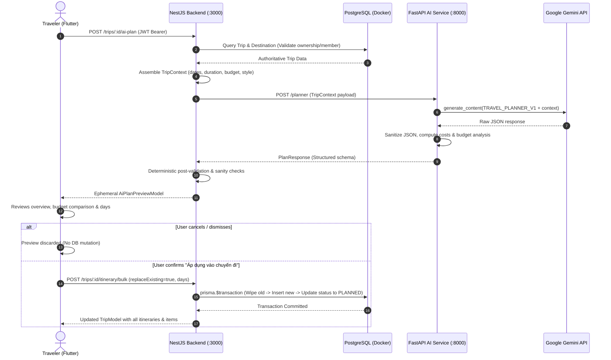

# WanderAI — AI Trip Planner Architecture & Specification

## 1. Overview

The AI Trip Planner in WanderAI allows travelers to generate personalized, day-by-day itineraries using the authoritative `TripContext`. It combines Google Gemini (`gemini-2.0-flash`), domain prompt engineering (`TRAVEL_PLANNER_V1`), deterministic validation logic in backend services, and human-in-the-loop preview confirmation before writing to the primary PostgreSQL database.

---

## 2. Core Architectural Invariants

| Principle | Implementation Rule |
| :--- | :--- |
| **No Direct DB Access by AI** | Neither Gemini nor the FastAPI AI service has write access to the PostgreSQL database. All database writes are performed exclusively by the NestJS backend in an atomic transaction upon explicit user confirmation. |
| **Authoritative Context Retrieval** | Trip parameters (`destination`, `startDate`, `endDate`, `totalBudget`, `travelStyle`, `interests`) are retrieved directly from PostgreSQL by NestJS using the authenticated user's JWT identity. Client-supplied metadata is never blindly trusted. |
| **Deterministic Arithmetic** | Day costs (`day_cost = sum(item.estimated_cost)`) and total trip costs (`sum(day.day_cost)`) are calculated deterministically in backend application code. LLM arithmetic is never trusted for budget enforcement. |
| **In-Memory Preview First** | Generated itineraries are delivered to Flutter as an ephemeral preview. Users can inspect activities, timing, tips, and budget variances before deciding to apply or discard. |
| **Atomic Bulk Persistence** | When confirmed, the entire itinerary is persisted using `prisma.$transaction`. Existing itineraries are optionally wiped and replaced atomically, ensuring the database is never left in an inconsistent partial state. |

---

## 3. End-to-End Execution Flow

---

## 4. Prompt Engineering (`TRAVEL_PLANNER_V1`)

Prompt template is versioned under `apps/ai-service/app/prompts/planner_prompt.py`.

### Key Directives:
1. **Realistic Vietnamese Travel Logistics**:
   - Only propose verified attractions, food stalls, and landmarks in the destination province.
   - Cluster activities geographically to avoid unreasonable transit times across provinces.
2. **Realistic Cost Attribution**:
   - Provide concrete VND costs for food, activities, and transport. Free attractions (beaches, public pagodas) are strictly marked with `estimated_cost = 0`.
3. **Structured Day Progression**:
   - Organizes 4–6 activities chronologically per day with explicit `start_time` and `end_time` (e.g. `08:00` - `09:30`).
4. **Strict Day Adherence**:
   - Generates exactly $N$ days corresponding to the duration between `startDate` and `endDate`.

---

## 5. Deterministic Validation & Budget Analysis

Every itinerary is validated by deterministic code:
- **Cost Summation**:
  $$\text{day\_cost} = \sum_{i \in \text{day.items}} \max(0, \text{item.estimated\_cost})$$
  $$\text{total\_estimated\_cost} = \sum_{d \in \text{days}} d.\text{day\_cost}$$
- **Variance Calculation**:
  $$\text{variance} = \text{total\_budget} - \text{total\_estimated\_cost}$$
  $$\text{is\_over\_budget} = (\text{total\_budget} > 0) \land (\text{total\_estimated\_cost} > \text{total\_budget})$$

---

## 6. Evaluation Framework

Evaluation datasets are located in `data/evaluation/planner/`:
- `moc_chau_3d.json`: 3-day budget exploration in mountainous Mộc Châu.
- `da_nang_4d.json`: 4-day family vacation in coastal Đà Nẵng with Hội An.
- `ha_giang_3d.json`: 3-day adventure loop across high-altitude mountain passes.

An automated evaluation script (`data/evaluation/planner/evaluate_planner.py`) runs as part of the test suite (`test_evaluation_scenario_runner` in pytest) to verify arithmetic integrity, day count constraints, and keyword matching.

---

## 7. Verification Results

| Suite | Component | Tests Passed | Status |
| :--- | :--- | :--- | :--- |
| **AI Unit Tests** | `test_planner.py` | 5 passed | ✅ Green |
| **Backend Integration** | `planner.e2e-spec.ts` | 7 passed | ✅ Green |
| **Mobile Widget Tests** | `planner_test.dart` | 5 passed | ✅ Green |
| **Total Regressions** | Full Monorepo | 86 passed | ✅ Green |
