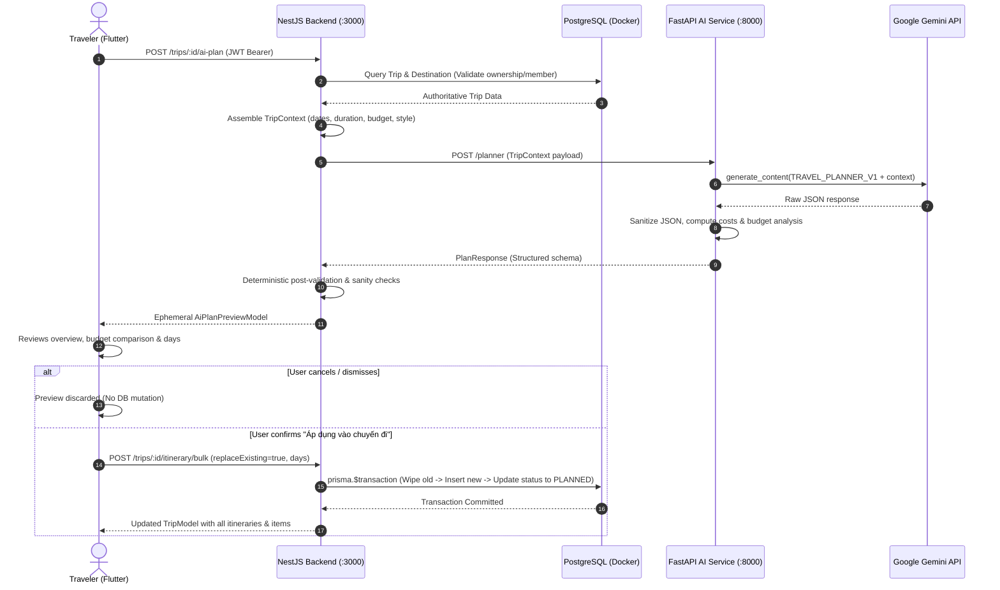

# WanderAI — AI Trip Planner Architecture & Specification

## 1. Overview

The AI Trip Planner in WanderAI allows travelers to generate personalized, day-by-day itineraries using the authoritative `TripContext`. It combines Google Gemini (`gemini-3.5-flash`, configurable via `PLANNER_MODEL`), domain prompt engineering (`TRAVEL_PLANNER_V1`), deterministic validation logic in backend services, and human-in-the-loop preview confirmation before writing to the primary PostgreSQL database.

---

## 2. Core Architectural Invariants

| Principle | Implementation Rule |
| :--- | :--- |
| **No Direct DB Access by AI** | Neither Gemini nor the FastAPI AI service has write access to the PostgreSQL database. All database writes are performed exclusively by the NestJS backend in an atomic transaction upon explicit user confirmation. |
| **Authoritative Context Retrieval** | Trip parameters (`destination`, `startDate`, `endDate`, `totalBudget`, `travelStyle`, `interests`) are retrieved directly from PostgreSQL by NestJS using the authenticated user's JWT identity. Client-supplied metadata is never blindly trusted. |
| **Deterministic Arithmetic** | Day costs (`day_cost = sum(item.estimated_cost)`) and total trip costs (`sum(day.day_cost)`) are calculated deterministically in backend application code. LLM arithmetic is never trusted for budget enforcement. |
| **In-Memory Preview First** | Generated itineraries are delivered to Flutter as an ephemeral preview. Users can inspect activities, timing, tips, and budget variances before deciding to apply or discard. |
| **Atomic Bulk Persistence** | When confirmed, the entire itinerary is persisted using `prisma.$transaction`. Existing itineraries are optionally wiped and replaced atomically, ensuring the database is never left in an inconsistent partial state. |

---

## 3. End-to-End Execution Flow

---

## 4. Prompt Engineering (`TRAVEL_PLANNER_V1`)

Prompt template is versioned under `apps/ai-service/app/prompts/planner_prompt.py`.

### Key Directives:
1. **Realistic Vietnamese Travel Logistics**:
   - Only propose verified attractions, food stalls, and landmarks in the destination province.
   - Cluster activities geographically to avoid unreasonable transit times across provinces.
2. **Realistic Cost Attribution**:
   - Provide concrete VND costs for food, activities, and transport. Free attractions (beaches, public pagodas) are strictly marked with `estimated_cost = 0`.
3. **Structured Day Progression**:
   - Organizes 4–6 activities chronologically per day with explicit `start_time` and `end_time` (e.g. `08:00` - `09:30`).
4. **Strict Day Adherence**:
   - Generates exactly $N$ days corresponding to the duration between `startDate` and `endDate`.

---

## 5. Deterministic Validation & Budget Analysis

Every itinerary is validated by deterministic code:
- **Cost Summation**:
  $$\text{day\_cost} = \sum_{i \in \text{day.items}} \max(0, \text{item.estimated\_cost})$$
  $$\text{total\_estimated\_cost} = \sum_{d \in \text{days}} d.\text{day\_cost}$$
- **Variance Calculation**:
  $$\text{variance} = \text{total\_budget} - \text{total\_estimated\_cost}$$
  $$\text{is\_over\_budget} = (\text{total\_budget} > 0) \land (\text{total\_estimated\_cost} > \text{total\_budget})$$

---

## 6. Evaluation Framework

Evaluation datasets are located in `data/evaluation/planner/`:
- `moc_chau_3d.json`: 3-day budget exploration in mountainous Mộc Châu.
- `da_nang_4d.json`: 4-day family vacation in coastal Đà Nẵng with Hội An.
- `ha_giang_3d.json`: 3-day adventure loop across high-altitude mountain passes.

An automated evaluation script (`data/evaluation/planner/evaluate_planner.py`) runs as part of the test suite (`test_evaluation_scenario_runner` in pytest) to verify arithmetic integrity, day count constraints, and keyword matching.

---

## 7. Verification Results

| Suite | Component | Tests Passed | Status |
| :--- | :--- | :--- | :--- |
| **AI Unit Tests** | `test_planner.py` | 5 passed | ✅ Green |
| **Backend Integration** | `planner.e2e-spec.ts` | 7 passed | ✅ Green |
| **Mobile Widget Tests** | `planner_test.dart` | 5 passed | ✅ Green |
| **Total Regressions** | Full Monorepo | 86 passed | ✅ Green |

## 8. Model, Output Limit & Live Smoke Test (TASK 07.2)

- **Previous model:** `gemini-2.0-flash` (hardcoded) - retired by Google, returns 404 NOT_FOUND. Together with `max_output_tokens=4096` (exhausted by thinking tokens) this broke the live planner.
- **Current model:** `gemini-3.5-flash`, verified available via the configured API key (`models.list` + a test call) on 2026-10-04. Settings: `PLANNER_MODEL`, `PLANNER_MAX_OUTPUT_TOKENS` (default 16384), `PLANNER_TIMEOUT_MS` (default 55000, below the 60 s NestJS timeout).
- Output uses `response_mime_type=application/json`; `MAX_TOKENS` truncation is detected and returned as a controlled 502.
- Provider/JSON failures return 502 with a generic message; details are logged server-side only. No DB write occurs on failure.
- **Live smoke test:** `PLANNER_LIVE_TEST=1 pytest tests/test_planner_live.py -v -s` (real Gemini; skipped by default, no key needed for normal runs). Result 2026-10-04: passed, 31.6 s, 3 days, 19 items, estimated 3,085,000 of 5,000,000 VND.
- **Limitations:** latency ~25-35 s per plan; with no `GEMINI_API_KEY` the router still returns a canned mock plan (testing fallback); model availability depends on Google and can change again - the live smoke test is the guard.
- **Live evidence (2026-10-04):** real `POST /trips/:id/ai-plan` through NestJS returned 201 in 29 s (3 days, 16 items, estimated 1,960,000 of 5,000,000 VND); itinerary row counts before/after preview were identical (0/0); `POST /trips/:id/itinerary/bulk` then wrote 16 items; invalid bulk was rejected (400) and atomic. With `PLANNER_MODEL=gemini-2.0-flash` the API returned a controlled 502 (generic message, no DB write). Flutter app (Chrome): preview 3 days / 18 items, apply, reload - 3 itineraries / 18 items persisted (DB-confirmed).
- **Flutter fix:** the global Dio receive timeout (15 s) was shorter than real planning time; `generateAiPlan` now sets a 75 s per-request timeout.
