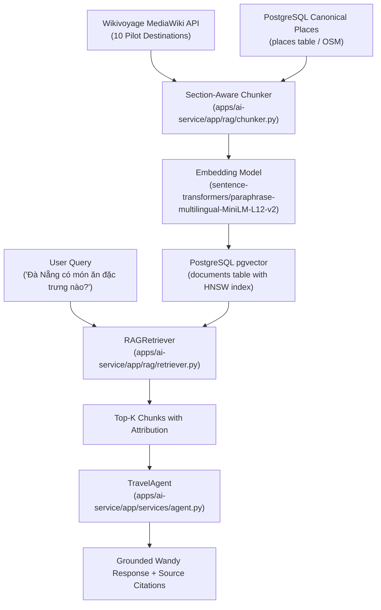

# WanderAI RAG Pipeline Specification

**Document Version:** 1.0.0  
**Audit Date:** 2026-10-01  
**Auditor:** Technical Lead & AI Engineer (Antigravity)  
**Task Reference:** TASK 06.4 — RAG Foundation  
**System Target:** WanderAI Retrieval-Augmented Generation (FastAPI AI Service & Travel Agent)

---

## 1. Overview & Architecture

The WanderAI RAG pipeline grounds the conversational AI Travel Assistant (Wandy) in verified, legally cleared open-source travel knowledge across Vietnam. It uses **Wikivoyage** articles (CC BY-SA 3.0) and canonical **OpenStreetMap (OSM)** places (ODbL 1.0) stored as dense vector embeddings in PostgreSQL using `pgvector`.



---

## 2. Ingestion Pipeline (`app.rag.ingestion`)

### Pilot Destinations Ingested:
1. **Vietnam** (Overview, cultural etiquette, transport, health, safety) — 113 chunks
2. **Hanoi** (Old Quarter, dining, historical sites, transport) — 86 chunks
3. **Da Nang** (Beaches, bridges, cuisine, transit) — 57 chunks
4. **Hoi An** (Ancient Town, tailoring, dining) — 44 chunks
5. **Hue** (Imperial City, royal cuisine, tombs) — 37 chunks
6. **Nha Trang** (Coastal activities, island tours) — 44 chunks
7. **Da Lat** (Highland climate, coffee culture) — 20 chunks
8. **Ha Long Bay** (Karst landscapes, cruise advice) — 14 chunks
9. **Ninh Binh** (Trang An, Tam Coc, scenic tours) — 27 chunks
10. **Phu Quoc** (Island beaches, night markets) — 22 chunks
* **Total Wikivoyage Chunks:** 464 chunks
* **OSM Canonical Place Grounding:** 164 chunks
* **Total pgvector Chunks:** 561 chunks (628 before TASK 07.3; 67 moved to `document_quarantine`)

### Crawler Etiquette:
* Endpoint: Official MediaWiki Action API (`https://en.wikivoyage.org/w/api.php?action=query&prop=extracts&explaintext=1`).
* Rate Limiting: 500ms delay between consecutive requests.
* User-Agent Header: `WanderAI-ResearchBot/1.0 (academic travel research; contact: wanderai@example.com)`.

---

## 3. Section-Aware Chunker (`app.rag.chunker`)

Unlike naive character or token chunkers that split across sentences or lose context, `SectionAwareChunker`:
1. Identifies heading levels (`== Heading ==`, `=== Subheading ===`).
2. Prefixes every chunk with document and section context (e.g., `Da Nang - Eat\n...`).
3. Infers semantic topics automatically:
   - `Eat / Drink / Food` → `culinary`
   - `Climate / Weather` → `climate`
   - `Get in / Get around` → `transport`
   - `See / Do` → `attractions` / `activities`
   - `Stay safe / Health` → `safety` / `health`
4. Preserves sentence boundaries with a target of 250 words and maximum of 450 words.
5. Computes a deterministic SHA-256 `content_hash` for deduplication.

---

## 4. Embedding Model & Vector Storage

* **Model:** `sentence-transformers/paraphrase-multilingual-MiniLM-L12-v2`
* **Dimension:** 384 dimensions
* **Normalization:** Cosine normalized ($L_2$ norm = 1.0)
* **Vector Index:** PostgreSQL `HNSW` (Hierarchical Navigable Small World) index with `vector_cosine_ops`:
  ```sql
  CREATE INDEX documents_embedding_hnsw_idx 
  ON documents USING hnsw (embedding vector_cosine_ops);
  ```
* **Deduplication:** Enforced at database level via `UNIQUE(content_hash, embedding_model)`.

---

## 5. Retrieval & Agent Integration

* **Service:** `RAGRetriever` (`app/rag/retriever.py`)
* **Similarity Metric:** Cosine similarity computed as `1 - (embedding <=> query_vec)`.
* **Agent Flow:** In `TravelAgent.handle_chat`, user queries are sent to `RAGService.search_with_sources()`. Retrieved chunks format an informative grounding context, and source URLs are returned in `ChatResponse.sources` for transparent attribution.
