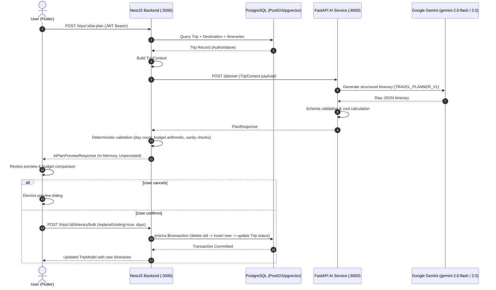

# AI Trip Planner API Contract

## 1. Overview

This document defines the interface contract between Flutter, NestJS backend, and FastAPI AI Service for generating and saving trip itineraries using `TripContext`.

### Core Invariants:
1. **AI Never Writes to Database**: Gemini / FastAPI never accesses or modifies PostgreSQL.
2. **Authoritative TripContext**: NestJS retrieves the trip from PostgreSQL using JWT identity (`userId`), validating ownership or membership before generating context.
3. **Deterministic Validation**: Day counts and budget arithmetic (`sum(estimatedCost)`) are computed in deterministic backend code, not trusted to LLM arithmetic.
4. **Preview Before Save**: AI outputs are returned as an in-memory preview. Persistence only occurs when the user explicitly confirms via the bulk save endpoint.
5. **Atomic Bulk Persistence**: Itinerary replacement/creation happens in an ACID PostgreSQL transaction (`prisma.$transaction`).

---

## 2. Architecture & Flow



---

## 3. Endpoints

### 3.1. Generate AI Itinerary Preview
- **Route:** `POST /trips/:id/ai-plan`
- **Auth:** Required (`Bearer <JWT>`)
- **Permission:** Trip Owner or Member

#### Request
- **URL Parameters:** `id` (UUID of trip)
- **Body:** Optional customization params:
```json
{
  "additionalPrompt": "Tập trung các quán ăn vặt và chụp ảnh sống ảo",
  "preferredPace": "relaxed" // "relaxed" | "moderate" | "fast"
}
```

#### Response (`200 OK`)
```json
{
  "success": true,
  "data": {
    "tripId": "b6a71e72-2ff8-410a-b33c-354972e2cf5c",
    "destination": "Đà Nẵng",
    "totalDays": 3,
    "overview": "Chuyến khám phá Đà Nẵng 3 ngày kết hợp bãi biển Mỹ Khê, bán đảo Sơn Trà và phố cổ Hội An.",
    "bestTimeToVisit": "Tháng 3 đến tháng 8 trời trong xanh, ít mưa.",
    "generalTips": [
      "Nên mang theo kem chống nắng và mũ rộng vành khi ra biển.",
      "Thuê xe máy khoảng 120.000 - 150.000 VND/ngày để di chuyển thuận tiện."
    ],
    "budgetAnalysis": {
      "totalBudget": 3000000,
      "estimatedCost": 2650000,
      "currency": "VND",
      "isOverBudget": false,
      "variance": 350000
    },
    "days": [
      {
        "dayNumber": 1,
        "date": "2026-10-15",
        "title": "Ngày 1: Biển Mỹ Khê & Bán đảo Sơn Trà",
        "dayCost": 850000,
        "items": [
          {
            "orderIndex": 1,
            "startTime": "07:30",
            "endTime": "09:00",
            "activity": "Ăn sáng mì Quảng ếch Bếp Trang",
            "placeName": "Mì Quảng Bếp Trang",
            "notes": "Mì quảng hương vị đậm đà đặc trưng Đà Nẵng",
            "estimatedCost": 65000,
            "transportMode": "motorbike"
          },
          {
            "orderIndex": 2,
            "startTime": "09:30",
            "endTime": "11:30",
            "activity": "Tham quan Chùa Linh Ứng - Bán đảo Sơn Trà",
            "placeName": "Chùa Linh Ứng",
            "notes": "Chiêm bái tượng Phật Bà 67m ngắm toàn cảnh vịnh Đà Nẵng",
            "estimatedCost": 0,
            "transportMode": "motorbike"
          }
        ]
      }
    ]
  }
}
```

#### Error Responses
- `401 Unauthorized`: Token missing or expired.
- `403 Forbidden`: Current user is not owner/member of the trip.
- `404 Not Found`: Trip not found.
- `422 Unprocessable Entity`: Trip lacks minimum required context (no destination or duration <= 0).
- `503 Service Unavailable`: AI service unreachable.

---

### 3.2. Bulk Save Itinerary (Atomic Persistence)
- **Route:** `POST /trips/:id/itinerary/bulk`
- **Auth:** Required (`Bearer <JWT>`)
- **Permission:** Trip Owner only

#### Request
- **URL Parameters:** `id` (UUID of trip)
- **Body:**
```json
{
  "replaceExisting": true,
  "days": [
    {
      "dayNumber": 1,
      "title": "Ngày 1: Biển Mỹ Khê & Bán đảo Sơn Trà",
      "date": "2026-10-15",
      "items": [
        {
          "orderIndex": 1,
          "activity": "Ăn sáng mì Quảng ếch Bếp Trang",
          "startTime": "07:30",
          "endTime": "09:00",
          "estimatedCost": 65000,
          "notes": "Mì quảng hương vị đậm đà đặc trưng Đà Nẵng",
          "transportMode": "motorbike"
        },
        {
          "orderIndex": 2,
          "activity": "Tham quan Chùa Linh Ứng - Bán đảo Sơn Trà",
          "startTime": "09:30",
          "endTime": "11:30",
          "estimatedCost": 0,
          "notes": "Chiêm bái tượng Phật Bà 67m ngắm toàn cảnh vịnh Đà Nẵng",
          "transportMode": "motorbike"
        }
      ]
    }
  ]
}
```

#### Response (`201 Created` or `200 OK`)
Returns the complete updated `TripModel` with new itineraries and items:
```json
{
  "success": true,
  "data": {
    "id": "b6a71e72-2ff8-410a-b33c-354972e2cf5c",
    "title": "Chuyến đi Đà Nẵng 3N2Đ",
    "status": "PLANNED",
    "isAiGenerated": true,
    "itineraries": [ ... ]
  }
}
```

#### Error Responses
- `400 Bad Request`: Invalid payload or day numbers out of order.
- `403 Forbidden`: Non-owner attempts to bulk save.
- `500 Internal Server Error`: Transaction rolled back cleanly on error.

---

### 3.3. FastAPI Internal Endpoint: `POST /planner`
- **Route:** `POST /planner`
- **Consumer:** NestJS `AiProxyService`
- **Payload (`TripContextRequest`):**
```json
{
  "trip_id": "b6a71e72-2ff8-410a-b33c-354972e2cf5c",
  "destination": "Đà Nẵng",
  "days": 3,
  "start_date": "2026-10-15",
  "end_date": "2026-10-17",
  "budget": 3000000,
  "currency": "VND",
  "travel_style": "budget",
  "interests": ["beach", "food"],
  "existing_itinerary_count": 0,
  "notes": ""
}
```
