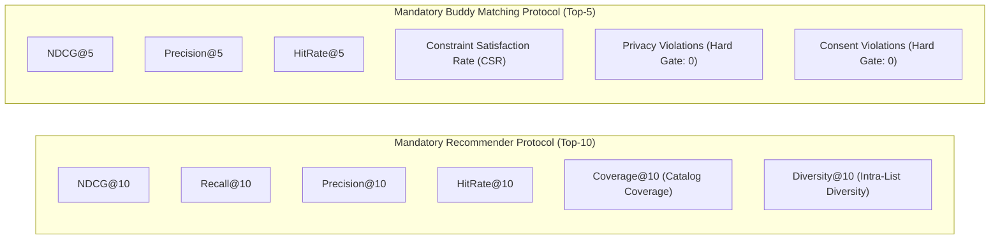

# GoMate Data Contract & Quality Invariants (V1)

**Document Version:** 1.0.0  
**Snapshot Date:** 2026-10-07  
**Branch / Worktree:** `feature/data-foundation-w2`  
**Task Reference:** TASK DATA-01B (Data Contract Lock)  
**Status:** FROZEN & RATIFIED FOR DATA-02

---

## 1. Executive Summary

This document establishes the binding **Data Contract** governing all travel data ingestion, preprocessing, entity resolution, storage, and evaluation across the WanderAI (GoMate) system. Any pull request, pipeline run, or model experiment violating these invariants will be rejected by automated CI/CD gates.

---

## 2. Core Architectural Invariants

### Invariant 1: Canonical POI Primary Key (`CANONICAL_POI_INVARIANT`)
- OpenStreetMap IDs (e.g., `node/123456`, `way/789101`) queried via the selected canonical Overpass query endpoint serve as the single authoritative, immutable ground truth for physical POIs. Upstream OpenStreetMap remains the root authority.
- Every verified place in `database.places` must possess at least one associated record in `database.place_sources` with `source_name = 'osm'`.
- Places lacking verified `place_sources` are classified as unverified and quarantined from production query endpoints.
- Ingestion pipelines must record `osm_base` (replication timestamp from Overpass header `osm3s.timestamp_osm_base`), `query_timestamp_utc`, element version, and changeset ID.

### Invariant 2: Overture Maps Secondary Cross-Check (`OVERTURE_CROSS_CHECK_INVARIANT`)
- Overture Maps Places data (Release `2026-09-23.1`, Schema v2.0.0, 81,455,425 places) is strictly designated as a **secondary freshness and entity verification layer**.
- Overture Places is compiled from canonical source families including Meta, Microsoft, Foursquare, BrightQuery, AllThePlaces, PinMeTo, DAC, Krick, and RenderSEO, and **contains zero OpenStreetMap data**.
- Overture Places is a **multi-license dataset** (CDLA Permissive 2.0, Apache 2.0, CC0 1.0). Ingested auxiliary records must record their source-derived license.
- Overture GERS IDs **must NEVER overwrite or replace** OpenStreetMap canonical IDs.
- When entity resolution confirms an OSM POI matches an Overture record, the Overture reference is recorded as an auxiliary source entry (`source_name='overture'`, `source_id='gers:...'`, `license='...'`).

### Invariant 3: Factual Policy on Google Maps Exclusion (`GOOGLE_MAPS_EXCLUSION_INVARIANT`)
- `GOOGLE_MAPS_DATASET_USE = EXCLUDED`.
- Google Places/Maps licensing, caching, export/attribution, and map-use restrictions are unsuitable for GoMate's reproducible offline research dataset workflow.
- Zero scraping of Google Maps, Google Places, or Google Reviews.
- Zero ingestion of Google data into the repository, PostgreSQL database, pgvector document store, or training corpora.

### Invariant 4: Dual Recommender Experiment Isolation (`RECOMMENDER_ISOLATION_INVARIANT`)
To maintain scientific validity, recommendation experiments are partitioned into two strictly isolated tracks:
- **`REC-A` (GoMate POI Recommendation):** Content-based and knowledge-graph recommendations over verified OpenStreetMap POIs (Hanoi, Ha Long, and baseline regions), evaluated against structured persona preference vectors and trip itineraries.
- **`REC-B` (ViHoRec Benchmark Evaluation):** Collaborative filtering, Matrix Factorization, and Graph Neural Network baselines evaluated on the official ViHoRec temporal split (560 hotels, 6,822 users).
- **Strict Prohibition:** `REC-A` POI UUIDs and `REC-B` ViHoRec hotel IDs (`H0000`–`H0559`) **must NEVER be merged, mapped, or concatenated into a single hybrid training matrix**. They address distinct experimental questions and have separate ground truths.

### Invariant 5: Quality and Verified Provenance Over Raw Count (`QUALITY_PROVENANCE_OVER_COUNT`)
- Regional POI quotas (e.g. $\approx 120$ Hanoi, $\approx 60$ Ha Long) represent **target coverage goals, not hard gates**.
- **CANONICAL RULE: QUALITY + VERIFIED PROVENANCE OVERRIDES RAW COUNT.**
- If fewer valid POIs exist within a target bounding box after applying strict Overpass verification, the gap is formally reported. Verification requirements must never be weakened or relaxed to achieve numerical quotas.

### Invariant 6: Zero Fabricated Ratings (`ZERO_FAKE_RATINGS_INVARIANT`)
- Places without genuine, verified customer reviews must have `rating = NULL` and `review_count = 0`.
- Automated seeding of arbitrary default ratings (e.g., historical 4.5 defaults) is permanently prohibited.
- Endpoints serving place details must handle null ratings gracefully without breaking client UI components.

### Invariant 7: Restricted Dataset Governance (`RESTRICTED_DATA_COMPLIANCE_INVARIANT`)
- Datasets governed by non-commercial licenses (CC BY-NC 4.0) or academic agreements (VLSP DUA, ViMACSA) are strictly quarantined in `data/restricted/` and excluded from public git commits via `.gitignore`.
- Raw text files from restricted sources must never be bundled into mobile application assets or exposed via unauthenticated API routes.

### Invariant 8: Strict Privacy & Consent Gates (`PRIVACY_CONSENT_HARD_GATES`)
- In traveler buddy matching and group discovery, user identifiable attributes (phone number, email, real surname, exact live GPS coordinates) are masked until mutual opt-in consent is achieved.
- Automated tests enforce:
  $$\text{Privacy Violations} \equiv 0, \quad \text{Consent Violations} \equiv 0$$
  These two gates are absolute hard blockers. Zero tolerance for regression.

---

## 3. Mandatory Metric Contract (Ratified)

Following the DATA-01B review, numerical accuracy targets (e.g., requiring NDCG@10 $\ge$ 0.12) are **decoupled from blocking PASS/FAIL gates** until empirical baselines are trained and published in DATA-02 / REC-01. However, the computation of all 6 recommender metrics and 6 matching metrics remains **strictly mandatory**.



### 3.1. Recommender Evaluation Contract (Top-10)
All recommendation models (MostPop, BPR-MF, LightGCN, ItemKNN, Content-Based) must report:
1. **$\text{NDCG@10}$:** Ranking gain discounted by position $\log_2(i+1)$.
2. **$\text{Recall@10}$:** Ratio of ground truth relevant items successfully surfaced.
3. **$\text{Precision@10}$:** Fraction of top-10 recommended items that are relevant.
4. **$\text{HitRate@10}$:** Binary hit indicator across test interactions.
5. **$\text{Coverage@10}$:** Percentage of unique catalog items recommended across test users.
6. **$\text{Diversity@10}$:** Average pairwise distance between recommended items.

### 3.2. Traveler Buddy Matching Contract (Top-5)
All matching engines must report:
1. **$\text{NDCG@5}$:** Compatibility ranking quality.
2. **$\text{Precision@5}$:** Fraction of top-5 matches satisfying mutual preferences.
3. **$\text{HitRate@5}$:** Probability of finding at least one valid buddy in top-5.
4. **$\text{Constraint Satisfaction Rate (CSR)}$:** Percentage of hard negative constraints (e.g. gender preference, non-smoking, travel dates) respected. Hard target: **100%**.
5. **$\text{Privacy Violations}$:** Count of unauthorized profile attribute disclosures. **Hard Gate: 0**.
6. **$\text{Consent Violations}$:** Count of unsolicited chat sessions or unconsented match requests. **Hard Gate: 0**.

---

## 4. Subsystem Interface Contracts

```
┌────────────────────────┐         PostgreSQL (places / place_sources)
│  DATA FOUNDATION       ├─────────────────────────────────────────────┐
│  - OSM Ingestion       │                                             │
│  - Overture Crosscheck │                                             ▼
│  - Wikivoyage RAG      │         pgvector (documents)        ┌───────────────┐
└───────────┬────────────┤────────────────────────────────────►│  BACKEND API  │
            │            │                                     │  (NestJS)     │
            ▼            │                                     └───────┬───────┘
┌────────────────────────┴───┐                                         │ HTTP REST
│  RESEARCH REC PIPELINE     │                                         ▼
│  - REC-A: POI Content Rank │                                 ┌───────────────┐
│  - REC-B: ViHoRec Collab   │                                 │  FLUTTER APP  │
└────────────────────────────┘                                 └───────────────┘
```

1. **Data Foundation $\to$ Backend API:**
   - Places served via `GET /places?verifiedOnly=true` must return only places possessing a valid `osm` entry in `place_sources`.
   - Categories must conform to the GoMate Category Taxonomy.
2. **Data Foundation $\to$ AI Service (RAG):**
   - Documents must contain valid `source_name`, `license`, `attribution`, and chunked text under 450 words.
   - Vector similarity queries must filter by `deleted_at IS NULL` and verified place relations.
3. **Backend API $\to$ Mobile Client:**
   - Places with null ratings must display `rating: null` (rendering "Chưa có đánh giá" in UI without crashing).
   - Emergency contacts and travel preferences must adhere strictly to verified DTO contracts.
