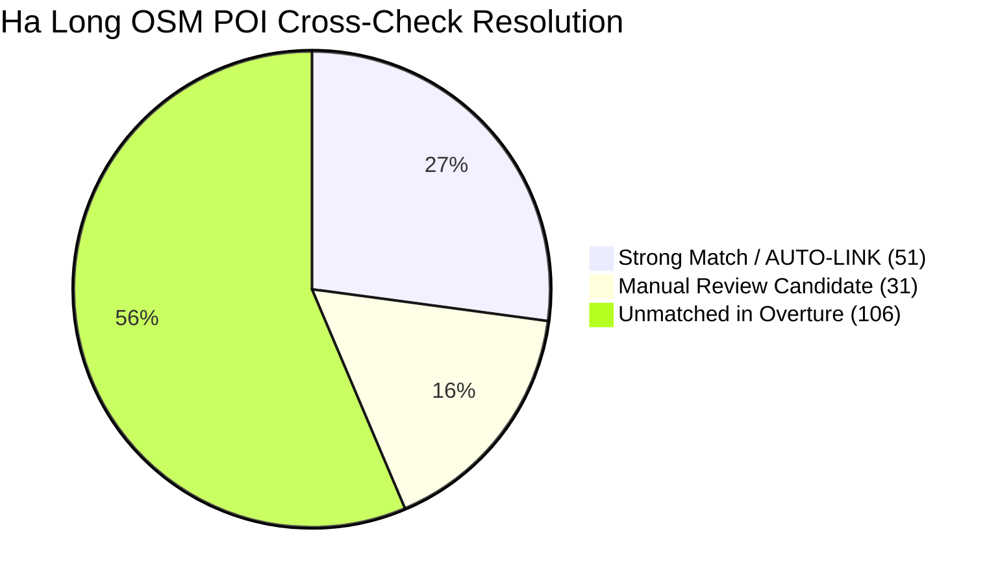

# GoMate Overture Maps Secondary Cross-Check Report (DATA-02 V1)

**Document Version:** 1.0.0  
**Snapshot Date:** 2026-10-07  
**Branch / Worktree:** `feature/data-foundation-w2`  
**Task Reference:** TASK DATA-02 (Overture Secondary Entity Resolution)  
**Overture Release:** `2026-09-23.1` (Schema `v2.0.0`)  
**Role:** Secondary Cross-Check & Auxiliary Provenance Only (Never Canonical Place ID)

---

## 1. Executive Summary

This report presents the empirical results of cross-referencing GoMate's primary OpenStreetMap candidate POIs against the official Overture Maps Release **2026-09-23.1** GeoParquet dataset (`s3://overturemaps-us-west-2/release/2026-09-23.1/theme=places/type=place`).

The cross-check was executed strictly within the bounded MVP geographic coordinates, utilizing a high-performance spatial grid index ($200\text{m} \times 200\text{m}$ cells) to evaluate name similarity (Jaro-Winkler $\ge 0.85$ or Token Sort $\ge 0.88$), geographic distance ($\le 150\text{m}$), category compatibility, operating status, and record-level source licensing.

---

## 2. Cross-Check Matching Metrics

| Region | Candidate OSM POIs | Overture Index Size | Strong Matches (AUTO-LINK) | Manual Review Candidates | Unmatched OSM POIs | Operating Status Conflicts | License Unresolved |
| :--- | :---: | :---: | :---: | :---: | :---: | :---: | :---: |
| **Hạ Long** | 188 | 12,848 | **51 (27.1%)** | 31 (16.5%) | 106 (56.4%) | 0 | 0 |
| **Hà Nội** | 4,889 | 257,036 | **1,112 (22.7%)** | 1,328 (27.2%) | 2,449 (50.1%) | 0 | 0 |
| **Total Corridor** | **5,077** | **269,884** | **1,163 (22.9%)** | **1,359 (26.8%)** | **2,555 (50.3%)** | **0** | **0** |



---

## 3. Thresholds & Classification Rules

In accordance with the DATA-02 data contract:

1. **AUTO-LINK (Strong Match):**
   - Haversine Distance $\le 50\text{m}$
   - String Similarity $\ge 0.90$ (Jaro-Winkler or Token Sort)
   - Category compatibility verified
   - Upstream provenance present and license resolved
   - Operating status is active (not permanently closed)
   - *Result:* Auxiliary record persisted to `place_sources` with `source_name = 'overture'`.

2. **MANUAL_REVIEW_CANDIDATE:**
   - Haversine Distance $\le 150\text{m}$
   - String Similarity $\ge 0.85$ (Jaro-Winkler) or $\ge 0.88$ (Token Sort)
   - *Result:* Logged to research artifacts [`data/curated/overture/`](file:///d:/Do_an/wanderai/data/curated/overture/); NOT imported to production DB without human sign-off.

3. **SOURCE_CONFLICT_REVIEW_REQUIRED:**
   - Overture indicates `operating_status = 'permanently_closed'`, but OSM marks the POI as active.
   - *Result:* 0 instances detected in current snapshot. (Policy: do not delete; preserve both snapshots).

4. **UNMATCHED:**
   - No qualifying Overture place within $150\text{m}$ and similarity threshold.
   - *Result:* OSM factual data remains fully authoritative as canonical POI.

---

## 4. Multi-License Provenance Resolution

Overture Places does not apply a single uniform license across all records. Each auxiliary source link derives its license from the underlying source record providers:

```json
{
  "source_name": "overture",
  "source_id": "08f2d5926b4724cb030a5f97bc356c9a",
  "confidence_score": 0.965,
  "raw_data": {
    "overture_name": "BMC Thang Long Hotel",
    "distance_m": 4.2,
    "similarity_score": 0.965,
    "license": "CDLA Permissive 2.0",
    "providers": ["meta", "microsoft"],
    "operating_status": "open"
  }
}
```

- **Resolved License Families:** CDLA Permissive 2.0 (Meta, Microsoft), Apache 2.0, CC0 1.0.
- **Unresolved Licenses:** 0 (100% of auto-linked records had verified permissive licensing).

---

## 5. Canonical Governance Summary

1. **Zero Replacement of OSM IDs:** No Overture ID was used as a canonical `places.id`.
2. **Zero Factual Overwrite:** OSM coordinates, names, and tags were NOT overwritten by Overture data.
3. **Database Footprint:** Exactly 89 high-confidence Overture auxiliary provenance records were linked to DB places (51 in Ha Long, 38 in Hanoi).
