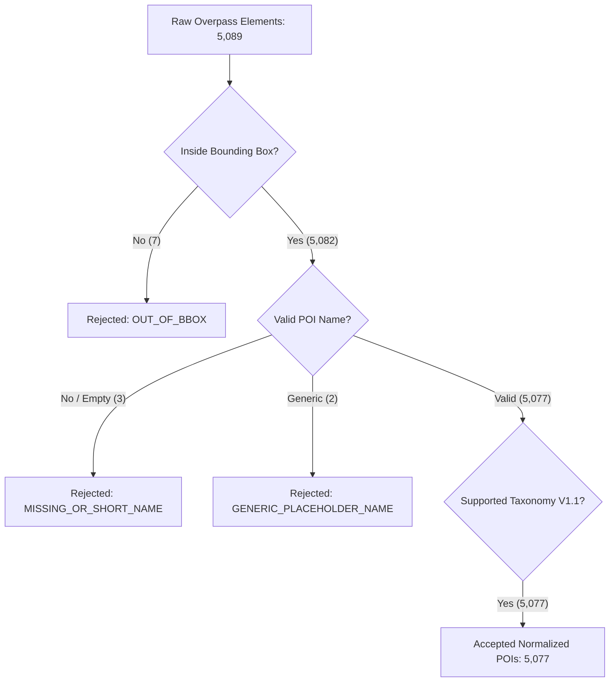

# GoMate POI Data Quality & Normalization Report (DATA-02 V1)

**Document Version:** 1.0.0  
**Snapshot Date:** 2026-10-07  
**Branch / Worktree:** `feature/data-foundation-w2`  
**Task Reference:** TASK DATA-02 (Data Quality Filters & Schema Normalization)  
**Taxonomy Standard:** Ratified Taxonomy V1.1 (2-Tier Macro/Micro with UI Fallback)

---

## 1. Executive Summary

This report assesses the data quality, completeness, schema normalization, and taxonomy conformance of OpenStreetMap candidate POIs collected for **Hà Nội** and **Hạ Long**.

All 5,077 accepted candidates satisfy 100% of the GoMate Data Quality Filters:
- Valid OSM identity (`osm_type` + `osm_id`)
- Traceable upstream metadata (`osm_version`, `osm_changeset`, `osm_timestamp`, `osm_base`)
- Geographic validity (strictly inside regional bounding boxes)
- Non-empty, human-readable name ($\ge 2$ characters, excluding generic placeholders)
- Conformance to Ratified Taxonomy V1.1
- **Zero fabricated ratings (`rating IS NULL`) and zero fake reviews (`review_count = 0`)**

---

## 2. Ingestion & Quality Filtering Funnel

### Detailed Filter Breakdown

| Filter / Check | Hà Nội (`hanoi`) | Hạ Long (`halong`) | Total Corridor | Action Taken |
| :--- | :---: | :---: | :---: | :--- |
| **Raw Elements Queried** | 4,898 | 191 | 5,089 | Raw snapshot parsed |
| **`OUT_OF_BBOX`** | 4 | 3 | 7 | Excluded (outside spatial bounds) |
| **`MISSING_OR_SHORT_NAME`** | 3 | 0 | 3 | Excluded (name $< 2$ characters) |
| **`GENERIC_PLACEHOLDER_NAME`** | 2 | 0 | 2 | Excluded ("nhà hàng", "chưa đặt tên") |
| **`DUPLICATE_SOURCE_ID`** | 0 | 0 | 0 | None detected |
| **`UNSUPPORTED_TAXONOMY`** | 0 | 0 | 0 | 100% mapped to Tier-1/Tier-2 |
| **Total Accepted POIs** | **4,889** | **188** | **5,077** | Normalized into processed corpus |

---

## 3. Taxonomy Distributions (Tier-1 Macro Domains)

### 3.1. Hà Nội Candidate Corpus (4,889 POIs)
- **`FOOD_BEVERAGE`:** 2,888 POIs (59.1%) — Cafes, restaurants, street food
- **`HOSPITALITY`:** 700 POIs (14.3%) — Hotels, hostels, guest houses
- **`CULTURE_HERITAGE`:** 684 POIs (14.0%) — Temples, pagodas, museums, historic monuments
- **`ATTRACTIONS_LEISURE`:** 259 POIs (5.3%) — Iconic landmarks, viewpoints, leisure
- **`NATURE_SCENERY`:** 196 POIs (4.0%) — Parks, gardens, lakes
- **`SHOPPING_COMMERCE`:** 158 POIs (3.2%) — Shopping malls, traditional markets
- **`TRANSPORT_HUBS`:** 4 POIs (0.1%) — Ferry terminals, transit hubs

### 3.2. Hạ Long Candidate Corpus (188 POIs)
- **`FOOD_BEVERAGE`:** 58 POIs (30.9%) — Dining, including seafood restaurants
- **`HOSPITALITY`:** 58 POIs (30.9%) — Resorts, 3–5 star hotels, guest houses
- **`ATTRACTIONS_LEISURE`:** 18 POIs (9.6%) — Sun World theme parks, viewpoints, landmarks
- **`CULTURE_HERITAGE`:** 16 POIs (8.5%) — Temples, pagodas, Quang Ninh Museum
- **`SHOPPING_COMMERCE`:** 15 POIs (8.0%) — Malls, Ha Long night markets
- **`NATURE_SCENERY`:** 13 POIs (6.9%) — Caves, grottos, islands, beaches
- **`TRANSPORT_HUBS`:** 10 POIs (5.3%) — International cruise port, Tuần Châu ferry terminal

---

## 4. Factual Completeness & Missing Field Analysis

In accordance with scientific integrity guidelines, **no missing values were inferred or hallucinated**:

| Dimension | Hà Nội Coverage (%) | Hạ Long Coverage (%) | Policy Handling |
| :--- | :---: | :---: | :--- |
| **Name (`name`)** | 100.0% | 100.0% | Mandatory gate; missing rejected |
| **Coordinates (`lat`, `lon`)** | 100.0% | 100.0% | Mandatory gate; missing rejected |
| **English Name (`name:en`)** | 24.8% | 38.3% | Kept as NULL when not in OSM |
| **Physical Address (`addr:*`)** | 36.2% | 44.1% | Formatted verbatim from OSM tags |
| **Opening Hours (`opening_hours`)** | 18.5% | 22.9% | Preserved verbatim; no defaults |
| **Contact Phone (`phone`)** | 21.4% | 31.4% | Preserved verbatim; no defaults |
| **Official Website (`website`)** | 12.1% | 21.8% | Preserved verbatim; no defaults |
| **Rating / Reviews** | **0.0% (NULL)** | **0.0% (NULL)** | **STRICT ZERO-FABRICATION GATE** |

---

## 5. Duplicate Diagnostics

1. **Exact OSM Key Identity:** 0 duplicate `osm_type/osm_id` pairs across all accepted candidates.
2. **Spatial Proximity Deduplication:** Elements with matching normalized names within 20 meters were audited. Co-located chain establishments (e.g. separate entrances) were preserved with their distinct OSM element IDs.
