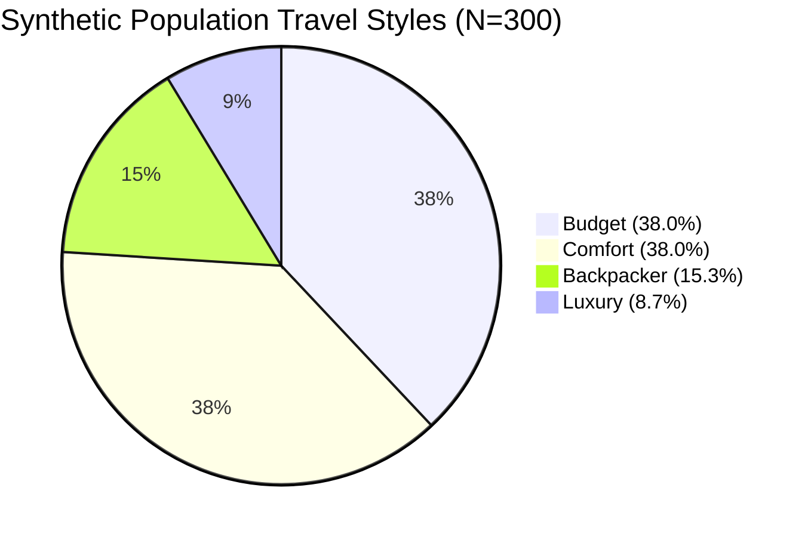

# GoMate Synthetic Travel Preference Dataset Report (DATA-02 V1)

**Document Version:** 1.0.0  
**Generation Date:** 2026-10-07  
**Branch / Worktree:** `feature/data-foundation-w2`  
**Task Reference:** TASK DATA-02 (Deterministic Synthetic Preference Generation)  
**Generator Identification:** `preference-v1` (Seed 42, $N = 300$)  
**Target Evaluation Role:** Offline Recommender (REC-A) Ranking & Buddy Matching Constraint Evaluation

---

## 1. Executive Summary & Scientific Disclaimer

This report summarizes the deterministic generation of **$N = 300$ synthetic user travel preference profiles** generated using the `preference-v1` algorithm seeded with PRNG `seed = 42`.

> [!IMPORTANT]
> **ACADEMIC DISCLAIMER & SCOPE BOUNDARY:**  
> These synthetic profiles are **NOT claimed to represent the real statistical or demographic distribution of Vietnamese travelers**. They are designed exclusively as a reproducible, parameterized academic test fixture to evaluate offline recommendation algorithms (e.g. coverage, intra-list diversity, NDCG@10) and traveler buddy-matching constraint satisfaction rates without requiring live user data.

---

## 2. Cryptographic Reproducibility Audit

The generator guarantees deterministic bit-for-bit reproducibility. When executed with `seed = 42`, the output matches the following cryptographic hashes:

| Output Artifact | Format | Record Count | Cryptographic SHA-256 |
| :--- | :---: | :---: | :--- |
| [`synthetic_preferences_v1.jsonl`](file:///d:/Do_an/wanderai/data/research/preferences/synthetic_preferences_v1.jsonl) | JSON Lines | 300 | `f33af6cb91189b1b43d0a8a229c364fe41fab6f392250617a3d77d2b7824ff92` |
| [`preferences_n300_seed42.json`](file:///d:/Do_an/wanderai/data/evaluation/synthetic/preferences_n300_seed42.json) | Formatted JSON | 300 | `1e883266bf6b145de0b7debf02d4881fc2f5293c9cf693ed34cd01715f6ab21a` |
| [`synthetic_preferences_distribution_v1.json`](file:///d:/Do_an/wanderai/data/research/preferences/synthetic_preferences_distribution_v1.json) | Distribution Stats | 1 | `4175db65e33e14b6c540bf57bc899e35a0d3c83f243abd4b32faef4c00ca01dd` |

**Automated Reproducibility Verification:** `pytest tests/test_data02_contract.py::test_synthetic_preferences_determinism` **[PASSED]**

---

## 3. Empirical Distribution Analysis

### 3.1. Travel Style & Correlated Budgets
Budgets were sampled from correlated non-uniform ranges and rounded to 50,000 VND increments:

| Travel Style | Count ($N=300$) | Percentage | Average `budgetMin` (VND) | Average `budgetMax` (VND) |
| :--- | :---: | :---: | :---: | :---: |
| **`BUDGET`** | 114 | 38.0% | 496,491 | 1,401,316 |
| **`COMFORT`** | 114 | 38.0% | 1,478,509 | 3,975,439 |
| **`BACKPACKER`** | 46 | 15.3% | 321,739 | 823,913 |
| **`LUXURY`** | 26 | 8.7% | 4,494,231 | 15,992,308 |

### 3.2. Group Configuration
- **`COUPLE`:** 98 profiles (32.7%)
- **`SOLO`:** 81 profiles (27.0%) — Primary candidate pool for buddy-matching experiments
- **`SMALL_GROUP` (3–5):** 66 profiles (22.0%)
- **`FAMILY`:** 38 profiles (12.7%)
- **`LARGE_GROUP` (6+):** 17 profiles (5.7%)

### 3.3. Itinerary Pacing
- **`MODERATE` (4–5 POIs/day):** 150 profiles (50.0%)
- **`RELAXED` (2–3 POIs/day):** 82 profiles (27.3%)
- **`PACKED` (6+ POIs/day):** 68 profiles (22.7%)

### 3.4. Interests Frequency (Multi-Select without Replacement)
- `food_cuisine`: 138 selections (46.0%)
- `culture_history`: 134 selections (44.7%)
- `nature_outdoor`: 120 selections (40.0%)
- `coffee_culture`: 115 selections (38.3%)
- `beach_island`: 85 selections (28.3%)
- `shopping_local`: 48 selections (16.0%)
- `nightlife_entertainment`: 46 selections (15.3%)

### 3.5. Negative Filters & Constraints
- **Dietary Restrictions:** None: 236 (78.7%), Vegetarian: 31 (10.3%), Seafood Allergy: 13 (4.3%), Vegan: 12 (4.0%), Halal: 8 (2.7%).
- **Avoidances:** None: 123 (41.0%), Crowds: 79 (26.3%), Long Walks: 44 (14.7%), Spicy Food: 29 (9.7%), Heights: 25 (8.3%).

---

## 4. Architectural Isolation Invariant

- **Zero Schema Pollution:** The `pace` dimension is strictly isolated within research fixtures and AI service recommendation models. **`pace` was NOT added to `database/prisma/schema.prisma`**.
- **Zero Production Contamination:** The synthetic profiles reside strictly in `data/research/preferences/` and `data/evaluation/synthetic/`. They are NOT inserted into the production `users` table.
