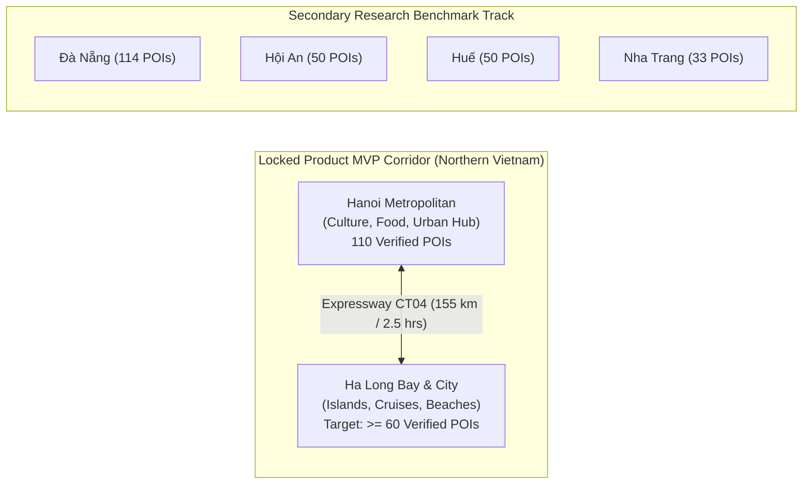

# GoMate MVP Geography Scope Freeze: Hanoi + Ha Long (V1)

**Document Version:** 1.0.0  
**Snapshot Date:** 2026-10-07  
**Branch / Worktree:** `feature/data-foundation-w2`  
**Task Reference:** TASK DATA-01B (MVP Geography Freeze)  
**Status:** NORTHERN TOURISM CORRIDOR (HANOI + HA LONG) LOCKED AS MVP SCOPE

---

## 1. Executive Summary & Scope Ratification

This document formally locks the product geographic scope for the GoMate Minimum Viable Product (MVP) and thesis demonstration to the **Northern Tourism Corridor: Hanoi + Ha Long**. 

Despite existing repository data having an abundance of verified POIs in Central Vietnam (Đà Nẵng, Hội An, Huế), this document enforces the architectural decision that **Ha Long will NOT be replaced by Đà Nẵng merely because existing data is easier**. The paired corridor of Hanoi (urban/cultural heritage) and Ha Long (coastal/nature UNESCO World Heritage) represents the quintessential 3–4 day Vietnamese travel itinerary and serves as the primary testbed for the AI trip planner.

---

## 2. Current Regional Data Asymmetry & Critical Deficit

An audit of the current repository reveals a severe geographical imbalance:

```
┌─────────────────────────────────────────────────────────────────────────────┐
│                    CURRENT REPOSITORY GEOGRAPHIC STATUS                     │
├───────────────┬─────────────────┬───────────────────┬───────────────────────┤
│ Region        │ Scope Tier      │ Verified OSM POIs │ Wikivoyage RAG Chunks │
├───────────────┼─────────────────┼───────────────────┼───────────────────────┤
│ **Hanoi**     │ **MVP CORE**    │ **110 places**    │ **48 chunks**         │
│ **Ha Long**   │ **MVP CORE**    │ **0 places (CRITICAL GAP)** │ **48 chunks**│
│ Đà Nẵng       │ Research Bench  │ 114 places        │ 48 chunks             │
│ Hội An        │ Research Bench  │ 50 places         │ 48 chunks             │
│ Huế           │ Research Bench  │ 50 places         │ 48 chunks             │
│ Nha Trang     │ Research Bench  │ 33 places         │ 48 chunks             │
│ HCMC / South  │ Future Post-MVP │ 0 places          │ 0 chunks              │
└───────────────┴─────────────────┴───────────────────┴───────────────────────┘
```

### The Ha Long Deficit
- **RAG Knowledge:** Official Wikivoyage article for *"Ha Long Bay"* is already ingested into pgvector (Page ID `13946`, Revision ID `5294720`, 48 chunks under CC BY-SA 3.0).
- **Verified POI Catalog:** Contains **exactly 0 verified OpenStreetMap places** for Ha Long. In `data/seed/synthetic_places.json`, Ha Long is represented only by 3 fabricated records (Vịnh Hạ Long, Đảo Tuần Châu, Bảo tàng Quảng Ninh) with rounded dummy coordinates.
- **Mandate for DATA-02:** DATA-02 **MUST execute an authoritative Overpass API collection** for the Ha Long tourism zone to establish $\ge 60$ verified POIs.

---

## 3. Geographic Boundary Specifications



### 3.1. Core MVP Region 1: Hanoi Metropolitan Area
- **Bounding Box:**
  $$\text{Latitude: } [20.95, 21.15] \text{ N}, \quad \text{Longitude: } [105.75, 105.95] \text{ E}$$
- **Key Urban Hubs:** Old Quarter (Hoàn Kiếm), Ba Đình historical quarter, Tây Hồ, Hai Bà Trưng.
- **Current Verified Count:** 110 places in DB (Historical landmarks, museums, pagodas, specialty cafes, craft centers).

### 3.2. Core MVP Region 2: Ha Long Bay & City
- **Bounding Box:**
  $$\text{Latitude: } [20.85, 21.05] \text{ N}, \quad \text{Longitude: } [106.95, 107.25] \text{ E}$$
- **Key Tourism Hubs:** Bãi Cháy tourist center, Tuần Châu international passenger terminal, Hòn Gai cultural quarter, Ha Long Bay marine landmarks.
- **Target Ingestion Quota in DATA-02:** $\ge 60$ verified POIs across:
  - Coastal and island attractions (caves, beaches, viewpoints).
  - Passenger ports and ferry terminals (Tuần Châu, Hạ Long International Port).
  - Seafood restaurants, local markets (Chợ Hạ Long 1), and bayside cafes.
  - Accommodations (hotels, resorts).

---

## 4. Operational Classification of Other Regions

1. **Đà Nẵng, Hội An, Huế, Nha Trang:**  
   Preserved under the **Secondary Research Benchmark Track**. Their verified POIs remain in the database for cross-regional generalizability tests and recommender evaluation baselines, but they do not distract from the primary Hanoi + Ha Long MVP application flow.
2. **Ho Chi Minh City & Southern Vietnam:**  
   Explicitly deferred to Post-MVP (Future Scope). No POI collection will be attempted for the South during Week 2.
