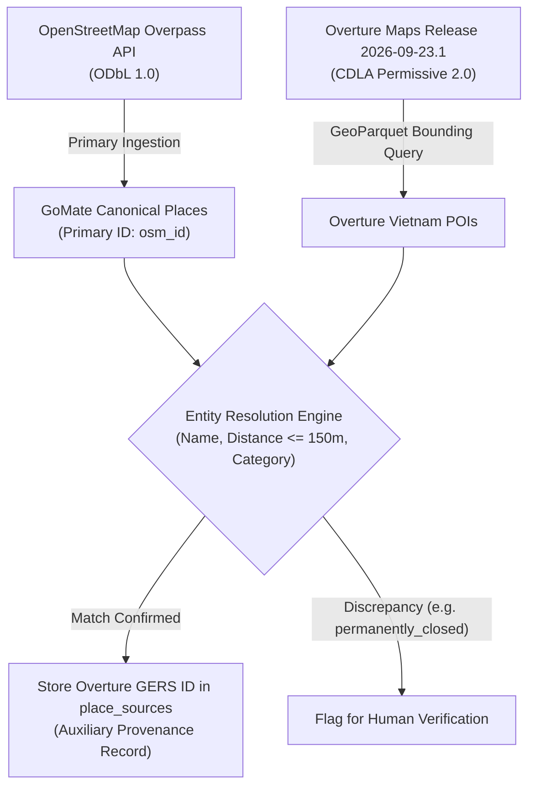

# Overture Maps Places Audit & Cross-Check Evaluation (V1)

**Document Version:** 1.0.0  
**Snapshot Date:** 2026-10-07  
**Branch / Worktree:** `feature/data-foundation-w2`  
**Task Reference:** TASK DATA-01B (Overture Maps Evaluation & Entity Resolution Plan)  
**Role in Architecture:** SECONDARY QUALITY & FRESHNESS CROSS-CHECK ONLY (Never Replaces OSM IDs)

---

## 1. Executive Summary

This document evaluates the official Overture Maps Foundation dataset as a secondary factual cross-check for the GoMate POI catalog. Based on the official **Release `2026-09-23.1` (Schema v2.0.0)**, we document schema specifications, licensing models, field taxonomies, and formulate the exact entity resolution protocol (`OSM ↔ Overture`) for DATA-02.

---

## 2. Overture Release Specifications & Schema v2.0.0 Audit

```
┌──────────────────────────────────────────────────────────────────────────────┐
│                    OVERTURE MAPS PLACES RELEASE AUDIT                        │
├───────────────────────┬──────────────────────────────────────────────────────┤
│ Release Identifier    │ 2026-09-23.1                                         │
│ Schema Version        │ v2.0.0 (Pydantic-governed structured specification)  │
│ Theme / Feature Type  │ places / place                                       │
│ Primary License       │ CDLA Permissive 2.0 (Community Data License)         │
│ Underlying Upstream   │ Meta, Microsoft, TomTom, OpenStreetMap contributors  │
│ Global Coverage       │ > 60 Million global POIs                             │
│ Access Distribution   │ Cloud-native GeoParquet (AWS S3 & Azure Blob)        │
└───────────────────────┴──────────────────────────────────────────────────────┘
```

### 2.1. Critical Schema Migration (September 2026 Release)
As of Release `2026-09-23.1`, Overture Maps has **officially removed the legacy `categories` property** (`categories.primary` and `categories.alternate`). The GoMate data pipeline strictly conforms to the new v2.0.0 taxonomy specification:

1. **`basic_category` (String):**  
   A simplified, machine-actionable category identifier corresponding 1:1 to the primary classification (e.g., `"restaurant"`, `"hotel"`, `"museum"`, `"cafe"`, `"tourist_attraction"`).
2. **`taxonomy` (Structured Object):**  
   Provides a full hierarchical classification tree:
   - `taxonomy.hierarchy`: Array of path segments from macro domain to specific subtype (e.g., `["food_and_drink", "restaurant", "vietnamese_restaurant"]`).
   - `taxonomy.primary`: The specific leaf classification.
   - `taxonomy.alternates`: Array of secondary or related classification strings.
3. **`operating_status` (String):**  
   Operational flag: `"operational"`, `"temporarily_closed"`, or `"permanently_closed"`. Crucial for filtering out defunct businesses in Vietnam.
4. **`names` (Object):**  
   Multilingual names dictionary (`names.primary`, `names.common`, `names.rules`).
5. **`geometry` (GeoJSON Point):**  
   WGS84 point coordinate `{"type": "Point", "coordinates": [longitude, latitude]}`.
6. **`confidence` (Float):**  
   Model-derived confidence score in $[0.0, 1.0]$.
7. **`sources` (List of Objects):**  
   Provenance array documenting upstream contributors (`dataset`, `record_id`, `confidence`).

---

## 3. Architectural Boundary: Secondary Cross-Check Only



### Inviolable Governance Principles
1. **Never Replace OSM Canonical Keys:** GoMate places derive their primary foreign key lineage from OpenStreetMap. An Overture GERS ID will never supersede an OSM node/way ID.
2. **Independent License Accounting:** 
   - OpenStreetMap attributes are governed by **ODbL 1.0** (requiring Share-Alike on derivative databases and OpenStreetMap attribution).
   - Overture Places attributes are governed by **CDLA Permissive 2.0**.
   - These licenses must never be conflated. Auxiliary records in `database.place_sources` maintain distinct `license` strings.

---

## 4. Entity Resolution Protocol: OSM ↔ Overture (DATA-02 Plan)

In DATA-02, an offline entity resolution runner will cross-check the verified OSM POI catalog against Overture Places for the target bounding boxes (Hanoi, Ha Long).

### 4.1. Step 1: Spatial Pre-Filtering
- For every canonical OSM POI $P_{\text{osm}} = (\text{lat}_1, \text{lon}_1)$, candidate Overture places $P_{\text{ovt}}$ are retrieved within a spatial bounding radius:
  $$\text{Haversine}(P_{\text{osm}}, P_{\text{ovt}}) \le 150.0 \text{ meters}$$

### 4.2. Step 2: Name Normalization & String Similarity
- Place names are normalized by:
  1. Stripping diacritics / accents (`unidecode`).
  2. Converting to lowercase and trimming whitespace.
  3. Removing generic business prefixes/suffixes (`"Khách sạn"`, `"Nhà hàng"`, `"Quán"`, `"Hotel"`, `"Restaurant"`).
- Compute **Jaro-Winkler Similarity** $S_{\text{jw}}$ and Token Sort Ratio $S_{\text{ts}}$. Match requires:
  $$S_{\text{jw}}(\text{norm\_name}_{\text{osm}}, \text{norm\_name}_{\text{ovt}}) \ge 0.85 \quad \lor \quad S_{\text{ts}} \ge 0.88$$

### 4.3. Step 3: Category Compatibility Validation
The Overture `basic_category` and `taxonomy.hierarchy[0]` must be compatible with the GoMate Tier-1 / Tier-2 category:

| GoMate Candidate Tier-1 | Compatible Overture `basic_category` | Compatible Overture `taxonomy.hierarchy[0]` |
| :--- | :--- | :--- |
| `CULTURE_HERITAGE` | `museum`, `place_of_worship`, `historic_site`, `monument` | `arts_and_entertainment`, `community_and_government` |
| `NATURE_SCENERY` | `park`, `beach`, `natural_feature`, `scenic_viewpoint` | `outdoors_and_recreation` |
| `ATTRACTIONS_LEISURE`| `tourist_attraction`, `theme_park`, `amusement_center` | `arts_and_entertainment` |
| `FOOD_BEVERAGE` | `restaurant`, `cafe`, `bar`, `coffee_shop`, `bakery` | `food_and_drink` |
| `HOSPITALITY` | `hotel`, `resort`, `motel`, `guest_house`, `hostel` | `accommodation` |
| `SHOPPING_COMMERCE` | `market`, `shopping_mall`, `convenience_store` | `retail` |

### 4.4. Step 4: Storage & Flagging Action
- **High-Confidence Match ($\text{Distance} \le 50\text{m}, \text{Score} \ge 0.90$):**  
  Insert auxiliary row into `place_sources`:
  ```sql
  INSERT INTO place_sources (place_id, source_name, source_id, raw_data, created_at)
  VALUES ($place_id, 'overture', $overture_id, $raw_json, now());
  ```
- **Closure Flag:** If Overture marks `operating_status = "permanently_closed"` for a matched place, flag place with `quarantine_review_needed = true` for human verification.
