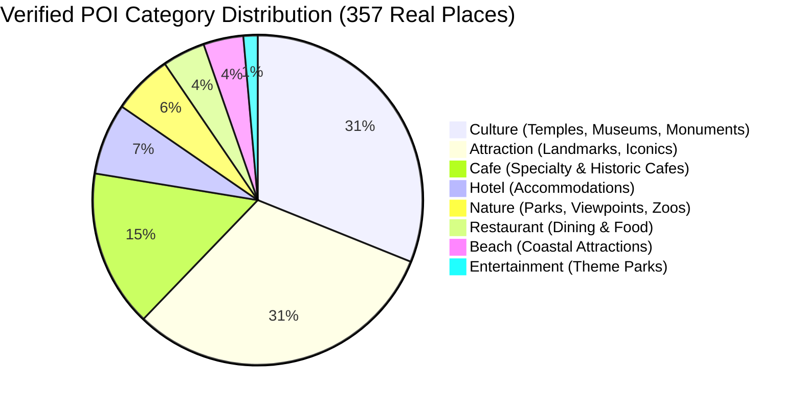

# GoMate POI Taxonomy Specification (V1)

**Document Version:** 1.1.0  
**Snapshot Date:** 2026-10-07  
**Branch / Worktree:** `feature/data-foundation-w2`  
**Task Reference:** TASK DATA-01B-R1 (POI Taxonomy Ambiguity Fixes & Semantic Alignment)  
**Governance Invariant:** Based strictly on REAL EXISTING DATA. Zero production code changes; zero `schema.prisma` edits. Preserve raw OSM tags in all cases.

---

## 1. Executive Summary & Semantic Clarifications

This document refines the GoMate POI Taxonomy to eliminate ambiguous category collapses identified during the DATA-01B review:
1. **Separation of Zoos and Parks:** `tourism=zoo` is explicitly mapped to `zoo_wildlife`, not collapsed into `park_garden`.
2. **Separation of Aquariums and Theme Parks:** `tourism=aquarium` is mapped to `aquarium`, not collapsed into `theme_park_leisure`.
3. **Separation of Modern Malls and Traditional Markets:** `shop=mall` is mapped to `shopping_mall`, strictly isolated from `amenity=marketplace` (`traditional_market`).
4. **Transport Hubs Governance:** `boat_terminal` (`amenity=ferry_terminal`) is classified under `TRANSPORT_HUBS` for research and routing models, while mapping to legacy `attraction` ONLY as a backward-compatible UI fallback.

---

## 2. Empirical Ground-Truth Data Distribution



---

## 3. Ratified 2-Tier POI Taxonomy with Overture v2.0.0 Mapping

The table below unifies OpenStreetMap tags, Overture Maps v2.0.0 fields, and the GoMate Candidate Taxonomy, while providing backward-compatible fallback to the 10 production seed categories.

| Tier-1 Macro Domain | Tier-2 Subcategory | Upstream OSM Tag Pattern | Overture `basic_category` | Overture `taxonomy.hierarchy[0]` | Production Seed Mapping (Backward-Compatible) |
| :--- | :--- | :--- | :--- | :--- | :--- |
| **1. CULTURE & HERITAGE** | `religious_temple` | `amenity=place_of_worship` | `place_of_worship` | `community_and_government` | `temple` |
| | `museum_gallery` | `tourism=museum`, `tourism=gallery` | `museum` | `arts_and_entertainment` | `museum` |
| | `historic_monument` | `historic=monument`, `historic=memorial`, `historic=castle` | `historic_site` | `arts_and_entertainment` | `attraction` (or `culture`) |
| **2. NATURE & SCENERY** | `beach_coastal` | `natural=beach`, `leisure=beach_resort` | `beach` | `outdoors_and_recreation` | `beach` |
| | `park_garden` | `leisure=park` | `park` | `outdoors_and_recreation` | `park` |
| | `zoo_wildlife` | `tourism=zoo` | `zoo` | `outdoors_and_recreation` | `park` (or `attraction`) |
| | `viewpoint_scenic` | `tourism=viewpoint` | `scenic_viewpoint` | `outdoors_and_recreation` | `attraction` (or `nature`) |
| | `cave_grotto` *(Ha Long)*| `natural=cave_entrance` | `natural_feature` | `outdoors_and_recreation` | `attraction` |
| | `island_landmark` *(Ha Long)*| `place=island`, `tourism=attraction` | `island` | `outdoors_and_recreation` | `attraction` |
| **3. ATTRACTIONS & LEISURE** | `landmark_iconic` | `tourism=attraction` (bridges, towers, squares) | `tourist_attraction` | `arts_and_entertainment` | `attraction` |
| | `aquarium` | `tourism=aquarium` | `aquarium` | `arts_and_entertainment` | `attraction` |
| | `theme_park_leisure` | `tourism=theme_park` | `theme_park` | `arts_and_entertainment` | `entertainment` (or `attraction`) |
| | `nightlife_entertainment`| `amenity=nightclub`, `amenity=pub`, `amenity=bar` | `bar` | `food_and_drink` | `nightlife` |
| **4. FOOD & BEVERAGE** | `cafe_tea` | `amenity=cafe` | `cafe` | `food_and_drink` | `cafe` |
| | `restaurant_dining` | `amenity=restaurant`, `amenity=food_court` | `restaurant` | `food_and_drink` | `restaurant` |
| | `seafood_dining` *(Ha Long)*| `amenity=restaurant` & `cuisine=seafood` | `seafood_restaurant`| `food_and_drink` | `restaurant` |
| | `street_food_market` | `amenity=fast_food` | `fast_food_restaurant`| `food_and_drink` | `market` (or `restaurant`) |
| **5. HOSPITALITY** | `hotel_resort` | `tourism=hotel`, `tourism=resort`, ViHoRec | `hotel` | `accommodation` | `hotel` |
| | `homestay_hostel` | `tourism=guest_house`, `tourism=hostel` | `guest_house` | `accommodation` | `hotel` |
| **6. TRANSPORT & HUBS** | `boat_terminal` *(Ha Long)* | `amenity=ferry_terminal` | `ferry_terminal` | `transportation` | `attraction` *(UI fallback only)* |
| **7. SHOPPING & COMMERCE** | `traditional_market` | `amenity=marketplace` | `market` | `retail` | `market` |
| | `shopping_mall` | `shop=mall` | `shopping_mall` | `retail` | `market` |

---

## 4. Comprehensive Tag Mapping Specifications (Machine-Readable)

```json
[
  {
    "osm_key": "amenity",
    "osm_value": "place_of_worship",
    "tier_1": "CULTURE_HERITAGE",
    "tier_2": "religious_temple",
    "overture_basic_category": "place_of_worship",
    "legacy_production_id": "temple",
    "display_vi": "Chùa, Đền & Nơi thờ tự",
    "display_en": "Temple & Place of Worship"
  },
  {
    "osm_key": "tourism",
    "osm_value": "museum",
    "tier_1": "CULTURE_HERITAGE",
    "tier_2": "museum_gallery",
    "overture_basic_category": "museum",
    "legacy_production_id": "museum",
    "display_vi": "Bảo tàng & Phòng trưng bày",
    "display_en": "Museum & Gallery"
  },
  {
    "osm_key": "historic",
    "osm_value": "monument",
    "tier_1": "CULTURE_HERITAGE",
    "tier_2": "historic_monument",
    "overture_basic_category": "historic_site",
    "legacy_production_id": "culture",
    "display_vi": "Di tích lịch sử & Tượng đài",
    "display_en": "Historic Monument"
  },
  {
    "osm_key": "natural",
    "osm_value": "beach",
    "tier_1": "NATURE_SCENERY",
    "tier_2": "beach_coastal",
    "overture_basic_category": "beach",
    "legacy_production_id": "beach",
    "display_vi": "Bãi biển",
    "display_en": "Beach"
  },
  {
    "osm_key": "leisure",
    "osm_value": "park",
    "tier_1": "NATURE_SCENERY",
    "tier_2": "park_garden",
    "overture_basic_category": "park",
    "legacy_production_id": "park",
    "display_vi": "Công viên & Cảnh quan xanh",
    "display_en": "Park & Garden"
  },
  {
    "osm_key": "tourism",
    "osm_value": "zoo",
    "tier_1": "NATURE_SCENERY",
    "tier_2": "zoo_wildlife",
    "overture_basic_category": "zoo",
    "legacy_production_id": "park",
    "display_vi": "Vườn thú & Khu bảo tồn động vật",
    "display_en": "Zoo & Wildlife Park"
  },
  {
    "osm_key": "natural",
    "osm_value": "cave_entrance",
    "tier_1": "NATURE_SCENERY",
    "tier_2": "cave_grotto",
    "overture_basic_category": "natural_feature",
    "legacy_production_id": "attraction",
    "display_vi": "Hang động & Thạch nhũ",
    "display_en": "Cave & Grotto"
  },
  {
    "osm_key": "tourism",
    "osm_value": "aquarium",
    "tier_1": "ATTRACTIONS_LEISURE",
    "tier_2": "aquarium",
    "overture_basic_category": "aquarium",
    "legacy_production_id": "attraction",
    "display_vi": "Thủy cung sinh vật biển",
    "display_en": "Aquarium"
  },
  {
    "osm_key": "tourism",
    "osm_value": "theme_park",
    "tier_1": "ATTRACTIONS_LEISURE",
    "tier_2": "theme_park_leisure",
    "overture_basic_category": "theme_park",
    "legacy_production_id": "entertainment",
    "display_vi": "Công viên giải trí chủ đề",
    "display_en": "Theme Park"
  },
  {
    "osm_key": "amenity",
    "osm_value": "ferry_terminal",
    "tier_1": "TRANSPORT_HUBS",
    "tier_2": "boat_terminal",
    "overture_basic_category": "ferry_terminal",
    "legacy_production_id": "attraction",
    "display_vi": "Cảng tàu du lịch & Bến phà",
    "display_en": "Cruise Terminal & Ferry Port"
  },
  {
    "osm_key": "tourism",
    "osm_value": "viewpoint",
    "tier_1": "NATURE_SCENERY",
    "tier_2": "viewpoint_scenic",
    "overture_basic_category": "scenic_viewpoint",
    "legacy_production_id": "attraction",
    "display_vi": "Điểm ngắm cảnh & Đèo",
    "display_en": "Scenic Viewpoint"
  },
  {
    "osm_key": "tourism",
    "osm_value": "attraction",
    "tier_1": "ATTRACTIONS_LEISURE",
    "tier_2": "landmark_iconic",
    "overture_basic_category": "tourist_attraction",
    "legacy_production_id": "attraction",
    "display_vi": "Điểm tham quan biểu tượng",
    "display_en": "Iconic Landmark"
  },
  {
    "osm_key": "amenity",
    "osm_value": "cafe",
    "tier_1": "FOOD_BEVERAGE",
    "tier_2": "cafe_tea",
    "overture_basic_category": "cafe",
    "legacy_production_id": "cafe",
    "display_vi": "Cà phê & Trà",
    "display_en": "Cafe & Tea"
  },
  {
    "osm_key": "amenity",
    "osm_value": "restaurant",
    "tier_1": "FOOD_BEVERAGE",
    "tier_2": "restaurant_dining",
    "overture_basic_category": "restaurant",
    "legacy_production_id": "restaurant",
    "display_vi": "Nhà hàng ẩm thực",
    "display_en": "Restaurant & Dining"
  },
  {
    "osm_key": "tourism",
    "osm_value": "hotel",
    "tier_1": "HOSPITALITY",
    "tier_2": "hotel_resort",
    "overture_basic_category": "hotel",
    "legacy_production_id": "hotel",
    "display_vi": "Khách sạn & Khu nghỉ dưỡng",
    "display_en": "Hotel & Resort"
  },
  {
    "osm_key": "amenity",
    "osm_value": "marketplace",
    "tier_1": "SHOPPING_COMMERCE",
    "tier_2": "traditional_market",
    "overture_basic_category": "market",
    "legacy_production_id": "market",
    "display_vi": "Chợ truyền thống & Chợ đêm",
    "display_en": "Traditional Market"
  },
  {
    "osm_key": "shop",
    "osm_value": "mall",
    "tier_1": "SHOPPING_COMMERCE",
    "tier_2": "shopping_mall",
    "overture_basic_category": "shopping_mall",
    "legacy_production_id": "market",
    "display_vi": "Trung tâm thương mại",
    "display_en": "Shopping Mall"
  },
  {
    "osm_key": "amenity",
    "osm_value": "nightclub",
    "tier_1": "ATTRACTIONS_LEISURE",
    "tier_2": "nightlife_entertainment",
    "overture_basic_category": "bar",
    "legacy_production_id": "nightlife",
    "display_vi": "Cuộc sống về đêm & Quán bar",
    "display_en": "Nightlife & Pubs"
  }
]
```

---

## 5. Backward Compatibility & Migration Strategy

1. **Production Table (`place_categories`):** Continues to host the 10 production seed categories with fixed primary keys.
2. **Boat Terminal Handling:** For UI presentation, `boat_terminal` maps to `attraction` so existing Flutter/Web screens render it without missing icon errors. For research, graph routing, and trip planning, it is processed under `TRANSPORT_HUBS / boat_terminal`.
3. **Preservation of Raw Tags:** Ingestion pipelines always persist the complete raw OSM `tags` object in `place_sources.raw_data` to ensure zero information loss.
