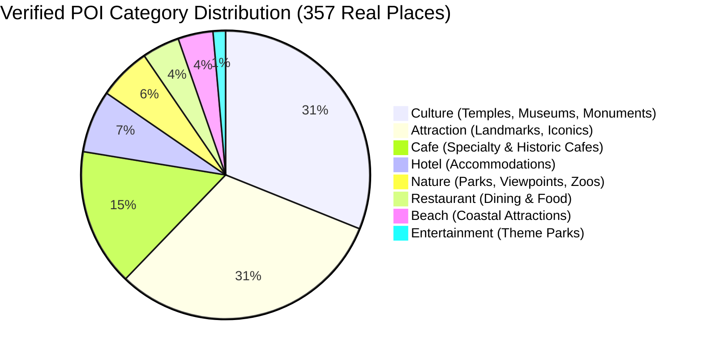

# GoMate POI Taxonomy Candidate Draft (V1)

**Document Version:** 1.0.0  
**Draft Snapshot Date:** 2026-10-07  
**Branch / Worktree:** `feature/data-foundation-w2`  
**Task Reference:** TASK DATA-01A (Empirical POI Taxonomy Candidate Preparation)  
**Governance Invariant:** Based strictly on REAL EXISTING DATA. Zero production code changes; zero `schema.prisma` edits.

---

## 1. Executive Summary & Problem Statement

An empirical audit of the GoMate repository reveals a significant structural divergence between three competing taxonomy representations currently coexisting in the codebase:

1. **Production Seed Taxonomy (`database/seed/categories.json`):**  
   Defines 10 flat categories: `restaurant`, `hotel`, `attraction`, `beach`, `temple`, `market`, `cafe`, `museum`, `park`, `nightlife`.
2. **OpenStreetMap Pipeline Ingestion Taxonomy (`data/pipelines/osm/config.py`):**  
   Collapses rich OSM tags into 8 broad categories: `attraction`, `culture`, `nature`, `entertainment`, `beach`, `cafe`, `restaurant`, `hotel`.
3. **Verified Database Reality (357 Verified Places):**  
   The active PostgreSQL database contains verified places with categories: `culture` (111), `attraction` (111), `cafe` (55), `hotel` (25), `nature` (21), `restaurant` (15), `beach` (14), `entertainment` (5).
4. **ViHoRec Benchmark Domain:**  
   Focuses exclusively on accommodation (560 hotels), but contains granular metadata tags (`facilities`, `star_rating`, `platform`).

### The Taxonomy Gap
- In the production seed, `temple` and `museum` exist as separate categories, but in the verified OSM database, they were both aggregated under `culture`.
- In the production seed, `park` exists, but scenic mountain passes and viewpoints were aggregated into `nature`.
- In the production seed, `nightlife` exists, but amusement and theme parks were classified under `entertainment`.
- Because foreign key relations link `places.category_id -> place_categories.id`, any future taxonomy harmonization must support backward compatibility without breaking production schemas.

---

## 2. Empirical Ground-Truth Data Distribution

The taxonomy design below is grounded directly in the 357 verified OpenStreetMap POIs and 560 ViHoRec hotels currently in the repository.



---

## 3. Proposed Hierarchical Candidate Taxonomy (2-Tier)

To resolve the tension between broad search filtering and fine-grained recommendation / RAG retrieval, we propose a **2-Tier Hierarchical Taxonomy Candidate**.

### 3.1. Overview Matrix

| Tier-1 Macro Domain | Tier-2 Candidate Subcategory | Upstream OSM Tag Pattern | Current Verified Count | Production Seed Mapping (Backward-Compatible) |
| :--- | :--- | :--- | :---: | :--- |
| **1. CULTURE & HERITAGE** | `religious_temple` | `amenity=place_of_worship` | 64 | `temple` |
| | `museum_gallery` | `tourism=museum`, `tourism=gallery` | 28 | `museum` |
| | `historic_monument` | `historic=monument`, `historic=memorial`, `historic=castle`, `historic=ruins` | 19 | `attraction` (or `culture`) |
| **2. NATURE & SCENERY** | `beach_coastal` | `natural=beach`, `leisure=beach_resort` | 14 | `beach` |
| | `park_garden` | `leisure=park`, `tourism=zoo` | 12 | `park` |
| | `viewpoint_scenic` | `tourism=viewpoint` | 9 | `attraction` (or `nature`) |
| **3. ATTRACTIONS & LEISURE** | `landmark_iconic` | `tourism=attraction` (bridges, towers, squares) | 111 | `attraction` |
| | `theme_park_leisure` | `tourism=theme_park`, `tourism=aquarium` | 4 | `entertainment` (or `attraction`) |
| | `nightlife_entertainment`| `amenity=nightclub`, `amenity=pub`, `amenity=bar` | 1 | `nightlife` |
| **4. FOOD & BEVERAGE** | `cafe_tea` | `amenity=cafe` | 55 | `cafe` |
| | `restaurant_dining` | `amenity=restaurant`, `amenity=food_court` | 15 | `restaurant` |
| | `street_food_market` | `amenity=fast_food`, `amenity=marketplace` (food) | 0 (Seed: 4) | `market` (or `restaurant`) |
| **5. HOSPITALITY** | `hotel_resort` | `tourism=hotel`, `tourism=resort`, ViHoRec | 25 (+560) | `hotel` |
| | `homestay_hostel` | `tourism=guest_house`, `tourism=hostel` | 0 | `hotel` |
| **6. SHOPPING & COMMERCE** | `traditional_market` | `amenity=marketplace`, `shop=mall` | 0 (Seed: 4) | `market` |

---

## 4. Comprehensive Tag Mapping Specifications

The candidate taxonomy explicitly documents how upstream OpenStreetMap tags map into both the Candidate 2-Tier schema and the current 10-category production schema.

```
                    ┌───────────────────────────┐
                    │ Upstream Raw OSM POI Tag  │
                    └─────────────┬─────────────┘
                                  │
          ┌───────────────────────┴───────────────────────┐
          ▼                                               ▼
┌───────────────────────────────┐               ┌───────────────────────────────┐
│  Tier-1 Macro Domain          │               │  Tier-2 Granular Subcategory  │
│  - CULTURE_HERITAGE           │               │  - religious_temple           │
│  - NATURE_SCENERY             │               │  - museum_gallery             │
│  - ATTRACTIONS_LEISURE        │               │  - beach_coastal              │
│  - FOOD_BEVERAGE              │               │  - landmark_iconic            │
│  - HOSPITALITY                │               │  - cafe_tea                   │
│  - SHOPPING_COMMERCE          │               │  - hotel_resort               │
└───────────────────────────────┘               └───────────────────────────────┘
```

### 4.1. Detailed Mapping Table

```json
[
  {
    "osm_key": "amenity",
    "osm_value": "place_of_worship",
    "tier_1": "CULTURE_HERITAGE",
    "tier_2": "religious_temple",
    "legacy_production_id": "temple",
    "display_vi": "Chùa, Đền & Nơi thờ tự",
    "display_en": "Temple & Place of Worship"
  },
  {
    "osm_key": "tourism",
    "osm_value": "museum",
    "tier_1": "CULTURE_HERITAGE",
    "tier_2": "museum_gallery",
    "legacy_production_id": "museum",
    "display_vi": "Bảo tàng & Phòng trưng bày",
    "display_en": "Museum & Gallery"
  },
  {
    "osm_key": "historic",
    "osm_value": "monument",
    "tier_1": "CULTURE_HERITAGE",
    "tier_2": "historic_monument",
    "legacy_production_id": "culture",
    "display_vi": "Di tích lịch sử & Tượng đài",
    "display_en": "Historic Monument"
  },
  {
    "osm_key": "natural",
    "osm_value": "beach",
    "tier_1": "NATURE_SCENERY",
    "tier_2": "beach_coastal",
    "legacy_production_id": "beach",
    "display_vi": "Bãi biển",
    "display_en": "Beach"
  },
  {
    "osm_key": "leisure",
    "osm_value": "park",
    "tier_1": "NATURE_SCENERY",
    "tier_2": "park_garden",
    "legacy_production_id": "park",
    "display_vi": "Công viên & Cảnh quan xanh",
    "display_en": "Park & Botanical Garden"
  },
  {
    "osm_key": "tourism",
    "osm_value": "viewpoint",
    "tier_1": "NATURE_SCENERY",
    "tier_2": "viewpoint_scenic",
    "legacy_production_id": "attraction",
    "display_vi": "Điểm ngắm cảnh & Đèo",
    "display_en": "Scenic Viewpoint"
  },
  {
    "osm_key": "tourism",
    "osm_value": "attraction",
    "tier_1": "ATTRACTIONS_LEISURE",
    "tier_2": "landmark_iconic",
    "legacy_production_id": "attraction",
    "display_vi": "Điểm tham quan biểu tượng",
    "display_en": "Iconic Landmark"
  },
  {
    "osm_key": "amenity",
    "osm_value": "cafe",
    "tier_1": "FOOD_BEVERAGE",
    "tier_2": "cafe_tea",
    "legacy_production_id": "cafe",
    "display_vi": "Cà phê & Trà",
    "display_en": "Cafe & Tea"
  },
  {
    "osm_key": "amenity",
    "osm_value": "restaurant",
    "tier_1": "FOOD_BEVERAGE",
    "tier_2": "restaurant_dining",
    "legacy_production_id": "restaurant",
    "display_vi": "Nhà hàng ẩm thực",
    "display_en": "Restaurant & Dining"
  },
  {
    "osm_key": "tourism",
    "osm_value": "hotel",
    "tier_1": "HOSPITALITY",
    "tier_2": "hotel_resort",
    "legacy_production_id": "hotel",
    "display_vi": "Khách sạn & Khu nghỉ dưỡng",
    "display_en": "Hotel & Resort"
  },
  {
    "osm_key": "amenity",
    "osm_value": "marketplace",
    "tier_1": "SHOPPING_COMMERCE",
    "tier_2": "traditional_market",
    "legacy_production_id": "market",
    "display_vi": "Chợ truyền thống & Chợ đêm",
    "display_en": "Traditional Market"
  },
  {
    "osm_key": "amenity",
    "osm_value": "nightclub",
    "tier_1": "ATTRACTIONS_LEISURE",
    "tier_2": "nightlife_entertainment",
    "legacy_production_id": "nightlife",
    "display_vi": "Cuộc sống về đêm & Quán bar",
    "display_en": "Nightlife & Pubs"
  }
]
```

---

## 5. Backward Compatibility & Migration Strategy

To guarantee that production stability is preserved without modifying `schema.prisma` or production NestJS/Flutter applications during Week 2:

1. **Production Table (`place_categories`):** Remains untouched with its existing primary keys (`id`, `name`, `icon`, `color`).
2. **Metadata Extension via JSON / RAG:** If subcategories are utilized in research baselines or RAG indexing, they will be stored inside the `metadata` JSON field of `documents` and `place_sources.raw_data` rather than creating a new relational column.
3. **Recommender Feature Vectors:** Offline recommendation algorithms (MostPop, LightGCN, NCF) will represent POI categories using one-hot or embedding representations mapped through the Tier-1 / Tier-2 candidate table.
