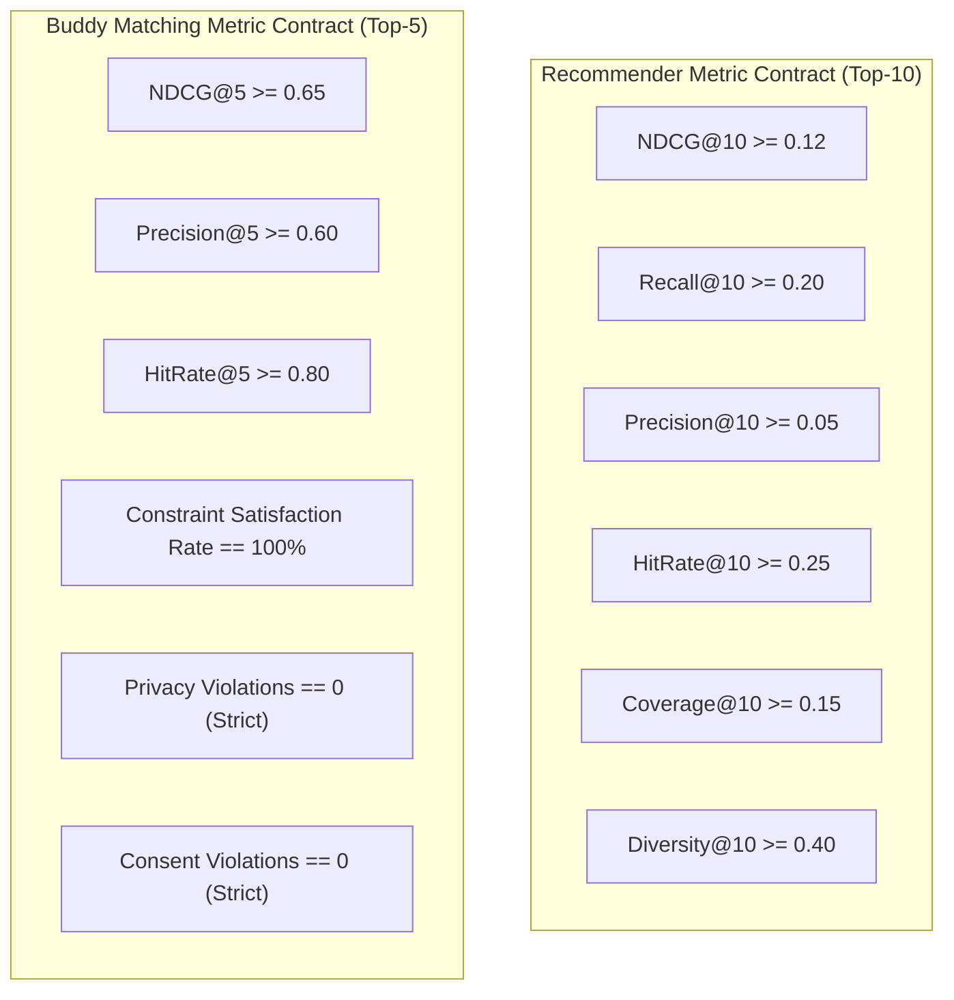

# GoMate Travel Preference Field Audit & Draft Metric Contract (V1)

**Document Version:** 1.0.0  
**Audit Snapshot Date:** 2026-10-07  
**Branch / Worktree:** `feature/data-foundation-w2`  
**Task Reference:** TASK DATA-01A (Preference Field Audit & Metric Contract Specification)  
**Governance Invariant:** Field proposal and metric contract only. Zero modifications to `schema.prisma`; zero changes to production applications.

---

## 1. Executive Summary

This document conducts an end-to-end audit of user travel preferences across the GoMate technology stack (Prisma schema, NestJS backend, Flutter mobile client, and Python AI service) and establishes a formal **Draft Metric Contract** for:
1. **Offline POI & Hotel Recommender Systems (Top-10 Protocol)**
2. **Traveler Buddy Matching Engine (Top-5 Privacy-Guarded Protocol)**

---

## 2. Preference Field Audit Across the System Stack

```mermaid
flowchart LR
    A["Flutter Mobile UI\n(travel_preferences chips)"] -->|HTTP PUT /users/me/preferences\n(Currently MISSING)| B["NestJS Backend API\n(users.service.ts)"]
    B -->|Prisma Client| C[("PostgreSQL\ntravel_preferences table")]
    C -->|Feature Extraction| D["AI Service / Recommender\n(loader.py & agent.py)"]
```

### 2.1. Current State vs. Gaps Summary

| Dimension | Prisma Schema (`schema.prisma`) | NestJS Backend (`apps/backend`) | Flutter Mobile (`apps/mobile`) | AI Service (`apps/ai-service`) | Production Status |
| :--- | :--- | :--- | :--- | :--- | :---: |
| **Travel Style** | `enum TravelStyle { BACKPACKER, BUDGET, COMFORT, LUXURY }` | Read in `findById`; DTO in `create-trip.dto.ts` | Enum in `trip_models.dart`; Read-only in profile | `travel_style: Optional[str]` in `TripContextRequest` | **READ-ONLY / NO UPDATE API** |
| **Pace** | **MISSING** (No column in schema) | **MISSING** | **MISSING** in profile (Ad-hoc days in trip form) | Implicit in `days` and `itinerary items` | **COMPLETELY ABSENT** |
| **Budget** | `budgetMin Int @default(0)`, `budgetMax Int @default(10000000)` (VND) | Read in `findById` | Input fields in trip form; Read-only in profile | `budget: Optional[int]`, `currency: "VND"` | **READ-ONLY / NO UPDATE API** |
| **Interests** | `interests String[] @default([])` | Read in `findById` | Static chips in profile view | `interests: List[str]` in planner request | **UNNORMALIZED FREE TEXT** |
| **Group Size** | `enum GroupSize { SOLO, COUPLE, SMALL_GROUP, LARGE_GROUP, FAMILY }` | Read in `findById` | Selectable in trip creation form | Inferred from trip context | **READ-ONLY / NO UPDATE API** |
| **Constraints** | `avoidances String[]`, `dietaryNeeds String[]` | Read in `findById` | Not exposed in profile view | Inferred in prompt notes | **PARTIAL & UNNORMALIZED** |

---

## 3. Proposed Representation & Normalization Mappings

### 3.1. Travel Style
- **Current Enum:** `BACKPACKER`, `BUDGET`, `COMFORT`, `LUXURY`
- **Semantic Specification:**
  - `BACKPACKER`: Focus on hostels, motorbikes/public transit, cultural immersion, low accommodation budget, high physical activity tolerance.
  - `BUDGET`: Cost-sensitive, 2-star hotels/homestays, street food, set daily spending limits.
  - `COMFORT`: Standard 3-star to 4-star hotels, balanced daily itinerary, taxis/ride-hailing, mixed dining.
  - `LUXURY`: 4-star to 5-star resorts, private transfers, fine dining, premium guided experiences.
- **Recommender Feature Encoding:** Ordinal scale $[0, 1, 2, 3]$ normalized to $[0.0, 1.0]$ or 4-dimensional one-hot vector.

### 3.2. Travel Pace
- **Current Status:** Absent from database schema.
- **Proposed Semantic Model:**
  - `RELAXED`: 2–3 POIs per day. Generous dwell times (2–3 hours per stop). Focus on leisure and cafes.
  - `MODERATE`: 4–5 POIs per day. Standard sightseeing pace with lunch and dinner stops.
  - `PACKED` (Fast): 6+ POIs per day. High density, quick photo check-ins, extensive coverage.
- **Interim Research Representation:** Stored in AI trip planner context as `daily_poi_target: int = 4` without requiring schema migrations in Week 2.

### 3.3. Budget Representation & Price Tier Normalization
- **Database Unit:** Integer VND (e.g., `10000000` = 10,000,000 VND).
- **Daily Budget Tiering (Per Traveler / Day):**
  - **Budget Tier ($< 500,000 \text{ VND}$):** Accommodations $< 300\text{k}$, food $< 150\text{k}$, attractions $< 50\text{k}$.
  - **Moderate Tier ($500,000 - 2,000,000 \text{ VND}$):** Accommodations $300\text{k}-1.2\text{M}$, food $150\text{k}-500\text{k}$, attractions $50\text{k}-300\text{k}$.
  - **Luxury Tier ($> 2,000,000 \text{ VND}$):** Accommodations $> 1.2\text{M}$, fine dining, premium entry passes.

### 3.4. Interests Normalization
To prevent free-text divergence, user interests will map onto the **Tier-1 / Tier-2 Candidate POI Taxonomy**:
```json
{
  "culture_history": ["museum_gallery", "historic_monument", "religious_temple"],
  "nature_outdoor": ["beach_coastal", "park_garden", "viewpoint_scenic"],
  "culinary_food": ["restaurant_dining", "street_food_market", "cafe_tea"],
  "entertainment_nightlife": ["theme_park_leisure", "nightlife_entertainment"],
  "shopping_local": ["traditional_market"]
}
```

### 3.5. Group Size
- `SOLO`: Core audience for traveler buddy matching; individual room or hostel bed.
- `COUPLE`: Private rooms, romantic venues, dual-occupancy pricing.
- `SMALL_GROUP` (3–5 people): Standard family room / taxi capacity; group table dining.
- `LARGE_GROUP` (6+ people): Requires advance reservations and charter transport.
- `FAMILY`: Hard constraint: child-friendly venues, stroller accessibility, low hazard.

### 3.6. Constraints & Safety Flags
- **Dietary:** `["vegetarian", "vegan", "halal", "gluten_free", "seafood_allergy"]`.
- **Mobility / Physical:** `["wheelchair_accessible", "elderly_friendly", "low_walking"]`.
- **Safety / Social:** `["female_only_group", "non_smoking", "no_alcohol"]`.

---

## 4. Draft Metric Contract

This contract defines the official evaluation metrics, mathematical formulations, and acceptance thresholds for graduation thesis experiments.



---

### 4.1. Recommender Metric Contract (Top-10 Protocol)

Evaluated on the official ViHoRec temporal test split and verified POI recommendation candidate set.

#### 1. NDCG@10 (Normalized Discounted Cumulative Gain at Rank 10)
- **Definition:** Measures ranking quality, penalizing relevant items placed lower in the top 10.
- **Formula:**
  $$\text{DCG@10} = \sum_{i=1}^{10} \frac{2^{r_i} - 1}{\log_2(i + 1)}, \quad \text{NDCG@10} = \frac{\text{DCG@10}}{\text{IDCG@10}}$$
  where $r_i \in \{0, 1\}$ indicates binary relevance.
- **Target Threshold:** $\text{NDCG@10} \ge 0.12$ (Baseline MostPop: $\sim 0.089$).

#### 2. Recall@10
- **Definition:** Fraction of ground-truth relevant items successfully retrieved in the top 10.
- **Formula:**
  $$\text{Recall@10} = \frac{|\text{Predicted}_{10} \cap \text{Actual}|}{|\text{Actual}|}$$
- **Target Threshold:** $\text{Recall@10} \ge 0.20$.

#### 3. Precision@10
- **Definition:** Fraction of recommended items in top 10 that are relevant.
- **Formula:**
  $$\text{Precision@10} = \frac{|\text{Predicted}_{10} \cap \text{Actual}|}{10}$$
- **Target Threshold:** $\text{Precision@10} \ge 0.05$.

#### 4. HitRate@10 (HR@10)
- **Definition:** Indicator of whether at least one relevant item appears in the top 10 recommendation list.
- **Formula:**
  $$\text{HR@10} = \begin{cases} 1 & \text{if } |\text{Predicted}_{10} \cap \text{Actual}| > 0 \\ 0 & \text{otherwise} \end{cases}$$
- **Target Threshold:** $\text{HR@10} \ge 0.25$.

#### 5. Coverage@10 (Catalog Coverage)
- **Definition:** Percentage of distinct items from the total catalog $\mathcal{I}$ recommended to at least one user across the test population $\mathcal{U}$.
- **Formula:**
  $$\text{Coverage@10} = \frac{\left| \bigcup_{u \in \mathcal{U}} \text{Predicted}_{10}(u) \right|}{|\mathcal{I}|}$$
- **Target Threshold:** $\text{Coverage@10} \ge 0.15$ (prevents severe popularity bias collapse).

#### 6. Diversity@10 (Intra-List Diversity)
- **Definition:** Average pairwise cosine or Jaccard distance between category/feature representations of recommended items.
- **Formula:**
  $$\text{Diversity@10}(u) = \frac{1}{\binom{10}{2}} \sum_{i < j} \left(1 - \text{sim}(\mathbf{v}_i, \mathbf{v}_j)\right)$$
- **Target Threshold:** $\text{Diversity@10} \ge 0.40$.

---

### 4.2. Traveler Buddy Matching Metric Contract (Top-5 Protocol)

Evaluated on candidate traveler compatibility pairs under strict privacy constraints.

#### 1. NDCG@5
- **Definition:** Ranking quality of the top 5 compatible traveler profiles.
- **Target Threshold:** $\text{NDCG@5} \ge 0.65$.

#### 2. Precision@5
- **Definition:** Percentage of top 5 recommended buddies who meet mutual destination, budget, and travel style compatibility.
- **Target Threshold:** $\text{Precision@5} \ge 0.60$.

#### 3. HitRate@5
- **Definition:** Probability that top 5 recommendations contain at least one mutually compatible companion.
- **Target Threshold:** $\text{HitRate@5} \ge 0.80$.

#### 4. Constraint Satisfaction Rate (CSR)
- **Definition:** Percentage of hard negative constraints (e.g., gender safety preferences, smoking/alcohol avoidances, overlapping travel dates) that are strictly honored.
- **Formula:**
  $$\text{CSR} = \frac{\text{Total Hard Constraints Satisfied}}{\text{Total Hard Constraints Evaluated}} \times 100\%$$
- **Target Threshold:** $\mathbf{100.0\%}$ (Zero tolerance for hard constraint violations).

#### 5. Privacy Violations Counter
- **Definition:** Total count of instances where private or identifiable user data (real name, phone, email, unmasked avatar, exact live GPS coordinates) is exposed to an unconsented user.
- **Formula:**
  $$\text{Privacy Violations} = \sum \text{Leaks}$$
- **Target Invariant:** $\mathbf{0}$ (Strict Zero Violation Gate).

#### 6. Consent Violations Counter
- **Definition:** Total count of match connections, direct chat sessions, or contact reveals established without double opt-in mutual consent (`MATCH_ACCEPTED` status).
- **Target Invariant:** $\mathbf{0}$ (Strict Zero Violation Gate).
