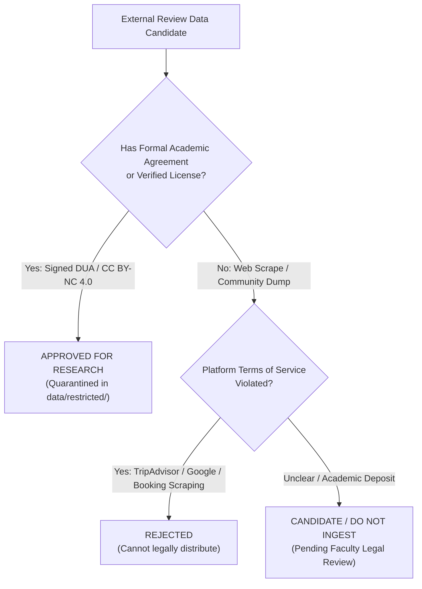
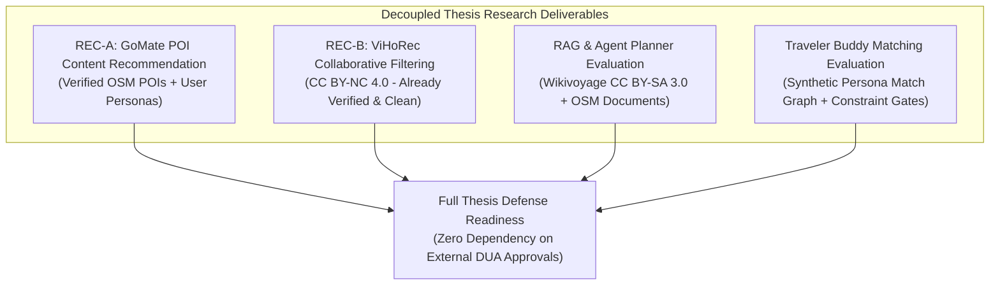

# GoMate Review Dataset Access & Clearance Strategy (V1)

**Document Version:** 1.0.0  
**Snapshot Date:** 2026-10-07  
**Branch / Worktree:** `feature/data-foundation-w2`  
**Task Reference:** TASK DATA-01B (Review Data Strategy & Governance)  
**Core Doctrine:** License labels on community mirrors do not prove upstream scraping rights. `UNKNOWN LICENSE => CANDIDATE / DO NOT INGEST`.

---

## 1. Executive Summary

This document establishes the official access acquisition protocol, legal review workflow, and risk mitigation strategy for external travel review datasets. 

Because commercial travel platforms (TripAdvisor, Booking.com, Foody, Google Maps) strictly prohibit unauthorized automated scraping, GoMate enforces a clear boundary between:
1. **Verified Academic Benchmarks** obtained through authorized Data User Agreements.
2. **Unverified Community Scrapes** which remain strictly quarantined.
3. **Decoupled Thesis Research Fallback** ensuring that academic milestones and thesis defense are never blocked by data acquisition delays.

---

## 2. Review Dataset Classification & Status Matrix

### 2.1. Status Breakdown

| Dataset Identifier | Domain | Sample Size | Legal / License Agreement | Current Status | Acquisition Action / Next Step |
| :--- | :--- | :--- | :--- | :---: | :--- |
| **VLSP 2018 ABSA (Hotel & Restaurant)** | Vietnamese Hotel & Dining Reviews | 5,600 reviews with 13 aspect categories | VLSP Data User Agreement (DUA) | `ACCESS_PENDING_DUA` | Human supervisor signs DUA form; submits to `vlsp.resources@gmail.com`. |
| **ViMACSA 2025** | Vietnamese Hotel Reviews + Photos | 4,876 text-image pairs (14,618 annotations) | Academic Research Agreement (UIT NLP Group) | `OPTIONAL_REQUEST_ACCESS` | Human researcher submits formal email to UIT NLP Group (`kietnv@uit.edu.vn`). |
| **visolex/VLSP2018-ABSA-Hotel** | Hugging Face Community Mirror | 5,600 reviews | Claimed Open / Unverified mirror | `CANDIDATE / DO NOT INGEST` | **DO NOT INGEST.** Unauthorized re-hosting that bypasses official VLSP DUA. |
| **CX Vietnamese Hotel Reviews** | Mendeley Data (DOI: 10.17632/dp8s59xnb7.1) | 20,551 hotel reviews | Deposited CC BY 4.0; Scraped from TripAdvisor | `CANDIDATE / DO NOT INGEST` | **DO NOT INGEST.** Upstream TripAdvisor ToS violation poses legal risk. |
| **TripAdvisor Scrape (`hienbm`)** | Unofficial GitHub Scrape | ~10,000 reviews | None / Unlicensed | `REJECTED` | Permanent rejection. Violation of TripAdvisor ToS Section 4. |
| **Google Maps Place Reviews** | Scraped Google Reviews | Varies | Proprietary / Google Terms | `REJECTED` | Permanent rejection under `GOOGLE_MAPS_DATASET_USE = EXCLUDED`. |

---

## 3. The Upstream Rights Doctrine

A foundational principle of GoMate data governance is:

> [!CAUTION]
> **A Creative Commons or Open Data label applied by a third-party uploader to a community mirror (e.g. Hugging Face, Kaggle, Mendeley Data) does NOT constitute proof of legitimate data rights.**

If the raw data was originally obtained by automated web scraping in violation of a website's published Terms of Service, the uploader lacked the legal authority to license that content under CC0 or CC BY. Ingesting such datasets into a graduation thesis repository creates copyright liability and violates university academic integrity guidelines.

---

## 4. Formal Access Procedure for VLSP 2018 ABSA

The Association for Vietnamese Language and Speech Processing (VLSP) provides the gold-standard Vietnamese Aspect-Based Sentiment Analysis benchmark:

1. **Document Preparation:** Download the official VLSP Data User Agreement form from [`https://vlsp.org.vn`](https://vlsp.org.vn/sites/default/files/DUA_VLSP2018.pdf).
2. **Signatures Required:** Must be signed by the human student researcher and the university faculty advisor / thesis supervisor.
3. **Submission:** Email scanned DUA PDF to `vlsp.resources@gmail.com` with subject:  
   `[VLSP 2018 DUA Request] WanderAI Research Project - University Graduation Thesis`.
4. **Storage Mandate:** Upon approval and receipt of data files (`vlsp2018_hotel_train.txt`, etc.), files must be placed in `data/restricted/vlsp2018/` and **never committed to Git**.

---

## 5. Thesis Defense Fallback Strategy (Decoupled Research Track)

To guarantee that the graduation thesis timeline is never delayed or jeopardized by third-party data access approvals:

- **Offline Recommender Baselines (REC-B):** The ViHoRec dataset (17,911 interactions, 560 hotels, 6,822 users) is already verified under CC BY-NC 4.0 and provides an uncontroversial benchmark for NDCG@10, Recall@10, and HitRate@10.
- **POI Recommender Baselines (REC-A):** Evaluates content-based ranking over real OSM POIs without requiring user review texts.
- **If VLSP DUA arrives:** Aspect sentiment modeling is integrated as an enrichment feature.
- **If VLSP DUA is delayed:** The thesis defense proceeds with 100% mathematical and empirical rigor on the core recommender, RAG, and matching contributions.
