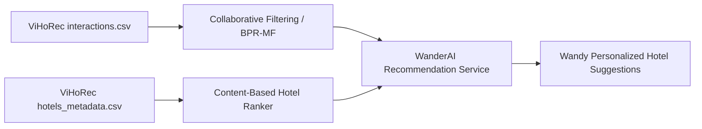

# ViHoRec — Recommendation & Cold-Start Benchmark Specification

**Dataset Name:** ViHoRec: A Quality-Controlled Vietnamese Hotel Recommendation Dataset and Cold-Start Benchmark  
**Author:** Minh Hoang Nguyen  
**Paper / Preprint:** arXiv:2607.12946 (arXiv preprint, 2024–2026)  
**Repository:** [`https://github.com/MinhNguyenDS/ViHoRec`](https://github.com/MinhNguyenDS/ViHoRec)  
**License:**
* **Dataset Artifacts:** Creative Commons Attribution-NonCommercial 4.0 International (**CC BY-NC 4.0**)
* **Benchmark & Pipeline Code:** **MIT License**
**Primary Architectural Role:** Collaborative Filtering, Item-Item / User-User Recommendation, Cold-Start Benchmarking  
**Strict Exclusion:** **NOT A REVIEW-TEXT / SENTIMENT DATASET**

---

## 1. Provenance & Artifact Inspection

ViHoRec was constructed through a reproducible multi-platform web crawling pipeline targeting three prominent Vietnamese Online Travel Agencies (OTAs):
1. **Booking.com (Vietnam)**
2. **Traveloka**
3. **iVIVU.com**

The data collection underwent cross-platform entity resolution (linking hotels across booking portals) and HMAC pseudonymization to protect reviewer privacy.

### Exact Released Statistics (Audited from Current Release on Master Branch)
* **Total Cleaned Interactions (`interactions.csv`):** 17,911 records (pre-cleaning: 18,267 raw events)
* **Unique Users:** 6,822 anonymized individuals
* **Unique Hotels:** 560 canonical hotels across Vietnam
* **Metadata Enriched Hotels (`hotels.csv`):** 560 hotels with name and location
* **Data Matrix Sparsity:** 99.53%
* **Cold-Start Characteristic:** 69.50% of users have recorded only a single interaction
* **Platform Distribution:** Booking.com (7,239), Traveloka (6,273), iVIVU (4,399)
* **Interaction Date Range:** 2011-10-15 to 2023-12-09
* **Official Benchmark Split:**
  - `train.csv`: 8,645 records
  - `val.csv`: 798 records
  - `test.csv`: 798 records (798 unique test users)

---

## 2. Released File Structure & Schema Analysis

The dataset is distributed as UTF-8 CSV files without natural-language review comments:

### 1. `interactions.csv` (Collaborative Filtering Log)
| Field | Type | Description | Sample Value |
| :--- | :--- | :--- | :--- |
| `user_id` | `VARCHAR(64)` | HMAC-SHA256 anonymized pseudonym | `a1b2c3d4e5...` |
| `hotel_id` | `VARCHAR(32)` | Canonical hotel identifier | `hotel_vn_00142` |
| `rating` | `FLOAT` | Numerical review score normalized to [1.0, 10.0] | `8.5` |
| `date` | `DATE` | Interaction / stay timestamp (2011–2023) | `2022-08-14` |
| `source` | `VARCHAR(20)` | OTA origin platform | `Traveloka` |

> [!IMPORTANT]
> `interactions.csv` contains **zero review sentences, aspect tags, or qualitative text**. It is an interaction/rating matrix designed for matrix factorization, neural collaborative filtering, and ranking models.

### 2. `hotels_metadata.csv` (Content-Based Metadata)
| Field | Type | Description |
| :--- | :--- | :--- |
| `hotel_id` | `VARCHAR(32)` | Canonical identifier matching `interactions.csv` |
| `hotel_name` | `VARCHAR(255)` | Verified hotel name |
| `city` | `VARCHAR(100)` | Province / City |
| `star_rating` | `FLOAT` | Star classification (1 to 5 stars) |
| `facilities` | `JSON / TEXT` | Semicolon-delimited facility tags (e.g., `wifi;pool;breakfast;spa;parking`) |
| `price_range` | `VARCHAR(20)` | Estimated price tier (Budget, Mid-range, Luxury) |

### 3. Benchmark Split
* **Temporal Evaluation:** ViHoRec includes a temporal "leave-last-one-out" evaluation split, ensuring that recommendation algorithms are tested on chronologically subsequent bookings without future-data leakage.

---

## 3. Dataset Roles in WanderAI Architecture

In WanderAI, ViHoRec is assigned exclusively to the **Recommendation Engine**:



### Prohibited Usages:
- **DO NOT** use ViHoRec for fine-tuning text sentiment classifiers (PhoBERT / ViDeBERTa).
- **DO NOT** use ViHoRec for aspect-category sentiment analysis (ABSA).
- **DO NOT** use ViHoRec for text review summarization.

---

## 4. Licensing & Usage Restrictions

1. **Academic Capstone Scope:**
   * Fully permitted under **CC BY-NC 4.0**.
   * WanderAI graduation project research, offline benchmarking, and thesis presentation satisfy non-commercial criteria.
2. **Commercial SaaS Deployment Scope:**
   * **PROHIBITED** without written permission from the author.
   * If WanderAI transitions to a commercial product, the recommendation model must be retrained on native WanderAI user interactions or licensed commercial datasets.
3. **Attribution Requirement:**
   * Any usage must cite the author:
     ```bibtex
     @article{nguyen2024vihorec,
       title={ViHoRec: A Quality-Controlled Vietnamese Hotel Recommendation Dataset and Cold-Start Benchmark},
       author={Nguyen, Minh Hoang},
       journal={arXiv preprint arXiv:2607.12946},
       year={2024}
     }
     ```

---

## 5. Storage & Reproducibility Policy

* ViHoRec CSV files are maintained in `data/restricted/vihorec/` under gitignore, with explicit checksum verification scripts.
* Code referencing ViHoRec lives in the recommendation experiment pipeline with reproducible train/test splits.
