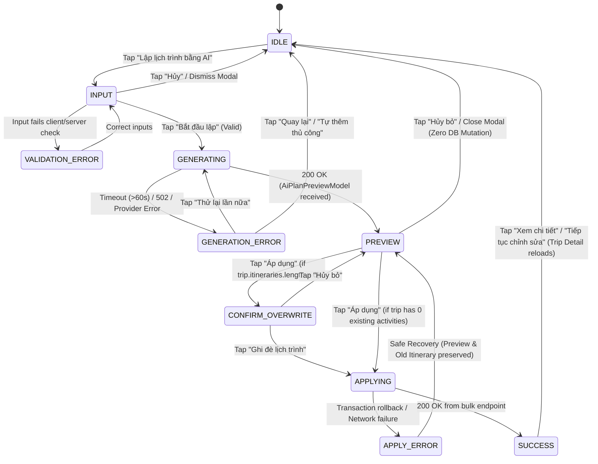

# GoMate AI Planner — UX & State Contract Specification V1

**Status:** APPROVED DESIGN & UX CONTRACT SPECIFICATION  
**Task:** TASK 08.2.3.6 — GOMATE AI PLANNER UX CONTRACT & STATE LOCK  
**Module:** Trip Management (`/trips`) & AI Planning Copilot (`/trips/:id/ai-plan`)  
**Target Viewports:** Mobile ($390 \times 844$), Desktop ($1440 \times 900$)  
**Source of Truth:** 
- Mobile: `apps/mobile/lib/features/trips/`
- Backend: `apps/backend/src/modules/trips/`, `apps/backend/src/modules/ai-proxy/`
- AI Service: `apps/ai-service/app/routers/planner.py`, `apps/ai-service/app/schemas/planner.py`
- Test Baselines: `planner.e2e-spec.ts` (NestJS), `test_planner.py` & `test_planner_failures.py` (FastAPI), `trip_test.dart` (Flutter)
- Visual Artifacts: `docs/audit/evidence/ui-08.2.3.5/trip-mobile-ai-*.png`, `trip-desktop-ai-preview.png`

---

## 1. Product Role & Architectural Boundary

The **GoMate AI Planner** is an in-trip intelligent scheduling accelerator powered by Gemini and structured itinerary heuristics. It assists travelers by translating high-level trip parameters (destination, duration, budget, travel style, and custom notes) into an organized, chronological, multi-day itinerary.

### 1.1. Core Invariants (Non-Negotiable)
1. **Preview Mutation Invariant:** Invoking `POST /trips/:id/ai-plan` produces a purely in-memory preview model. **It NEVER writes to the database, deletes existing activities, alters trip status, or mutates any server-side state.**
2. **Deterministic Arithmetic Invariant:** All cost calculations (day totals, total estimated cost, budget variance, and over-budget flags) are computed deterministically by backend and service code. The LLM is never trusted for financial arithmetic.
3. **Existing Itinerary Protection Invariant:** If a trip already contains scheduled activities, applying an AI plan requires explicit user confirmation via an overwrite warning dialog before issuing `POST /trips/:id/itinerary/bulk` with `replaceExisting: true`.
4. **Data Honesty & Provenance Invariant:** The AI Planner provides textual activity suggestions and place references. It does not invent canonical `placeId`s or fabricate ratings, opening hours, or official review scores unless backed by verified database records.
5. **No Fake Progress Metrics:** UI generation feedback relies on honest elapsed time cues, dynamic phase descriptions, and indeterminate progress indicators. Arbitrary pseudo-percentages (e.g., "67%") are strictly banned.

---

## 2. Current Capability Matrix

| Capability Area | Backend NestJS | Flutter Client | FastAPI AI Service | Design State | Capability Status | Verification Evidence |
| :--- | :---: | :---: | :---: | :---: | :---: | :--- |
| **Planner Entry** | `GET /trips/:id` | `trip_detail_screen.dart` | N/A | `trip-mobile-detail-empty-r1.png` | **CURRENT** | Dual CTA buttons on empty trip detail and header action. |
| **Trip Context Pass** | `trips.service.ts` | `trips_client.dart` | `schemas/planner.py` | `trip-mobile-ai-entry.png` | **CURRENT** | Passes `tripId`, `destination`, `days`, `budget`, `currency`, `travelStyle`, `interests`. |
| **Additional Prompt** | `PlanTripDto` | `noteController` | `TripContextRequest.notes` | `trip-mobile-ai-entry.png` | **CURRENT** | User enters optional prompt ("Tập trung quán ăn vặt..."). |
| **Preferred Pace** | `PlanTripDto.preferredPace` | Missing in dialog | Missing in prompt | `trip-mobile-ai-entry.png` | **PARTIAL / TARGET** | In DTO; client dialog currently provides prompt text input; choice chips are design target. |
| **Generation Liveness** | 60s timeout proxy | 75s Dio timeout | Generates JSON | `trip-mobile-ai-generating.png` | **CURRENT** | Live elapsed timer, indeterminate spinner, phase cues. Zero fake percentage. |
| **AI Plan Preview** | `POST /trips/:id/ai-plan` | `_showAiPlanPreviewModal` | `PlanResponse` | `trip-mobile-ai-preview.png` | **CURRENT** | **Zero DB writes verified** by `planner.e2e-spec.ts`. |
| **Budget Verification** | Deterministic code | Client display | Deterministic code | `trip-mobile-ai-preview.png` | **CURRENT** | Exact subtraction: `variance = totalBudget - estimatedCost`. |
| **Overwrite Warning** | `replaceExisting` param | Client itinerary check | N/A | `trip-mobile-ai-overwrite.png` | **CURRENT** | Dialog displayed if `trip.itineraries.length > 0`. |
| **Atomic Bulk Apply** | `POST /trips/:id/itinerary/bulk` | `saveAiPlan` notifier | N/A | `trip-mobile-ai-preview.png` | **CURRENT** | **Prisma `$transaction` verified** in `trips.service.ts`. |
| **Apply Success** | Updates status to `PLANNED` | SnackBar + reloads trip | N/A | `trip-mobile-ai-success.png` | **CURRENT** | Itinerary reloads, trip `isAiGenerated = true`. |
| **Apply Error** | HTTP Exception filter | SnackBar + preserves preview | N/A | Client error handling | **CURRENT** | Preview stays intact on failure; old itinerary untouched. |
| **Generation Error** | Controlled 502/503 | SnackBar + retry | Controlled 502 | `trip-mobile-ai-error.png` | **CURRENT** | No raw stack traces or API keys leaked to user. |
| **Wandy Chat Bridge** | Independent | Independent | Independent | `docs/design/` | **FUTURE** | Conversational chat does not yet mutate active trip directly. |
| **Autonomous Mutation**| Forbidden | Forbidden | Forbidden | Non-agentic | **FORBIDDEN BY CONTRACT**| All mutations require explicit human review and apply action. |

---

## 3. Exact API Contracts

### 3.1. Generate AI Plan Preview (`POST /trips/:id/ai-plan`)
- **Route:** `POST /trips/:id/ai-plan`
- **Authentication:** Bearer JWT (Required). User must be trip owner or member (401/403 enforced).
- **HTTP Code:** `200 OK` / `201 Created`
- **Timeout:** 
  - FastAPI AI Service: `PLANNER_TIMEOUT_MS` (default 45,000 ms)
  - NestJS `AiProxyService`: 60,000 ms
  - Flutter Client Dio: 75,000 ms

#### Request Payload (`PlanTripDto`)
```json
{
  "additionalPrompt": "Tập trung quán ăn vặt, bãi biển và các điểm check-in đẹp",
  "preferredPace": "relaxed"
}
```
*Note: Both fields are optional. If omitted, the AI Planner plans based strictly on the stored Trip Context.*

#### Internal TripContext Extracted from Database
```json
{
  "tripId": "b182cb62-97b5-4a64-b677-4b96b010f3c6",
  "destination": "Đà Nẵng",
  "days": 4,
  "startDate": "2026-10-15",
  "endDate": "2026-10-18",
  "budget": 8000000,
  "currency": "VND",
  "travelStyle": "comfort",
  "interests": ["beach", "food"],
  "notes": "Tập trung các quán hải sản ngon rẻ và ngắm hoàng hôn Sơn Trà"
}
```

#### Response Structure (`AiPlanPreviewModel`)
```json
{
  "success": true,
  "data": {
    "tripId": "b182cb62-97b5-4a64-b677-4b96b010f3c6",
    "destination": "Đà Nẵng",
    "totalDays": 4,
    "overview": "Hành trình 4 ngày tại Đà Nẵng kết hợp ẩm thực đặc sản, nghỉ ngơi tại bãi biển Mỹ Khê và khám phá danh thắng Bán đảo Sơn Trà.",
    "bestTimeToVisit": "Tháng 3 đến tháng 8",
    "generalTips": [
      "Nên thuê xe máy để di chuyển thuận tiện giữa các điểm",
      "Đặt trước bàn tại các quán hải sản ven biển"
    ],
    "budgetAnalysis": {
      "totalBudget": 8000000,
      "estimatedCost": 6450000,
      "currency": "VND",
      "isOverBudget": false,
      "variance": 1550000
    },
    "days": [
      {
        "dayNumber": 1,
        "date": "2026-10-15",
        "title": "Ngày 1: Biển Mỹ Khê & Sơn Trà",
        "dayCost": 850000,
        "items": [
          {
            "orderIndex": 1,
            "startTime": "08:00",
            "endTime": "09:30",
            "activity": "Ăn sáng mì Quảng ếch Bếp Trang",
            "placeName": "Mì Quảng Bếp Trang",
            "notes": "Món ăn đặc sản địa phương",
            "estimatedCost": 55000,
            "transportMode": "motorbike"
          }
        ]
      }
    ]
  }
}
```

---

### 3.2. Atomic Bulk Save Itinerary (`POST /trips/:id/itinerary/bulk`)
- **Route:** `POST /trips/:id/itinerary/bulk`
- **Authentication:** Bearer JWT (Required). User must be trip owner (403 if non-owner member attempts bulk save).
- **Execution Invariant:** Must execute inside an ACID transaction (`prisma.$transaction`).

#### Request Payload (`BulkItineraryDto`)
```json
{
  "replaceExisting": true,
  "days": [
    {
      "dayNumber": 1,
      "date": "2026-10-15",
      "title": "Ngày 1: Biển Mỹ Khê & Sơn Trà",
      "items": [
        {
          "orderIndex": 1,
          "activity": "Ăn sáng mì Quảng ếch Bếp Trang",
          "startTime": "08:00",
          "endTime": "09:30",
          "placeId": null,
          "notes": "Món ăn đặc sản địa phương (Mì Quảng Bếp Trang)",
          "estimatedCost": 55000,
          "transportMode": "motorbike"
        }
      ]
    }
  ]
}
```

#### Transaction Behavior:
1. Validates trip ownership.
2. If `replaceExisting !== false`:
   - `DELETE FROM "ItineraryItem" WHERE "itineraryId" IN (SELECT "id" FROM "Itinerary" WHERE "tripId" = :id)`
   - `DELETE FROM "Itinerary" WHERE "tripId" = :id`
3. Loops through `days`, upserts `Itinerary` records (`tripId_dayNumber`).
4. Loops through `items`, inserts `ItineraryItem` records.
5. Updates `Trip`: `isAiGenerated = true`, `status = 'PLANNED'`.
6. Returns refreshed `TripModel` with full child hierarchy.

---

## 4. AI Planner State Machine



---

## 5. Detailed State Specifications

### State 01: INPUT (Parameter Configuration)
- **Component:** `trip-mobile-ai-entry.png` (Modal Sheet / Dialog).
- **Authoritative Trip Context (Pre-populated from Trip):**
  - Destination name & duration (e.g., `Đà Nẵng 4N3Đ`).
  - Budget & Currency (e.g., `8.000.000 VND`).
  - Travel style & existing preferences.
- **Editable User Inputs:**
  - `additionalPrompt`: Free text notes (`"Tập trung các quán hải sản ngon rẻ và ngắm hoàng hôn Sơn Trà"`).
  - `preferredPace` *(Design Target / Supported in DTO)*: Choice chips (`Thư thả`, `Vừa phải`, `Khám phá nhanh`).
  - `interests` *(Design Target / Contextual)*: Filter chips (`Ẩm thực`, `Bãi biển`, `Văn hóa`, `Nghỉ dưỡng`, `Chụp ảnh`).
- **Validation Rules:**
  - `destination`: Required. If missing in trip, rejects with `"Chuyến đi cần có tên hoặc điểm đến để lập lịch trình"`.
  - `days`: Must be between 1 and 14 days. If `days > 14`, backend clamps to 14.
  - `budget`: Optional integer $\ge 0$.
- **Primary CTA:** Strictly **"Bắt đầu lập"** or **"Bắt đầu lập lịch trình"**.

---

### State 02: GENERATING (AI Computation & Liveness)
- **Component:** `trip-mobile-ai-generating.png`.
- **UX & Liveness Rules:**
  - **No Fake Percentages:** Banned: "30%", "65%", "92%".
  - **Indeterminate Spinner:** Centered circular pulse/spinner.
  - **Live Elapsed Time Feedback:** Shows honest runtime timer (`14s...`).
  - **Sequential Phase Cues:**
    1. `✓ Phân tích thông tin chuyến đi`
    2. `✓ Tìm địa điểm phù hợp tại [Điểm đến]`
    3. `• Sắp xếp tuyến đường & tối ưu thời gian...`
    4. `○ Cân đối ngân sách dự kiến`
  - **Timing Benchmarks:**
    - $0 - 15\text{s}$: Normal generation phase.
    - $15 - 45\text{s}$: Secondary reassuring phase cue: `"Wandy đang tối ưu lịch trình chi tiết..."`.
    - $> 60\text{s}$: Timeout trigger. Displays generation failure notice.

---

### State 03: PREVIEW (Non-Destructive Review)
- **Component:** `trip-mobile-ai-preview.png`, `trip-desktop-ai-preview.png`.
- **CRITICAL INVARIANT:** **Database is 100% untouched.** No records are written or deleted.
- **Information Hierarchy (Top to Bottom):**
  1. **Preview Banner:** Warning pill: `BẢN XEM TRƯỚC (CHƯA LƯU VÀO CHUYẾN ĐI)`.
  2. **Trip Summary Hero:** Title, destination, duration, AI overview text.
  3. **Deterministic Budget Gauge:**
     - Total Budget vs Estimated Cost.
     - Categorical Status Pill: `Trong hạn mức` (Green `#10B981`), `Cận hạn mức` (Amber `#F59E0B`), `Vượt ngân sách` (Red `#EF4444`).
     - Variance text (`Dư 1.550.000 đ` or `Vượt 450.000 đ`).
  4. **Day-by-Day Timeline Accordion / List:**
     - Day title and calculated day cost.
     - Ordered activity items: sequence number, time, activity name, place reference, cost, transport mode, and tips.
  5. **Actions Footer:**
     - Secondary: "Hủy bỏ" (Dismisses sheet, discards in-memory plan).
     - Primary: "Áp dụng lịch trình này" (Teal `#0F766E`).

---

### State 04: OVERWRITE CONFIRMATION (Itinerary Protection)
- **Component:** `trip-mobile-ai-overwrite.png`.
- **Trigger Rule:** Evaluated on client before issuing bulk save. If `trip.itineraries.isNotEmpty` and contains $\ge 1$ activity.
- **Dialog Specification:**
  - Header: Warning icon (Amber `#D97706`) + `"Ghi đè lịch trình hiện tại?"`.
  - Body: `"Chuyến đi này đã có N hoạt động. Áp dụng lịch trình mới từ AI sẽ thay thế toàn bộ danh sách cũ bằng lịch trình mới tối ưu."`.
  - Secondary Action: "Hủy bỏ" (Returns to Preview screen with preview intact).
  - Destructive Action: "Ghi đè lịch trình" (Triggers `POST /trips/:id/itinerary/bulk` with `replaceExisting: true`).

---

### State 05: APPLYING & SUCCESS / FAILURE
- **Applying State:**
  - Disables CTA buttons and displays inline spinner to prevent duplicate submissions.
  - Keeps preview in memory during the network round-trip.
- **Success State (`trip-mobile-ai-success.png`):**
  - Trigger: HTTP 200/201 from bulk endpoint.
  - UI: Success checkmark + `"Đã cập nhật lịch trình!"`.
  - Subtitle: `"Lịch trình N ngày tại [Điểm đến] đã được lưu đồng bộ vào tài khoản của bạn và sẵn sàng khởi hành."`.
  - Actions: `"Xem chi tiết lịch trình"` (Closes modal, navigates to Trip Detail screen with refreshed itinerary).
- **Apply Failure Handling:**
  - **No Fake Success:** Displays SnackBar/Modal: `"Không thể lưu lịch trình. Lịch trình hiện tại của bạn chưa bị thay đổi."`.
  - **Safety Preservation:** The in-memory preview is retained so the user does not lose their generated plan. They can retry saving.

---

## 6. Budget Evaluation Rules

| Budget Scenario | Calculation Condition | Status Token | Visual Badge | UI Card Border |
| :--- | :--- | :---: | :---: | :---: |
| **Within Budget** | $\text{estimatedCost} \le 0.85 \times \text{totalBudget}$ | `budgetSafe` | `✓ Trong hạn mức` (`#10B981`) | Teal `#0F766E` |
| **Near Limit** | $0.85 \times \text{totalBudget} < \text{estimatedCost} \le \text{totalBudget}$ | `budgetWarning` | `⚠ Cận hạn mức (92%)` (`#D97706`) | Amber `#F59E0B` |
| **Over Budget** | $\text{estimatedCost} > \text{totalBudget}$ | `budgetDanger` | `⚠ Vượt ngân sách (+X đ)` (`#DC2626`) | Crimson `#EF4444` |
| **No Budget Defined** | $\text{totalBudget} = \text{null}$ or $0$ | `neutral` | `Dự toán: X đ` (`#64748B`) | Slate `#E2E8F0` |

*No Fake Cost Rule: If an activity item does not incur a monetary cost (e.g., visiting a public beach or temple with free admission), cost is strictly displayed as `0 đ (Miễn phí)` rather than an estimated guess.*

---

## 7. Place & Source Honesty

1. **Plain Text Activity vs Canonical Place:**
   - The AI Planner operates via generative synthesis and heuristic place lookup. Output items provide `activity` and `placeName` strings.
   - It does **NOT** synthesize false `placeId` UUIDs. `placeId` is set to `null` unless the backend entity resolution pipeline explicitly resolves and links a canonical OSM record.
2. **Attribution & Review Score Integrity:**
   - AI Planner timeline items do not show synthetic star ratings (e.g., `★ 4.8`) or fabricated review counts.
   - Opening hours are displayed only when explicitly confirmed in source documents; otherwise labeled as suggestions.

---

## 8. Wandy Chat & Agent Boundaries

```
============================================================
ARCHITECTURAL SEPARATION OF CONCERNS
============================================================

1. TRIP AI PLANNER (Current Module):
   - Scope: Focused on chronological multi-day itinerary construction.
   - Invocation: Explicit user action from Trip Detail screen.
   - Mutability: Strictly gated by user preview and explicit Apply action.
   - Autonomous execution: NONE.

2. WANDY AI COPILOT CHAT (Tab 3):
   - Scope: Conversational question-answering, destination advice, travel tips.
   - Context: Currently operates in session-based memory with RAG over OSM.
   - Trip Linking: Phase 2 will accept active `tripId` as context.
   - Direct mutation: BANNED. Wandy Chat will suggest additions, but the user
     must confirm any addition to a trip.

3. AUTONOMOUS AGENT CAPABILITIES (Future Roadmap):
   - Any future autonomous agent (auto-booking, auto-replanning upon weather alerts)
     must adhere to the "Propose -> User Review -> Commit" lifecycle.
============================================================
```

---

## 9. Back Navigation & Cancellation Rules

| Current State | Back / Cancel Action | System Behavior |
| :--- | :--- | :--- |
| **INPUT** | Tap "Hủy" / Dismiss modal | Modal closes. Returns to Trip Detail. Zero changes. |
| **GENERATING** | Tap Back / System Back | Aborts client listener. In-flight request terminates or discards response. Returns to Trip Detail. |
| **PREVIEW** | Tap "Hủy bỏ" / Top close icon | Modal closes. In-memory preview discarded. Database remains untouched. |
| **OVERWRITE DIALOG**| Tap "Hủy bỏ" | Warning dialog closes. Returns to Preview modal. |
| **APPLYING** | Back disabled | Navigation guarded/disabled during bulk transaction to avoid partial writes. |
| **SUCCESS** | Tap "Xem chi tiết" | Navigates to Trip Detail, triggering reload of itineraries. |

---

## 10. Multi-Platform & Accessibility Contract

- **Touch Targets:** All clickable interactive buttons (`Bắt đầu lập`, `Hủy bỏ`, `Áp dụng`, choice chips) have minimum touch target dimensions $\ge 44 \times 44\text{ dp}$.
- **Screen Reader Announcements:** The generating state provides semantic `Semantics(liveRegion: true)` announcing phase transitions to assistive tech.
- **Color Independence:** Over-budget and warning indicators always combine color with an explicit semantic icon (`Icons.warning_amber`, `Icons.check`) and descriptive text.
- **Desktop Parity ($1440 \times 900$):** `trip-desktop-ai-preview.png` utilizes a 2-column layout (left metadata summary + right detailed timeline) but enforces 100% identical business rules, validation, and invariants as mobile.
