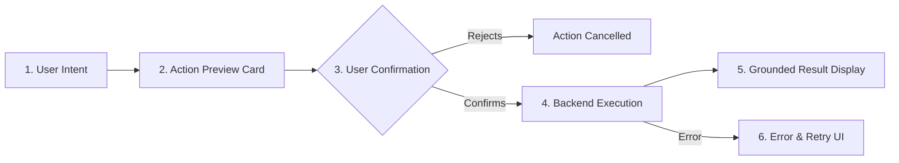

# GoMate Global Design Master Specification V1
## Unified System Architecture, Cross-Module UX Contracts & Master Design Lock

- **Document Reference:** `docs/design/gomate-global-design-master-v1.md`
- **Scope:** Complete GoMate Cross-Module Design Architecture (Modules 1 to 14)
- **Status:** **DESIGN LOCKED (V1 Master Specification)**
- **Audit Reference:** `TASK 08.2.4`
- **Applicable Platforms:** Flutter Mobile ($390 \times 844$), Web / Desktop Responsive ($1440 \times 900$)

---

## 1. Executive Summary & Master Design Philosophy

GoMate is an intelligent, honest, and community-centric travel copilot designed for explorers in Vietnam. Following the completion of the individual module specifications (`TASK 08.2.3.1` through `TASK 08.2.3.17-R2.2`), this document serves as the **supreme global design authority**. It locks all user flows, navigation models, component systems, privacy constraints, and AI boundaries across the entire application shell.

### 1.1. Core Architectural Pillars

1. **Absolute Data Honesty (Zero Fabrication):**
   - The system shall never fabricate ratings, review counts, street addresses, opening hours, pricing, emergency numbers, or user presence.
   - Missing data must always be rendered in an honest neutral state (e.g., *"Chưa có đánh giá"*, *"Chưa có thông tin địa chỉ"*).
   - Provenance transparency: Sourced data (e.g., OpenStreetMap, Wikivoyage) must be attributed, and source verification must never be falsely presented as "ground-truth field verification".
2. **Two-Tier Capability Governance:**
   - **Tier 1 (Current Runtime Baseline):** Strictly reflects verified operational code in the repository.
   - **Tier 2 (Complete Product Target):** Specifies the mandatory production target required for public launch without claiming un-implemented features as running.
3. **Six-State Classification Vocabulary:**
   - `CURRENT`: Verified operational code exists in repository runtime.
   - `PARTIAL`: Incomplete implementation exists (e.g., backend exists, mobile UI missing).
   - `MISSING`: Zero implementation exists in current repository runtime.
   - `PRODUCT TARGET`: Mandatory requirement for production release.
   - `FUTURE`: Explicitly deferred post-MVP launch.
   - `EXCLUDED`: Intentionally omitted from current GoMate scope.
4. **Guarded AI / Agent Autonomy:**
   - Wandy AI Copilot is an advisory assistant, not an autonomous agent.
   - All side-effecting operations (modifying trips, creating reminders, sending buddy requests, mutating expenses, initiating emergency calls) must follow the **Intent $\rightarrow$ Preview $\rightarrow$ Explicit Confirmation $\rightarrow$ Execution $\rightarrow$ Result** pipeline.
   - Emergency calling is strictly non-autonomous: it requires manual user confirmation and dispatches the native device dialer (`tel:`).
5. **Privacy by Design & Explicit Consent:**
   - Sensitive user information (phone number, precise location, travel preferences) is private by default.
   - Social matching and group membership require double opt-in mutual consent.
   - Geolocation is strictly foreground-only on user request; live continuous tracking is prohibited.

---

## 2. Global Navigation Contract

GoMate enforces a unified, persistent navigation model across both Mobile and Desktop viewports.

### 2.1. Canonical Navigation Shell

```
┌────────────────────────────────────────────────────────────────────────┐
│                        CANONICAL 5-DESTINATION SHELL                   │
├───────────┬──────────────┬──────────────┬──────────────┬───────────────┤
│ Tab 0     │ Tab 1        │ Tab 2        │ Tab 3        │ Tab 4         │
│ Khám phá  │ Bản đồ       │ Wandy AI     │ Chuyến đi    │ An toàn       │
│ (Explore) │ (Map/Places) │ (AI Copilot) │ (Trips)      │ (Safety)      │
├───────────┼──────────────┼──────────────┼──────────────┼───────────────┤
│ Hero,     │ POI Map,     │ Conversat.   │ Trip list,   │ Hotlines,     │
│ Copilot,  │ Categories,  │ grounding,   │ Itinerary,   │ SOS dialer,   │
│ Featured  │ Preview sheet│ Sources,     │ AI Planner,  │ Legal basis,  │
│ Destin.   │ Geolocation  │ Context CTAs │ Expenses     │ Da Nang *8899 │
└───────────┴──────────────┴──────────────┴──────────────┴───────────────┘
```

- **Mobile ($390 \times 844$):** Persistent `NavigationBar` at bottom with 5 tabs. Icon + label format. Height $64\text{px}$, active indicator color `#CCFBF1` (Teal-100), active icon color `#0F766E` (Teal-700).
- **Desktop ($1440 \times 900$):** Persistent left-hand sidebar navigation ($260\text{px}$ width) displaying the exact same 5 primary destinations, maintaining identical taxonomy. A secondary bottom utility area hosts `Cài đặt` (Settings) and user profile summary.

### 2.2. Route Hierarchy & Modal vs. Push Invariants

| Route Path | Type | Destination / Function | Navigation Behavior |
| :--- | :---: | :--- | :--- |
| `/` or `/home` | Shell Tab | Home / Khám phá | Root tab 0; back exits app or returns to Home. |
| `/map` | Shell Tab | Bản đồ & Địa điểm | Root tab 1; maintains pan/zoom & selected filters. |
| `/wandy` | Shell Tab | Wandy AI Copilot | Root tab 2; preserves conversation history in session. |
| `/trips` | Shell Tab | Quản lý Chuyến đi | Root tab 3; lists user trips. |
| `/safety` | Shell Tab | An toàn & Khẩn cấp | Root tab 4; offline directory & emergency dialer. |
| `/places/:id` | Push Screen | Place Detail | Stack push from Discover, Map, or Wandy; AppBar back arrow returns to caller with state intact. |
| `/trips/:id` | Push Screen | Trip Detail | Stack push from `/trips`; contains Itinerary, AI Planner trigger, Expenses. |
| `/trips/:id/plan-preview` | Modal Sheet | AI Planner Preview | Bottom sheet overlay; explicitly requires Confirm / Apply before mutating trip. |
| `/buddies` | Push Screen | Buddy Discovery | Stack push from Home or Trips; grid of compatible travelers. |
| `/buddies/:id` | Push Screen | Buddy Profile | Stack push from Buddy Discovery; displays shared travel style and Match CTA. |
| `/groups/:id` | Push Screen | Group Space | Stack push from Trips or Buddy Match; tabs for Chat, Shared Plan, Shared Expenses. |
| `/profile` | Push Screen | User Profile & Settings | Stack push from Home AppBar avatar; manages preferences and security. |
| `/login` | Full Modal | Authentication Login | Replaces stack if unauthenticated; redirects back to intended route on success. |
| `/register` | Full Modal | Account Registration | Sub-route of auth stack; includes email verification prompt. |
| `/forgot-password` | Full Modal | Password Recovery | Independent recovery stack; anti-enumeration confirmation. |

### 2.3. State & Context Preservation Invariants
1. **Tab Switching Preserves Context:** Navigating between the 5 primary tabs must not discard form input, scroll position, or map camera coordinates.
2. **Back Navigation Predictability:**
   - Tapping the AppBar back button on a pushed screen (`/places/:id`, `/trips/:id`) returns strictly to the preceding screen in the navigation stack.
   - Returning from Place Detail to Map strictly preserves the selected category chip, place marker count, user location dot, and camera viewport.
3. **Session Expiry Redirect:** When a 401 error cannot be resolved via silent refresh, the user is presented with a non-destructive re-login modal. Upon successful re-authentication, the user remains on their current screen without data loss.

---

## 3. Global Design System Invariants

All screens must strictly adhere to the GoMate Design System tokens.

### 3.1. Color Palette & Semantic Roles
- **Primary Brand (Teal):**
  - Dark/Accent: `#042F2E` (Teal-950), `#0F766E` (Teal-700)
  - Surface/Container: `#CCFBF1` (Teal-100), `#F0FDFA` (Teal-50)
- **Neutrals (Slate):**
  - Text Primary: `#0F172A` (Slate-900)
  - Text Secondary: `#475569` (Slate-600)
  - Text Muted: `#94A3B8` (Slate-400)
  - Card Border / Divider: `#E2E8F0` (Slate-200), `#CBD5E1` (Slate-300)
  - Background Surface: `#F8FAFC` (Slate-50), `#FFFFFF` (White)
- **Status & Alerts:**
  - Success: `#15803D` (Green-700), Container: `#DCFCE7` (Green-100)
  - Warning: `#B45309` (Amber-700), Container: `#FEF3C7` (Amber-100)
  - Error / SOS: `#DC2626` (Red-600), `#991B1B` (Red-800), Container: `#FEE2E2` (Red-100)
  - Info / Geolocation: `#0284C7` (Sky-600), Container: `#E0F2FE` (Sky-100)

### 3.2. Typography Hierarchy
- **Font Family:** `-apple-system, BlinkMacSystemFont, 'Segoe UI', Roboto, Helvetica, Arial, sans-serif`
- **Headings:**
  - Screen Titles (AppBar): $17\text{px}$, Weight 700 (Semi-bold / Bold)
  - Section Titles: $16\text{px}$ – $18\text{px}$, Weight 700
  - Card Titles: $15\text{px}$ – $16\text{px}$, Weight 600
- **Body & Controls:**
  - Body Regular: $13.5\text{px}$ – $14\text{px}$, Line height 1.45 – 1.5
  - Captions / Metadata: $11.5\text{px}$ – $12\text{px}$, Line height 1.4
  - Form Labels: $12.5\text{px}$, Weight 600, Color `#334155`
  - Button Text: $14\text{px}$ – $14.5\text{px}$, Weight 600

### 3.3. Component Invariants & The "Single Primary CTA" Rule
1. **Single Primary CTA Invariant:**
   - Every screen or modal sheet must provide **exactly one** visually dominant Primary Action button (`#0F766E` filled background, white text, $44\text{px}$ – $48\text{px}$ height, $10\text{px}$ border radius).
   - Secondary actions must use outlined surfaces (`border: 1px solid #CBD5E1`, background white) or text buttons.
   - Destructive actions (e.g., delete trip, cancel match) must use red outlines or red text with an explicit confirmation dialog before execution.
2. **Card Standards:**
   - Border radius: $12\text{px}$ or $16\text{px}$.
   - Surface: White `#FFFFFF`, border: $1\text{px}$ solid `#E2E8F0`, subtle shadow: `0 2px 8px rgba(0,0,0,0.04)`.
   - Internal padding: $14\text{px}$ – $18\text{px}$.
3. **Form Fields:**
   - Height: $44\text{px}$ – $46\text{px}$, border: $1\text{px}$ solid `#CBD5E1`, radius: $10\text{px}$.
   - Focus ring: $2\text{px}$ glow with `rgba(15,118,110,0.15)` and border color `#0F766E`.
   - Password fields must provide an interactive visibility toggle icon.

---

## 4. Data Honesty & Provenance Invariants

GoMate enforces strict anti-hallucination and truthfulness standards across all data representations:

```
┌────────────────────────────────────────────────────────────────────────┐
│                      DATA HONESTY AUDIT INVARIANTS                     │
├──────────────────────────┬─────────────────────────────────────────────┤
│ Dimension                │ Strict System Requirement                   │
├──────────────────────────┼─────────────────────────────────────────────┤
│ Ratings & Reviews        │ If rating is absent in DB:                  │
│                          │ Display "Chưa có đánh giá" (NO fake 4.8★).  │
├──────────────────────────┼─────────────────────────────────────────────┤
│ Addresses                │ If street address is absent in OSM:         │
│                          │ Display "Chưa có thông tin địa chỉ."        │
├──────────────────────────┼─────────────────────────────────────────────┤
│ Opening Hours            │ If hours are absent:                        │
│                          │ Display "Chưa có thông tin giờ mở cửa."     │
├──────────────────────────┼─────────────────────────────────────────────┤
│ Contact Info             │ Phone/Website sections are completely       │
│                          │ hidden if null; no placeholder "+84...".    │
├──────────────────────────┼─────────────────────────────────────────────┤
│ Verified Badge           │ "Đã xác minh" strictly denotes verified     │
│                          │ source provenance (OSM/Wikivoyage), never   │
│                          │ ground-truth human inspection.              │
├──────────────────────────┼─────────────────────────────────────────────┤
│ Geolocation Accuracy     │ Render "Khoảng cách chưa xác định" if GPS fix│
│                          │ is unavailable; never display fabricated km.│
├──────────────────────────┼─────────────────────────────────────────────┤
│ User Presence            │ ZERO online status indicators ("Đang hoạt   │
│                          │ động") allowed until heartbeat engine exists│
├──────────────────────────┼─────────────────────────────────────────────┤
│ Emergency Directory      │ 112 legal authority strictly cited to       │
│                          │ NĐ 200/2025/NĐ-CP & QĐ 2023/2024.           │
│                          │ Da Nang hotline strictly *8899.             │
└──────────────────────────┴─────────────────────────────────────────────┘
```

---

## 5. Privacy, Consent & User Boundaries

1. **User Phone Number Masking:**
   - Phone numbers are never exposed in public profiles, search listings, or community feeds.
   - In matched groups, contact exchange requires explicit two-party consent.
2. **Double Opt-In Buddy Matching:**
   - Traveler A requests match $\rightarrow$ Traveler B receives notification with profile preview $\rightarrow$ Match established only when B explicitly accepts.
   - Mutual match enables Group Chat; unaccepted requests cannot initiate direct messaging.
3. **Foreground Geolocation Only:**
   - Geolocation is queried strictly upon explicit user tap on the "Vị trí của tôi" button.
   - Zero background location tracking; no persistent GPS breadcrumbs stored without user initiation.
4. **Expense Ledger Neutrality:**
   - The Shared Expense module is a peer-to-peer record-keeping ledger. It does not integrate payment gateways, does not collect bank account credentials, and does not process monetary transactions.

---

## 6. AI Copilot (Wandy) Boundaries & Side-Effect Pipeline

### 6.1. Wandy Operational Boundaries
- **Current Runtime Capability:** Wandy operates as a conversational copilot providing grounded travel advice, local tips, and culture information based on pgvector-indexed destinations and places. Sourced citations are rendered as interactive chips.
- **Strict Boundary:** Wandy possesses **zero autonomous execution authority**. Wandy cannot mutate database records, charge credit cards, book hotel rooms, create groups, or dial emergency numbers on its own.

### 6.2. Side-Effect Execution Pipeline (Target Model)

Whenever Wandy is requested to perform an actionable task (e.g., *"Thêm Chùa Trấn Quốc vào chuyến đi Đà Nẵng"*):



1. **User Intent:** Natural language request detected by intent classifier.
2. **Action Preview:** Wandy renders a structured preview card showing proposed changes (e.g., Target Trip, Day, Activity, Time).
3. **Explicit Confirmation:** User must tap `[Xác nhận]` or `[Hủy bỏ]`.
4. **Backend Execution:** Client issues authenticated API request.
5. **Grounded Result:** Wandy renders confirmation notice with direct deep-link to the updated entity.
6. **Recovery:** If backend fails, a clear retry option is rendered without re-prompting the entire conversation.

---

## 7. Global Cross-Module User Flows (Flows A through L)

### FLOW A: Discover $\rightarrow$ Place Detail $\rightarrow$ Add to Trip $\rightarrow$ Trip Detail
1. User browses destination cards on Home (`/home`).
2. Taps a featured POI card $\rightarrow$ Navigation pushes `/places/:id`.
3. User reviews honest place details (ratings, hours, OSM source).
4. Taps primary CTA `[Thêm vào chuyến đi]`.
5. Modal sheet lists active user trips; user selects target trip and day.
6. Backend records item; UI provides snackbar with `[Xem chuyến đi]` CTA navigating to `/trips/:id`.

### FLOW B: Map $\rightarrow$ Marker $\rightarrow$ Place Preview $\rightarrow$ Place Detail $\rightarrow$ Preserved Map
1. User opens Bản đồ tab (`/map`); filters by category chip (e.g. `Văn hóa`).
2. Taps marker on map $\rightarrow$ Bottom preview sheet slides up with honest rating and distance.
3. User taps `[Xem chi tiết]` on preview sheet $\rightarrow$ Pushes `/places/:id`.
4. User taps AppBar back arrow $\rightarrow$ Returns to `/map`.
5. **Invariant:** Selected chip (`Văn hóa`), place count badge, map camera position, and active preview sheet are completely preserved.

### FLOW C: Wandy $\rightarrow$ Recommend Place $\rightarrow$ Place Detail $\rightarrow$ Add to Trip
1. User asks Wandy (`/wandy`): *"Gợi ý quán cà phê đẹp ở Hà Nội"*.
2. Wandy streams response with grounded POI card and source chips.
3. User taps POI recommendation card $\rightarrow$ Pushes `/places/:id`.
4. User reviews details and taps `[Thêm vào chuyến đi]`.
5. Back navigation seamlessly returns user to their Wandy conversation history.

### FLOW D: Trip $\rightarrow$ AI Planner $\rightarrow$ Preview Sheet $\rightarrow$ User Confirmation $\rightarrow$ Saved Plan
1. User opens an existing trip in `/trips/:id`.
2. Taps primary action `[Lập lịch trình bằng AI]`.
3. Client displays non-blocking generation modal with progress indicators.
4. Gemini engine generates itinerary in ~30s; client opens `AI Planner Preview` bottom sheet.
5. Preview displays days, POIs, budget variance, and over-budget warnings.
6. User taps `[Áp dụng lịch trình]`; confirmation dialog warns about overwriting existing draft items.
7. User confirms $\rightarrow$ Itinerary is persisted to PostgreSQL; Trip Detail updates immediately.

### FLOW E: Buddy Discovery $\rightarrow$ Profile $\rightarrow$ Match Request $\rightarrow$ Consent Handshake
1. User navigates to Buddy tab; filters by destination (`Đà Nẵng`) and travel style (`Ẩm thực & Văn hóa`).
2. Grid displays anonymous traveler cards with compatibility scores (e.g. `92% Tương thích`).
3. User taps card $\rightarrow$ Pushes `/buddies/:id`.
4. Profile displays shared preferences, language, verified status, but **masks phone number**.
5. User taps `[Gửi lời mời kết nối]`.
6. Target user receives notification; upon mutual consent, match status transitions to `MATCHED`.

### FLOW F: Buddy Match $\rightarrow$ Group Creation $\rightarrow$ Shared Itinerary $\rightarrow$ Group Chat $\rightarrow$ Shared Expense
1. From confirmed Buddy Match, user taps `[Tạo nhóm chuyến đi]`.
2. System initializes Group record with Leader and Member roles.
3. Group Space provides 3 unified sub-tabs:
   - **Lịch trình chung:** Collaborative shared itinerary with item voting.
   - **Trò chuyện:** Real-time message timeline with member avatars.
   - **Chi phí chung:** Expense ledger tracking shared bills and settlement balances.

### FLOW G: Trip Itinerary $\rightarrow$ Schedule Reminder $\rightarrow$ Local Notification
1. User views an itinerary item (e.g., flight departure or tour booking) in `/trips/:id`.
2. Taps `[Đặt nhắc nhở]` icon.
3. Modal picker allows selecting reminder lead time (15 mins, 1 hour, 1 day before).
4. System schedules notification via `flutter_local_notifications`.
5. Scheduled reminder is editable or removable from the item detail card.

### FLOW H: Safety $\rightarrow$ Emergency Directory $\rightarrow$ Confirmation Modal $\rightarrow$ Native Dialer
1. User taps An toàn tab (`/safety`).
2. Quick SOS card provides national hotlines (112, 113, 114, 115) and local visitor support (*8899 for Da Nang).
3. User taps emergency row (e.g. `Cứu nạn sự cố 112`).
4. **Mandatory Confirmation Invariant:** System displays emergency confirmation modal:
   *"Bạn có chắc chắn muốn gọi đến Cứu nạn 112? Cuộc gọi sẽ được chuyển sang ứng dụng điện thoại của thiết bị."*
5. User taps `[Xác nhận gọi]` $\rightarrow$ App dispatches `tel:112` to native device dialer.

### FLOW I: Profile $\rightarrow$ Settings $\rightarrow$ Privacy $\rightarrow$ Location $\rightarrow$ Security
1. User accesses Profile from top-right avatar on Home.
2. Settings screen displays structured groups:
   - **Tài khoản:** Public profile, email, verification status.
   - **Sở thích du lịch:** Travel preferences (read-only until PUT API implemented).
   - **Quyền riêng tư:** Profile visibility, buddy matching opt-in, location permissions.
   - **Bảo mật:** Đổi mật khẩu, quản lý phiên đăng nhập.
3. Tapping `[Đổi mật khẩu]` navigates to authenticated change password form.

### FLOW J: Session Lifecycle $\rightarrow$ 401 Interception $\rightarrow$ Silent Refresh $\rightarrow$ Re-Login
1. User performs authenticated action in app shell.
2. Access token (15m expiry) expires; server returns `401 Unauthorized`.
3. Client Dio Interceptor locks the request queue and triggers `POST /auth/refresh`.
4. If refresh succeeds: New tokens stored in `flutter_secure_storage`; queued requests retry seamlessly.
5. If refresh fails: Queue aborted, tokens cleared, user presented with session-expired modal to re-login.

### FLOW K: Password Recovery $\rightarrow$ Anti-Enumeration $\rightarrow$ Deep Link $\rightarrow$ Reset
1. User taps `Quên mật khẩu?` on login screen (`/login`).
2. Enters email on recovery screen; submits `[Gửi hướng dẫn đặt lại mật khẩu]`.
3. System returns generic confirmation copy regardless of email existence.
4. User taps deep link in email (`gomate://reset-password?token=...`).
5. App opens Reset Password screen; enforces canonical password complexity.
6. Upon submission, token is consumed (`used_at = now()`), and user is redirected to login.

### FLOW L: Social OAuth $\rightarrow$ Email Collision $\rightarrow$ Account Linking
1. User taps `Tiếp tục với Google` on login screen.
2. Native SDK retrieves Google IDToken; client submits to `POST /auth/oauth/google`.
3. Backend detects email collision with an existing password account.
4. Client displays **Account Conflict Card** (`auth-target-mobile-social-conflict-r2.png`).
5. User enters their existing GoMate password to confirm identity.
6. Client calls `POST /auth/link-account`; backend binds Google identity to canonical User without duplicating records.

---

## 8. Global Responsive & Breakpoint Specifications

GoMate is designed with a responsive layout model supporting handheld devices and expansive desktop environments.

```
┌────────────────────────────────────────────────────────────────────────┐
│                   RESPONSIVE BREAKPOINT ARCHITECTURE                   │
├─────────────────────────┬───────────────────┬──────────────────────────┤
│ Specification           │ Mobile Viewport   │ Desktop / Web Viewport   │
├─────────────────────────┼───────────────────┼──────────────────────────┤
│ Reference Resolution    │ 390 × 844 (iPhone)│ 1440 × 900 (Desktop Web) │
│ Navigation Shell        │ Bottom Nav Bar    │ Left-hand Sidebar (260px)│
│ Horizontal Overflow     │ STRICT ZERO TOLER.│ Max content width 1200px │
│ Layout Structure        │ Single column     │ Split-screen / 2-column  │
│ Card Information Density│ Compact cards     │ Multi-column grid / cards│
│ Dialogs & Modals        │ Bottom Sheet      │ Centered Floating Modal  │
└─────────────────────────┴───────────────────┴──────────────────────────┘
```

1. **Zero Horizontal Overflow:** All mobile screens must strictly fit within $390\text{px}$ usable width. Form inputs, bottom bars, and text areas must never trigger horizontal scrolling.
2. **Desktop Layout Optimization:** Desktop screens must leverage horizontal width for side-by-side workflows (e.g., Desktop Auth split-screen hero + form, Desktop Map POI sidebar + full map canvas) rather than artificially stretching mobile views.

---

## 9. Global User-Facing Terminology Invariants

To ensure professional quality and build user trust, GoMate mandates consistent Vietnamese terminology across all UI surfaces:

- **Forbidden Technical Leaks:** UI copy must NEVER expose backend model names (`User`, `Place`, `TripItem`), Prisma enums (`TRAVEL_STYLE`, `GROUP_ROLE`), REST API endpoints (`/auth/login`), or architectural tier tokens (`CURRENT`, `PARTIAL`, `MISSING`, `Tier 1`).
- **Standardized Translation Dictionary:**
  - *Explore / Discover:* `Khám phá`
  - *Map / Places:* `Bản đồ`
  - *AI Copilot:* `Wandy AI`
  - *Trips / Itineraries:* `Chuyến đi`
  - *Safety & Emergency:* `An toàn`
  - *Settings:* `Cài đặt`
  - *Profile:* `Hồ sơ cá nhân`
  - *Verified Provenance:* `Đã xác minh`
  - *No Ratings Yet:* `Chưa có đánh giá`
  - *Address Unavailable:* `Chưa có thông tin địa chỉ.`
  - *Hours Unavailable:* `Chưa có thông tin giờ mở cửa.`
  - *Directions:* `Chỉ đường`

---

## 10. Master Design Lock Declaration

By authority of this Global Design Review specification:
1. All 14 GoMate modules are **DESIGN LOCKED**.
2. No further UI redesigns, scope expansions, or visual regenerations are permitted.
3. All future engineering implementation (`TASK 08.3`) must strictly comply with the contracts, invariants, and dependency registers documented herein.

$$\mathbf{GOMATE\ GLOBAL\ DESIGN\ =\ MASTER\ LOCKED}$$
