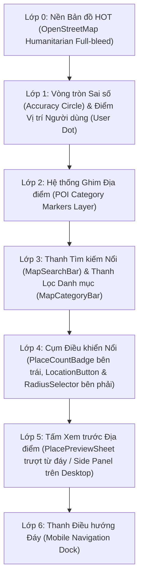
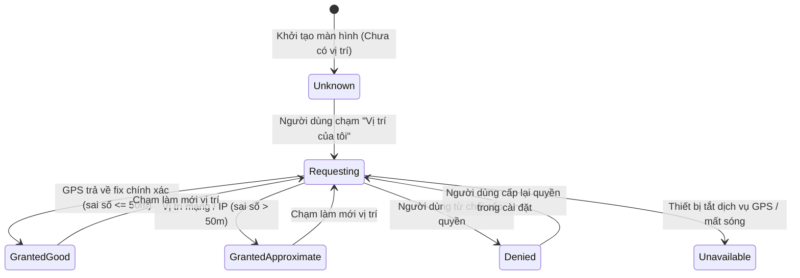

# GoMate — Map Screen Visual Specification (V1)

**Tài liệu:** Đặc tả Kỹ thuật Thiết kế Thị giác Màn hình Bản đồ (GoMate Map Visual Specification)  
**Phiên bản:** 1.0.0  
**Ngày ban hành:** 2026-10-05  
**Nhánh:** `feature/gomate-visual-mockups`  
**Trạng thái:** Authoritative Visual Specification Baseline (P0 Map Screen)  
**Tài liệu tham chiếu:** `docs/design/gomate-mockup-plan-v1.md`, `docs/design/gomate-design-system-ux-spec-v1.md`, `docs/architecture/decisions/ADR-005-map-provider.md`, `docs/architecture/decisions/ADR-006-map-tile-provider.md`, `docs/audit/task-08.1-closure-audit.md`.

---

## 1. Mục tiêu & Nguyên tắc Thiết kế Cốt lõi (Design Philosophy)

Màn hình Bản đồ (Map Screen) là trái tim khám phá không gian của GoMate — nơi người dùng tìm kiếm địa điểm, lọc trải nghiệm văn hóa ẩm thực, định vị thực tế và chuyển tiếp liền mạch sang điều hướng thực địa.

### Nguyên tắc bất biến (Invariants)
1. **Bản đồ là phần thị giác chủ đạo (Map Dominant):** Chiếm $100\%$ không gian nền (Full-bleed), các thanh công cụ, nút điều khiển và tấm xem trước được bố trí dạng lớp nổi (Floating Overlays) thanh thoát, không che khuất không gian bản đồ khi không cần thiết.
2. **Bản đồ nền mở & không watermark (OpenStreetMap Humanitarian HOT):** Sử dụng gạch bản đồ HOT (`https://{s}.tile.openstreetmap.fr/hot/{z}/{x}/{y}.png`) với dự phòng OSM-FR. Tuyệt đối không dùng API Key thương mại (Google/Mapbox/CARTO), không hiển thị watermark *"API KEY REQUIRED"*.
3. **Trung thực về dữ liệu (Data Integrity):**
   - Địa điểm có xác minh hiển thị nhãn `"Đã xác minh"`.
   - Không có đánh giá hiển thị `"Chưa có đánh giá"` (không tạo số sao giả mạo 4.5★/5.0★).
   - Không có địa chỉ chi tiết hiển thị `"Chưa có thông tin địa chỉ"`.
   - Không có giờ mở cửa hiển thị `"Chưa có thông tin giờ mở cửa"`.
4. **Trung thực về vị trí người dùng (Location Truth):**
   - Khoảng cách chỉ được tính toán qua công thức Haversine từ tọa độ GPS thực tế của thiết bị (`userPos`). Nếu chưa có vị trí, hiển thị `"Khoảng cách chưa xác định"`.
   - Tuyệt đối không dùng tâm bản đồ mặc định của Hà Nội để giả lập vị trí người dùng.
5. **Camera ổn định (No Camera Jumping):**
   - Mở bản đồ không tự ý giật camera tới vị trí người dùng.
   - Nhấn chọn marker hoặc mở xem chi tiết không tự ý di chuyển tâm bản đồ.
   - Camera **chỉ** dịch chuyển khi người dùng chủ động chạm nút **"Vị trí của tôi"** (`_LocationButton`), với hiệu ứng chuyển động mượt mà $250\text{ms}$ `Curves.easeInOutCubic`.

---

## 2. Thứ bậc Thị giác & Bố cục (Visual Hierarchy & Layout)



### 2.1. Phân tầng Bố cục Di động ($390 \times 844\text{ px}$)
- **Safe Area Top ($44\text{ px}$):** Dành cho status bar hệ điều hành.
- **Top Overlay ($52\text{ px}$ từ đỉnh):**
  - `MapSearchBar` ($46\text{ px}$ chiều cao, bo góc $28\text{ px}$, đổ bóng mềm, viền `#E2E8F0`). Placeholder: `"Tìm địa điểm, món ăn, trải nghiệm..."`.
  - `MapCategoryBar` ($40\text{ px}$ chiều cao): Dải chip cuộn ngang bo tròn (Pill), chip đang chọn có nền Teal `#0F766E`, chữ trắng; chip chưa chọn có nền trắng, viền Slate-200 `#E2E8F0`.
- **Floating Controls Area:**
  - **Góc dưới trái:** Huy hiệu đếm địa điểm `PlaceCountBadge` (`#CCFBF1`, chữ `#115E59`, bo góc $999\text{ px}$). Khi chọn marker, badge tự động đẩy lên cách đáy $340\text{ px}$ để không bị tấm xem trước che khuất.
  - **Góc dưới phải:** Cụm 2 nút bấm hình tròn xếp dọc:
    1. Nút "Vị trí của tôi" (`_LocationButton`, $48 \times 48\text{ px}$, nền trắng, đổ bóng nổi elevation 3).
    2. Nút "Bán kính tìm kiếm" (`MapRadiusSelector`, $44 \times 44\text{ px}$, icon radar Teal + nhãn `"10km"`).
  - **Viên thuốc trạng thái vị trí (`LocationStatusPill`):** Nổi bên trái nút vị trí, hiển thị độ chính xác (ví dụ: `"Đã xác định vị trí · ±25 m"`). Tự động mờ dần sau 5 giây khi có tín hiệu tốt.
- **Tấm Xem trước Địa điểm (`PlacePreviewSheet`):** Trượt từ mép đáy màn hình, bo góc trên $24\text{ px}$, hiển thị tóm tắt địa điểm, khoảng cách, nhãn xác minh, đánh giá và nút kêu gọi hành động `"Xem chi tiết"`.
- **Bottom Navigation Dock ($68\text{ px}$):** Cố định ở đáy với 5 tab, tab **"Bản đồ"** được kích hoạt bằng màu Teal thương hiệu và thanh chỉ thị mềm.

### 2.2. Phân tầng Bố cục Máy tính để bàn ($1440 \times 900\text{ px}$)
- **Top Navigation Bar ($64\text{ px}$):** Trải rộng toàn màn hình với Logo GoMate, 5 liên kết điều hướng và Avatar cá nhân.
- **Bản đồ Fullscreen:** Trải rộng toàn bộ $1440 \times 836\text{ px}$ phía dưới thanh điều hướng.
- **Thanh Tìm kiếm Căn giữa:** Khung tìm kiếm rộng $580\text{ px}$ đặt ở tọa độ `top: 84px`, căn giữa màn hình với phím tắt nhanh `Ctrl K`.
- **Dải Lọc Danh mục:** Nằm ngay dưới ô tìm kiếm trên nền kính mờ nhẹ (`backdrop-filter: blur(8px)`), tạo cảm giác cổng thông tin du lịch chuyên nghiệp.
- **Bảng Chi tiết Theo ngữ cảnh (Contextual Side Panel):** Khi nhấn vào marker, thông tin địa điểm xuất hiện dưới dạng một thẻ nổi độc lập rộng $380\text{ px}$ ở góc phải màn hình (`right: 32px, top: 84px`), không che bản đồ và không kéo giãn giao diện di động một cách thô thiển.

---

## 3. Hệ thống Ghim Địa điểm (POI Marker System)

Các marker được phân định màu sắc trực quan theo bảng màu danh mục chuẩn hóa `AppColors.forCategory()`:

| Danh mục (Category) | Màu Token | Giá trị Hex | Biểu tượng (Icon SVG) | Ví dụ Thực tế tại Hà Nội |
| :--- | :--- | :--- | :--- | :--- |
| **Văn hóa (Culture)** | `catCulture` | `#4F46E5` | Biểu tượng Đền/Chùa | Chùa Trấn Quốc, Đền Quán Thánh |
| **Tham quan (Attraction)** | `catAttraction` | `#9333EA` | Biểu tượng Di tích | Lăng Chủ tịch Hồ Chí Minh |
| **Nhà hàng (Restaurant)** | `catRestaurant` | `#EA580C` | Biểu tượng Ẩm thực | Nhà Hàng New Day, Bánh Tôm Hồ Tây |
| **Cà phê (Cafe)** | `catCafe` | `#78350F` | Biểu tượng Tách cà phê | Cà Phê Giảng, Đinh Cafe |
| **Khách sạn (Hotel)** | `catHotel` | `#0D9488` | Biểu tượng Giường ngủ | Khách sạn Pan Pacific |
| **Thiên nhiên (Nature)** | `catNature` | `#16A34A` | Biểu tượng Cây công viên | Công viên Bách Thảo |
| **Biển (Beach)** | `catBeach` | `#0284C7` | Biểu tượng Sóng biển | Bãi tắm/Điểm ven hồ |
| **Giải trí (Entertainment)** | `catEntertainment` | `#DB2777` | Biểu tượng Pháo hoa | Rạp xiếc, Khu vui chơi |

### Quy cách Kích thước Marker:
- **Trạng thái Nghỉ (Normal State):** Đường kính $34\text{ px}$, viền trắng $2\text{ px}$, đổ bóng nhẹ $0\text{px } 2\text{px } 6\text{px rgba}(0,0,0,0.22)$.
- **Trạng thái Được chọn (Selected State):** Đường kính $48\text{ px}$ (phóng to $1.15\times$), viền trắng dày $3.5\text{ px}$, đổ bóng màu phát sáng $0\text{px } 6\text{px } 16\text{px rgba}(15,118,110,0.45)$, kèm Tooltip nhãn tên nổi phía trên ghim.

---

## 4. Trải nghiệm Định vị & Vị trí Người dùng (Location UX States)

Quy trình định vị được xử lý minh bạch qua 6 trạng thái độc lập của máy trạng thái `UserLocationState`:



### Chi tiết Đặc tả Từng Trạng thái:

1. **A. Unknown (Trạng thái Nghỉ - Mặc định):**
   - Icon nút vị trí: `Icons.my_location` màu xám `#475569`.
   - Bản đồ: Hiển thị trung tâm thành phố Hà Nội. Không có chấm xanh, không có vòng tròn sai số.
   - Khoảng cách POI: Hiển thị nhãn `"Khoảng cách chưa xác định"`.

2. **B. Requesting (Đang xác định vị trí):**
   - Nút vị trí hiển thị vòng tròn tiến trình quay nhẹ (`CircularProgressIndicator`) màu Teal `#0F766E`.
   - Camera không dịch chuyển.

3. **C. Granted / Good (Vị trí Chính xác Cao):**
   - Điều kiện: Sai số $\le 50\text{ m}$ (Ví dụ: $\pm 25\text{ m}$).
   - Chấm vị trí: Chấm tròn xanh lam `#2563EB` đường kính $18\text{ px}$, viền trắng $3\text{ px}$, quầng sáng $44\text{ px}$.
   - Vòng tròn sai số: Vòng tròn mờ bán kính tương ứng số mét thực tế, màu nền `rgba(37,99,235,0.12)`, viền `rgba(37,99,235,0.4)`. Nằm bên dưới lớp POI, không chặn thao tác chạm marker.
   - Nút vị trí: Icon `my_location` màu xanh lam `#2563EB`.
   - Status Pill: `"Đã xác định vị trí · ±25 m"`. Tự động ẩn sau 5 giây.
   - Khoảng cách POI: Tính theo công thức Haversine thực tế (ví dụ: `"2.4 km"` tới Chùa Trấn Quốc).

4. **D. Approximate (Vị trí Ước lượng):**
   - Điều kiện: Sai số $> 50\text{ m}$ (Ví dụ: $\pm 180\text{ m}$ do định vị qua Wi-Fi/IP trên máy tính xách tay).
   - Chấm vị trí: Chấm tròn màu hổ phách `#B45309`.
   - Vòng tròn sai số: Vòng tròn rộng màu `rgba(180,83,9,0.12)`.
   - Nút vị trí: Icon `location_searching` màu vàng hổ phách `#B45309`.
   - Status Pill: `"Vị trí ước lượng · ±180 m"` với biểu tượng cảnh báo nhẹ. Không thông báo lỗi làm người dùng hoang mang.

5. **E. Permission Denied (Quyền bị Từ chối):**
   - Nút vị trí: Icon `Icons.location_disabled` màu đỏ `#B91C1C`.
   - Status Pill: `"Quyền vị trí bị từ chối"` màu đỏ viền `#FECACA`.
   - Hộp thông báo / SnackBar: Xuất hiện ở đáy màn hình với nội dung: *"Quyền vị trí bị từ chối trong trình duyệt"* kèm nút bấm hành động rõ ràng: `[Mở cài đặt]`.
   - Bản đồ giữ nguyên tâm camera, không có chấm xanh, khoảng cách hiển thị `"Khoảng cách chưa xác định"`.

6. **F. Location Unavailable (Không Xác định được Vị trí):**
   - Nút vị trí: Icon `Icons.location_off` màu xám trung tính `#94A3B8`.
   - Status Pill: `"Không xác định được vị trí"`.
   - Bản đồ và các thao tác tìm kiếm, lọc danh mục vẫn hoạt động hoàn toàn bình thường, không biến toàn bộ màn hình thành trang lỗi.

---

## 5. Tấm Xem trước Địa điểm (Place Preview Sheet)

Khi người dùng nhấn vào bất kỳ marker POI nào trên bản đồ:
- Marker chuyển sang trạng thái kích hoạt (Selected).
- Tấm `PlacePreviewSheet` trượt lên êm ái từ đáy màn hình (Mobile) hoặc mở thẻ bên phải (Desktop).
- **Tuyệt đối không tự ý di chuyển camera bản đồ.**
- Nội dung chi tiết trên tấm xem trước:
  1. **Thanh kéo (Drag Handle):** Rộng $40\text{ px}$, cao $4\text{ px}$, màu `#CBD5E1`.
  2. **Hàng tiêu đề:**
     - Icon vuông bo góc $10\text{ px}$ mang màu sắc danh mục tương ứng.
     - Tên địa điểm chuẩn tiếng Việt (ví dụ: `"Chùa Trấn Quốc"`).
     - Tên danh mục (ví dụ: `"Văn hóa"`).
     - Nút đóng thẻ `[✕]`.
  3. **Hàng thông tin kiểm chứng (Facts Row):**
     - Đánh giá trung thực: `"☆ Chưa có đánh giá"`.
     - Khoảng cách Haversine: `"2.4 km"` (nếu có vị trí) hoặc `"Khoảng cách chưa xác định"`.
     - Huy hiệu xác thực: `[✓ Đã xác minh]` màu xanh lá cây `#15803D` trên nền `#DCFCE7`.
  4. **Địa chỉ thực tế từ OSM:** Trích xuất từ thẻ dữ liệu OpenStreetMap (ví dụ: *"Đường Thanh Niên, Phường Yên Phụ, Tây Hồ, Hà Nội"*). Nếu thiếu, hiển thị *"Chưa có thông tin địa chỉ"*.
  5. **Tọa độ GPS:** Định dạng số thập phân chuẩn mực (ví dụ: `21.04790, 105.83676`).
  6. **Nút Hành động Chính (Primary CTA):** `"Xem chi tiết →"` dẫn trực tiếp tới `Place Detail Screen` (`FLOW 08`) thông qua cơ chế `context.push()` để bảo toàn nguyên vẹn trạng thái bản đồ khi người dùng quay lại.

---

## 6. Bộ Chọn Bán kính (Map Radius Selector)

- **Vị trí:** Nút tròn nổi đặt ngay dưới nút vị trí ở góc phải màn hình.
- **Kích thước:** $44 \times 44\text{ px}$, nền trắng, icon radar Teal `#0F766E`, nhãn phụ bên dưới hiển thị bán kính hiện tại (Mặc định: `"10km"`).
- **Tùy chọn bán kính:** Hỗ trợ 4 nấc khoảng cách thân thiện:
  - `1 km` (Đi bộ quanh khu vực)
  - `5 km` (Khu vực nội thành)
  - `10 km` (Mặc định - Bán kính khám phá thành phố)
  - `25 km` (Toàn vùng ngoại ô & lân cận)
- **Menu lựa chọn:** Hiển thị dạng popup menu nhỏ gọn bo góc $12\text{ px}$, có đánh dấu radio tích chọn rõ ràng.

---

## 7. Trạng thái Tìm kiếm & Lọc (Search & Filtering States)

1. **Tìm kiếm có kết quả (Search Active):**
   - Nhập từ khóa (Ví dụ: `"Chùa"`).
   - Nút xoá `[✕]` xuất hiện bên phải thanh tìm kiếm để xóa nhanh.
   - Bản đồ lọc ngay các ghim phù hợp (Chùa Trấn Quốc, Đền Quán Thánh).
   - Huy hiệu đếm địa điểm cập nhật tức thì: `"2 địa điểm"`.
2. **Tìm kiếm không có kết quả (Search Empty):**
   - Từ khóa không tồn tại trong bán kính (Ví dụ: `"Thác Bản Giốc"` tại Hà Nội).
   - Huy hiệu đếm hiển thị `"0 địa điểm"`.
   - Xuất hiện thẻ thông báo thân thiện ở giữa màn hình:
     - Biểu tượng kính lúp màu xám Slate-400.
     - Tiêu đề: `"Không tìm thấy địa điểm"`.
     - Nội dung: *"Thử từ khóa khác hoặc mở rộng phạm vi tìm kiếm."*.
     - 2 nút hành động: Nút thứ cấp `"Xóa tìm kiếm"` và nút chính `"Mở rộng bán kính"`.
3. **Lọc theo Danh mục (Category Filter):**
   - Nhấn chọn chip danh mục (Ví dụ: `"Nhà hàng"`).
   - Chip chuyển sang màu nền Teal đậm `#0F766E`, chữ trắng.
   - Bản đồ chỉ hiển thị các marker Nhà hàng.
   - Huy hiệu đếm cập nhật (Ví dụ: `"12 địa điểm"`).
   - **Tấm xem trước cũ tự động đóng lại (Stale preview dismissed)** để tránh giữ lại thông tin địa điểm của danh mục trước đó.

---

## 8. Trạng thái Sự cố Mạng / Gạch Bản đồ (Tile Network Error Fallback)

Nếu kết nối mạng gặp sự cố tạm thời hoặc máy chủ gạch bản đồ HOT không phản hồi:
- Bản đồ chuyển sang nền lưới caro nhẹ nhàng (`#F1F5F9` viền nét mờ `#E2E8F0`), không làm trắng màn hình, không vỡ layout.
- Lớp dữ liệu ghim POI vẫn được giữ nguyên vẹn trên màn hình.
- Xuất hiện thanh thông báo phục hồi nhẹ nhàng ở phía trên màn hình:
  - Nền vàng hổ phách nhạt `#FEF3C7`, viền `#FDE68A`.
  - Tiêu đề: `"Không tải được bản đồ nền"`.
  - Phụ đề: *"Các điểm POI vẫn hiển thị bình thường."*.
  - Nút bấm: `[Thử lại]` để kích hoạt tải lại gạch bản đồ mà không phải tải lại toàn bộ trang.

---

## 9. Danh mục 16 Mockup Hình ảnh Đã Kết xuất

Tất cả 16 tập tin ảnh đã được tạo và lưu trữ chuẩn xác tại `docs/audit/evidence/ui-08.2.3.2/`:

```
docs/audit/evidence/ui-08.2.3.2/
├── map-mobile-default.png                  (390 x 844 px)  - Bản đồ di động mặc định
├── map-mobile-location-good.png            (390 x 844 px)  - Vị trí GPS chính xác cao (±25m)
├── map-mobile-location-approximate.png     (390 x 844 px)  - Vị trí ước lượng Wi-Fi/IP (±180m)
├── map-mobile-permission-denied.png        (390 x 844 px)  - Quyền vị trí bị từ chối + SnackBar
├── map-mobile-location-unavailable.png     (390 x 844 px)  - Không có tín hiệu định vị
├── map-mobile-search.png                   (390 x 844 px)  - Tìm kiếm đang hoạt động (từ khóa "Chùa")
├── map-mobile-search-empty.png             (390 x 844 px)  - Tìm kiếm không có kết quả + Modal
├── map-mobile-category-filter.png          (390 x 844 px)  - Lọc danh mục Nhà hàng
├── map-mobile-selected-place.png           (390 x 844 px)  - Đã chọn địa điểm + Tấm Preview Sheet
├── map-mobile-tile-error.png               (390 x 844 px)  - Sự cố tải gạch bản đồ + Banner phục hồi
├── map-desktop-default.png                 (1440 x 900 px) - Bản đồ desktop mặc định toàn màn hình
├── map-desktop-location-good.png           (1440 x 900 px) - Vị trí GPS chính xác trên desktop
├── map-desktop-search.png                  (1440 x 900 px) - Tìm kiếm trên desktop (Ctrl K)
├── map-desktop-selected-place.png          (1440 x 900 px) - Bảng chi tiết bên phải (Side Panel)
├── map-desktop-permission-denied.png       (1440 x 900 px) - Cảnh báo từ chối vị trí trên desktop
└── map-desktop-search-empty.png            (1440 x 900 px) - Trạng thái tìm kiếm rỗng trên desktop
```

---

## 10. Nguyên tắc Khả năng Tiếp cận (Accessibility & Inclusivity)

- **Điểm chạm tối thiểu (Touch Targets):** Tất cả các nút bấm nổi (`_LocationButton`, `MapRadiusSelector`), chip lọc và nút trên tấm xem trước đều có vùng chạm tối thiểu từ $44 \times 44\text{ px}$ đến $48 \times 48\text{ px}$.
- **Tương phản Màu sắc (WCAG AA):** Chữ văn bản chính `#0F172A` trên nền trắng đạt tỷ lệ tương phản $15.4:1$; chữ thương hiệu `#0F766E` trên nền trắng đạt $4.8:1$; chữ trên huy hiệu `#115E59` trên `#CCFBF1` đạt $6.2:1$.
- **Nhãn ngữ nghĩa cho Trình đọc Màn hình (Semantics):**
  - Nút vị trí: `Semantics(label: 'Vị trí của tôi')`.
  - Nút bán kính: `Semantics(label: 'Bán kính tìm kiếm 10 km')`.
  - Ghim địa điểm: `Semantics(label: 'Địa điểm Chùa Trấn Quốc, thể loại Văn hóa, khoảng cách 2.4 km')`.
- **Không phụ thuộc thuần túy vào màu sắc:** Tất cả trạng thái đều kết hợp đồng thời **Biểu tượng (Icon)**, **Màu sắc (Color)** và **Văn bản Tiếng Việt rõ nghĩa (Text Label)**.

---

## Kết luận & Sẵn sàng Triển khai

Bản đặc tả thiết kế thị giác Màn hình Bản đồ (V1) này cùng bộ 16 hình ảnh mockup độ phân giải cao đã chốt chặt chẽ toàn bộ trạng thái thị giác, quy chuẩn tương tác và trải nghiệm người dùng, đảm bảo lập trình viên có thể chuyển hóa chuẩn xác thành code Flutter mà không phải phỏng đoán bất kỳ chi tiết UX nào.
