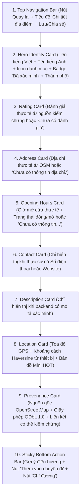
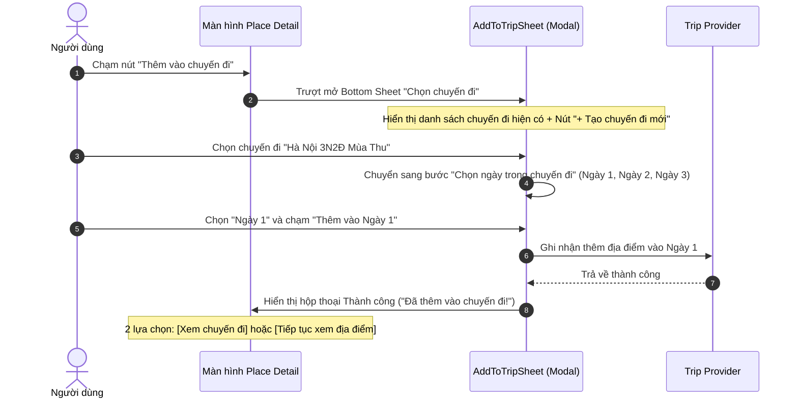

# GoMate — Place Detail Screen Visual Specification (V1)

**Tài liệu:** Đặc tả Kỹ thuật Thiết kế Thị giác Màn hình Chi tiết Địa điểm (GoMate Place Detail Visual Specification)  
**Phiên bản:** 1.0.0  
**Ngày ban hành:** 2026-10-05  
**Nhánh:** `feature/gomate-visual-mockups`  
**Trạng thái:** Authoritative Visual Specification Baseline (P0 Place Detail Screen)  
**Mục tiêu kết nối:** DISCOVER (Khám phá) $\rightarrow$ PLAN (Lên lịch trình / Thêm vào chuyến đi) $\rightarrow$ NAVIGATE (Chỉ đường thực tế)  

---

## 1. Mục Tiêu Sản Phẩm & Định Hướng Thị Giác

Màn hình Chi tiết Địa điểm (Place Detail Screen — route `/places/:id`) không phải là một ốc đảo độc lập mà là mắt xích cốt lõi kết nối ba trụ cột của GoMate:
1. **Khám phá (Discovery):** Tiếp nối mượt mà từ Bản đồ $\rightarrow$ Ghim POI $\rightarrow$ Tấm xem trước $\rightarrow$ Chi tiết địa điểm.
2. **Lên kế hoạch (Planning):** Lưu địa điểm vào Chuyến đi (`FLOW 09`) và phân bổ vào từng ngày cụ thể (`Day-by-Day Itinerary`).
3. **Điều hướng (Navigation):** Dẫn hướng thực tế qua ứng dụng bản đồ ngoài (Google Maps) dựa trên tọa độ GPS thực tế của thiết bị (`userPos`).

### Triết lý Trực quan:
- **Tươi sáng & Thuần Việt:** Ngôn ngữ tiếng Việt đầy đủ dấu thanh, chuẩn mực du lịch văn hóa.
- **Tiết lộ Lũy tiến (Progressive Disclosure):** Không nhồi nhét tất cả thông tin lên đầu; phân tầng mạch lạc từ Nhận diện (Hero) $\rightarrow$ Thông số cốt lõi $\rightarrow$ Vị trí $\rightarrow$ Nguồn gốc dữ liệu.
- **Trung thực dữ liệu tuyệt đối:**
  - Có xác minh hiển thị `[✓ Đã xác minh]`.
  - Không có đánh giá hiển thị `"☆ Chưa có đánh giá"` (không tạo số sao giả mạo 4.5★/5.0★).
  - Không có địa chỉ hiển thị `"📍 Chưa có thông tin địa chỉ."` (không tự ghép tên địa điểm + thành phố thành địa chỉ giả).
  - Không có giờ mở cửa hiển thị `"Chưa có thông tin giờ mở cửa."`.
  - Không có liên hệ (phone/website) thì **ẩn hoàn toàn** section thay vì hiển thị "N/A" hoặc để trống thô thiển.

---

## 2. Thứ Bậc Thông Tin & Bố Cục (Information Hierarchy)



---

## 3. Chi Tiết Kích Thước & Thông Số Bố Cục (Layout Measurements)

### 3.1. Thiết Bị Di Động (Mobile $390 \times 844\text{ px}$)
- **Safe Area Top:** $44\text{ px}$ (Status bar hệ thống).
- **AppBar:** Chiều cao $52\text{ px}$, nền trắng `#FFFFFF`, viền dưới $1\text{ px}$ `#E2E8F0`:
  - Leading button: Icon mũi tên quay lại (`Icons.arrow_back`), vùng chạm $44 \times 44\text{ px}$, nhãn tooltip *"Quay lại"*.
  - Title: Text H3 `"Chi tiết địa điểm"` ($17\text{ px}$, bold, `#0F172A`).
  - Action buttons: Nút lưu yêu thích và chia sẻ ($34 \times 34\text{ px}$).
- **Vùng Nội dung Cuộn (Scrollable Body):**
  - Đệm lề hai bên: $16\text{ px}$ (`AppSpacing.screenHorizontal`).
  - Khoảng cách giữa các khối thẻ: $12\text{ px}$.
  - Khoảng đệm trống đáy màn hình: $16\text{ px}$ để đảm bảo khối cuối cùng không bị thanh Sticky Bar che khuất.
- **Hero Card:**
  - Nền: Màu danh mục phủ mờ nhẹ `rgba(color, 0.07)` với viền `rgba(color, 0.22)`.
  - Bo góc: $18\text{ px}$ (`AppRadius.heroRadius`).
  - Icon danh mục: $44 \times 44\text{ px}$, nền bo góc $12\text{ px}$ mang sắc độ đậm của danh mục.
  - Tên địa điểm: Text H1 ($20 - 22\text{ px}$, font-weight: 800, `#0F172A`).
  - Huy hiệu xác minh: $11\text{ px}$, font-weight: 700, `#15803D` trên nền `#DCFCE7`.
- **Thẻ Thông Tin (Content Cards):**
  - Nền: Trắng `#FFFFFF`, viền $1\text{ px}$ `#E2E8F0`, bo góc $16\text{ px}$ (`AppRadius.cardRadius`), đổ bóng nhẹ `0 1px 3px rgba(0,0,0,0.03)`.
  - Tiêu đề mục: Font-weight: 700, kích thước $13.5\text{ px}$, màu Teal thương hiệu `#0F766E`, icon tiêu đề $17\text{ px}$.
- **Bản Đồ Thu Nhỏ (Place Mini Map):**
  - Chiều cao: $130\text{ px} - 140\text{ px}$, bo góc $12\text{ px}$, viền `#E2E8F0`.
  - Sử dụng gạch bản đồ HOT không watermark, hiển thị ghim địa điểm ở tâm với quầng phát sáng mờ.
  - Dòng bản quyền: `© OpenStreetMap contributors · HOT` ở góc dưới trái.
- **Thanh Tác Vụ Dính Đáy (Sticky Bottom Action Bar):**
  - Vị trí: Cố định ở đáy màn hình (`position: fixed, bottom: 0`).
  - Chiều cao: $76\text{ px} + \text{Safe Area Bottom}$.
  - Nền trắng `#FFFFFF`, viền trên $1\text{ px}$ `#E2E8F0`, đổ bóng mềm `0 -4px 16px rgba(0,0,0,0.06)`.
  - Dòng chú thích: *"Điều hướng sẽ mở ứng dụng bản đồ ngoài"* ($11\text{ px}$, `#94A3B8`).
  - Hàng nút bấm:
    - **Nút Thứ cấp ("Thêm vào chuyến đi"):** Chiều cao $44\text{ px}$, nền `#CCFBF1`, chữ và icon `#0F766E`, viền `#99F6E4`, bo góc $12\text{ px}$, tỷ lệ flex: $1$.
    - **Nút Chính ("Chỉ đường"):** Chiều cao $44\text{ px}$, nền Teal `#0F766E`, chữ và icon trắng `#FFFFFF`, bo góc $12\text{ px}$, đổ bóng nổi `0 4px 12px rgba(15,118,110,0.28)`, tỷ lệ flex: $1.1$.

### 3.2. Máy Tính Để Bàn (Desktop $1440 \times 900\text{ px}$)
- **Top Global Navigation Bar ($64\text{ px}$):** Logo GoMate, 5 liên kết điều hướng, Avatar cá nhân.
- **Sub-bar ($50\text{ px}$):** Dòng điều hướng quay lại *"← Quay lại Bản đồ"* kèm đường dẫn ngữ cảnh (Breadcrumbs): `"Bản đồ / Hà Nội / Chùa Trấn Quốc"`.
- **Bố Cục Chia 2 Cột (Two-Column Split Grid $1160\text{ px}$ căn giữa):**
  - **Cột Trái ($680\text{ px}$ - Information Column):**
    - Hero Card lớn ($26\text{ px}$ title).
    - Hàng nút tác vụ chính (`[Chỉ đường]` + `[Thêm vào chuyến đi]`).
    - Thẻ Đánh giá, Thẻ Địa chỉ, Thẻ Giờ mở cửa, Thẻ Mô tả.
  - **Cột Phải ($440\text{ px}$ - Sticky Contextual Column):**
    - Thẻ Vị trí với Bản đồ Mini cỡ lớn ($240\text{ px}$ chiều cao).
    - Tọa độ GPS chính xác và khoảng cách thực tế từ thiết bị.
    - Thẻ Nguồn gốc & Bản quyền OpenStreetMap ODbL.

---

## 4. Ma Trận Trạng Thái Dữ Liệu (Design States Matrix)

| Trạng thái Thiết kế | Hero Header | Đánh giá (Rating) | Địa chỉ (Address) | Giờ mở cửa | Liên hệ | Nguồn gốc | Thanh CTA |
| :--- | :--- | :--- | :--- | :--- | :--- | :--- | :--- |
| **01. Default Rich** | Đầy đủ tên, thể loại, badge xác minh | $4.6\star$ ($128$ reviews) | Địa chỉ phố đầy đủ | $07:30 - 17:30$ Đang mở | Phone + Web | OpenStreetMap ODbL | [Chỉ đường] + [Thêm vào chuyến đi] |
| **02. No Rating** | Đầy đủ | `"☆ Chưa có đánh giá"` | Đầy đủ | Đầy đủ | Đầy đủ | Đầy đủ | Đầy đủ |
| **03. No Address** | Đầy đủ | Đầy đủ | `"📍 Chưa có thông tin địa chỉ."` | Đầy đủ | Đầy đủ | Đầy đủ | Đầy đủ |
| **04. No Hours** | Đầy đủ | Đầy đủ | Đầy đủ | `"Chưa có thông tin giờ mở cửa."` | Đầy đủ | Đầy đủ | Đầy đủ |
| **05. Minimal Data** | Đầy đủ | `"☆ Chưa có đánh giá"` | `"Chưa có thông tin địa chỉ."` | `"Chưa có thông tin giờ mở cửa."` | Ẩn hoàn toàn | Đầy đủ | Đầy đủ (theo tọa độ) |
| **06. Unverified** | **Không** có badge xác minh | `"☆ Chưa có đánh giá"` | Địa chỉ hoặc Chưa có | Giờ hoặc Chưa có | Ẩn | `"Chưa được xác minh nguồn dữ liệu"` | Đầy đủ |
| **07. Loading** | Skeleton Shimmer | Skeleton | Skeleton | Skeleton | Skeleton | Skeleton | Skeleton |
| **08. Error** | Màn hình lỗi mạng kết nối, nút `[Thử lại]` | — | — | — | — | — | — |
| **09. Empty 404** | Màn hình thông báo không tìm thấy địa điểm, nút `[Về bản đồ]` | — | — | — | — | — | — |

---

## 5. Quy Trình & Trạng Thái Thêm Vào Chuyến Đi (Add-To-Trip Flow)

Flow thêm địa điểm vào lịch trình tuân thủ quy chuẩn tương tác dạng Modal / Bottom Sheet không làm mất ngữ cảnh:



### Các Biến thể Trạng thái Add-To-Trip:
1. **Bước 1 — Chọn Chuyến Đi (`place-mobile-add-to-trip.png`):**
   - Danh sách các chuyến đi của người dùng kèm số ngày và ngày đi.
   - Thẻ chuyến đi được chọn có viền Teal `#0F766E` và dấu tích tròn màu xanh.
   - Nút `[+ Tạo chuyến đi mới]` và nút `[Tiếp tục (Chọn ngày) →]`.
2. **Bước 2 — Chọn Ngày (`place-mobile-trip-day-select.png`):**
   - Tiêu đề: *"Chọn ngày trong chuyến đi"*.
   - Danh sách ngày (Ngày 1, Ngày 2, Ngày 3) kèm số lượng địa điểm hiện có trong ngày đó.
   - Nút bấm xác nhận: `[Thêm vào Ngày 1]`.
3. **Bước 3 — Thành Công (`place-mobile-add-success.png`):**
   - Biểu tượng tích xanh thành công trên nền tròn `#DCFCE7`.
   - Thông điệp chúc mừng rõ ràng: *"Chùa Trấn Quốc đã được thêm thành công vào Ngày 1 của chuyến đi Hà Nội 3N2Đ Mùa Thu."*.
   - 2 nút hành động: Nút chính `[Xem chuyến đi]` và nút phụ `[Tiếp tục xem địa điểm]`.

---

## 6. Quy Trình Điều Hướng & Chỉ Đường (Navigation CTA Flow)

- Khi người dùng chạm nút **"Chỉ đường"** (`place-mobile-navigation.png`):
  - Hiển thị hộp thoại xác nhận điều hướng minh bạch:
    - Điểm đến: Tên địa điểm kèm tọa độ chính xác (`21.0479, 105.8368`).
    - Điểm xuất phát: Vị trí thực tế của thiết bị (`userPos`) và khoảng cách Haversine (`2.4 km`).
    - Ghi chú minh bạch: *"Ứng dụng sẽ chuyển hướng an toàn sang Google Maps để điều hướng lộ trình từng bước (Turn-by-turn)."*.
  - Nút bấm hành động: `[Mở Google Maps ngay ↗]`.
  - URL điều hướng chuẩn: `https://www.google.com/maps/dir/?api=1&destination=21.047900,105.836760&origin=21.030000,105.850000&travelmode=driving`.

---

## 7. Hành Vi Quay Lại Bản Đồ (Back Navigation Invariant)

- Khi người dùng nhấn nút mũi tên quay lại trên AppBar (`place_detail_back`):
  - Hệ thống sử dụng `context.pop()`.
  - Màn hình Bản đồ (`MapScreen`) bên dưới được bảo toàn **100% trạng thái**:
    - Tâm camera và mức zoom không đổi (không giật về tâm mặc định).
    - Bộ lọc danh mục (ví dụ: `Văn hóa`) vẫn giữ nguyên.
    - Bán kính tìm kiếm (ví dụ: `10 km`) vẫn giữ nguyên.
    - Marker Chùa Trấn Quốc vẫn ở trạng thái được chọn (Selected) kèm tấm Preview Sheet.
    - Trạng thái định vị người dùng (`userPos`) không bị mất.

---

## 8. Khả Năng Tiếp Cận & Tương Phản (Accessibility & WCAG AA)

- **Vùng chạm cảm ứng (Touch Targets):** Mọi nút bấm (`Chỉ đường`, `Thêm vào chuyến đi`, nút back, nút đóng modal) đều đạt diện tích tối thiểu từ $44 \times 44\text{ px}$ đến $46 \times 46\text{ px}$.
- **Tương phản Màu sắc (Contrast Ratio):**
  - Chữ chính `#0F172A` trên nền trắng: **$15.4:1$** (Vượt chuẩn AAA).
  - Chữ phụ `#475569` trên nền trắng: **$7.1:1$** (Chuẩn AAA).
  - Chữ nút chính `#FFFFFF` trên `#0F766E`: **$4.8:1$** (Đạt chuẩn AA).
  - Chữ nút phụ `#0F766E` trên `#CCFBF1`: **$6.2:1$** (Chuẩn AAA).
- **Trình đọc màn hình (Semantics):**
  - `Semantics(label: 'Quay lại bản đồ')`
  - `Semantics(label: 'Chỉ đường tới Chùa Trấn Quốc')`
  - `Semantics(label: 'Thêm Chùa Trấn Quốc vào chuyến đi')`
  - `Semantics(label: 'Địa điểm đã xác minh nguồn gốc OpenStreetMap')`

---

## 9. Danh Sách 18 Mockup Hình Ảnh Đã Tạo

Tất cả 18 mockup hình ảnh chất lượng cao đã được kết xuất hoàn tất tại thư mục `docs/audit/evidence/ui-08.2.3.3/`:

```
docs/audit/evidence/ui-08.2.3.3/
├── place-mobile-default-rich.png       (390 x 844 px)  - Bản di động dữ liệu đầy đủ
├── place-mobile-no-rating.png          (390 x 844 px)  - Trạng thái chưa có đánh giá
├── place-mobile-no-address.png         (390 x 844 px)  - Trạng thái chưa có thông tin địa chỉ
├── place-mobile-no-hours.png           (390 x 844 px)  - Trạng thái chưa có thông tin giờ mở cửa
├── place-mobile-minimal-data.png       (390 x 844 px)  - Trạng thái dữ liệu tối giản (sparse)
├── place-mobile-unverified.png         (390 x 844 px)  - Trạng thái địa điểm chưa xác minh
├── place-mobile-loading.png            (390 x 844 px)  - Trạng thái đang tải Skeleton Shimmer
├── place-mobile-error.png              (390 x 844 px)  - Trạng thái lỗi tải kèm nút Thử lại
├── place-mobile-empty-404.png          (390 x 844 px)  - Trạng thái địa điểm không tồn tại (404)
├── place-mobile-add-to-trip.png        (390 x 844 px)  - Modal bước 1: Chọn chuyến đi
├── place-mobile-trip-day-select.png    (390 x 844 px)  - Modal bước 2: Chọn ngày trong chuyến đi
├── place-mobile-add-success.png        (390 x 844 px)  - Modal bước 3: Thêm thành công
├── place-mobile-navigation.png         (390 x 844 px)  - Modal xác nhận điều hướng Google Maps
├── place-desktop-default.png           (1440 x 900 px) - Bản desktop chia 2 cột tiêu chuẩn
├── place-desktop-rich-data.png         (1440 x 900 px) - Bản desktop dữ liệu phong phú
├── place-desktop-unverified.png        (1440 x 900 px) - Bản desktop địa điểm chưa xác minh
├── place-desktop-add-to-trip.png       (1440 x 900 px) - Hộp thoại thêm vào chuyến đi trên desktop
└── place-desktop-error.png             (1440 x 900 px) - Trạng thái báo lỗi kết nối trên desktop
```

---

## Kết Luận & Sẵn Sàng Triển Khai

Bản đặc tả thiết kế thị giác Màn hình Chi tiết Địa điểm (V1) này đã khóa chặt 100% các quyết định thị giác, cấu trúc thông tin và luồng liên kết 3 chiều (Khám phá $\rightarrow$ Lịch trình $\rightarrow$ Điều hướng), bảo đảm quá trình chuyển hóa sang mã nguồn Flutter diễn ra chuẩn xác, vững chắc và hoàn toàn không có sự phỏng đoán.
