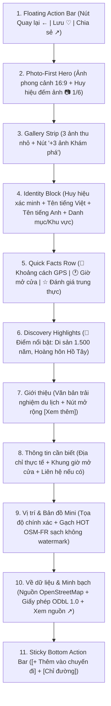

# GoMate — Place Detail Screen Visual Specification (V2 / R1)

**Tài liệu:** Đặc tả Thiết kế Thị giác & Trải nghiệm Đa phương tiện Màn hình Chi tiết Địa điểm (GoMate Place Detail Visual Enrichment & Media Design Specification)  
**Phiên bản:** 2.0.0 (Revision of V1)  
**Ngày ban hành:** 2026-10-05  
**Nhánh:** `feature/gomate-visual-mockups`  
**Trạng thái:** Authoritative Visual Specification Baseline (P0 Place Detail V2)  
**Mục tiêu cốt lõi:** Chuyển đổi từ "Trang thông tin dữ liệu" (Data Detail Page) thành "Trải nghiệm Khám phá Du lịch" (Travel Discovery Experience).

---

## 1. Triết Lý Thiết Kế V2: Travel Discovery Experience

Place Detail V2 tái định vị màn hình chi tiết địa điểm xoay quanh công thức:
$$\text{PLACE} + \text{VISUAL} + \text{DISCOVERY} + \text{TRUST} + \text{ACTION}$$

Màn hình khơi gợi **5 cảm giác cốt lõi**:
1. **DISCOVER (Khám phá):** Hình ảnh phong cảnh du lịch truyền cảm hứng, làm chủ đạo thị giác (Hero Photo-first), kích thích mong muốn trải nghiệm.
2. **TRUST (Tin cậy):** Nguồn gốc dữ liệu minh bạch từ OpenStreetMap (ODbL 1.0), tách bạch tuyệt đối giữa **Kiểm chứng dữ liệu** (Verified Provenance) và **Đánh giá người dùng** (User Reviews).
3. **UNDERSTAND (Thấu hiểu):** Nắm bắt nhanh địa điểm trong 3 giây đầu thông qua Hàng thông số nhanh (Quick Facts: khoảng cách GPS, trạng thái mở cửa, đánh giá trung thực).
4. **PLAN (Lên kế hoạch):** Luồng thêm vào lịch trình chuyến đi (Add-to-Trip) 3 bước mượt mà, phân bổ chính xác theo từng ngày (`Day-by-Day`).
5. **NAVIGATE (Điều hướng):** Nút CTA "Chỉ đường" luôn sẵn sàng, mở trực tiếp ứng dụng bản đồ ngoài từ tọa độ thực tế của người dùng.

---

## 2. Bảng Đối Chiếu Nâng Cấp V1 $\rightarrow$ V2 (Design Evolution Matrix)

| Khu vực / Thành phần | Thiết kế V1 (Task 08.2.3.3) | Thiết kế V2 (Task 08.2.3.3-R1) | Lý do & Giá trị cải tiến |
| :--- | :--- | :--- | :--- |
| **Hero Anchor** | Card chữ kèm Icon danh mục lớn, thiếu hình ảnh trực quan | **Photo-First Hero** ($16:9 / 16:10$), ảnh phong cảnh rực rỡ, góc chụp du lịch | Tạo cảm xúc khám phá ngay khi mở màn hình, thoát khỏi cảm giác "danh bạ dữ liệu hành chính". |
| **Thư viện ảnh (Gallery)** | Không có | **Gallery Strip** (3 thumbnail + nút `+3 ảnh`) dẫn vào **Fullscreen Lightbox Viewer** | Cho phép người dùng chiêm ngưỡng nhiều góc độ (kiến trúc, cảnh quan, hiện vật) với bản quyền ảnh rõ ràng. |
| **Fallback khi thiếu ảnh** | Không có khu vực ảnh nên không có fallback | **Soft Category Illustration Fallback** (minh họa kiến trúc nhẹ nhàng + *"Chưa có hình ảnh"*) | Trung thực dữ liệu, không tự ý nhặt ảnh Internet không bản quyền hay ảnh AI ngẫu nhiên. |
| **Thanh thông số (Quick Facts)** | Phân mảnh thành các card riêng biệt (Card Đánh giá, Card Địa chỉ...) | **Compact Quick Facts Row** dạng thanh viên thuốc (Pills) ngay dưới tên địa điểm | Tối ưu diện tích màn hình, người dùng nắm bắt khoảng cách GPS, giờ mở cửa và đánh giá chỉ trong 1 hàng. |
| **Điểm nổi bật (Highlights)** | Không có | **Discovery Tags Section** (*"🏮 Chùa 1.500 năm tuổi"*, *"🌅 Hoàng hôn Hồ Tây"*) | Kể chuyện du lịch (Visual Storytelling), làm nổi bật giá trị văn hóa đặc thù. |
| **Giới thiệu địa điểm** | Đặt tên mục là "Mô tả", text tĩnh thô | Đổi tên thành **"Giới thiệu"**, typography thoáng, hỗ trợ rút gọn/mở rộng `[Xem thêm]` | Giọng văn thân thiện, trải nghiệm đọc dễ chịu, không chiếm dụng chiều dọc màn hình. |
| **Thông tin cần biết (Facts)** | Chia thành nhiều card rời rạc gây rối mắt ("Card soup") | **Compact Fact Rows** gộp trong 1 card với các đường phân cách thanh mảnh | Giảm nhiễu thị giác, tạo nhịp đọc tự nhiên, tự động ẩn dòng nếu dữ liệu rỗng. |
| **Bản đồ thu nhỏ (Mini Map)** | Card lớn chiếm nhiều diện tích ngang ngửa Hero | Giữ nguyên bản đồ HOT OSM-FR nhưng thu gọn thành **bổ trợ vị trí**, ưu tiên Hero ảnh | Bản đồ đóng vai trò định vị thực địa chứ không lấn át trải nghiệm cảm xúc. |
| **Minh bạch dữ liệu (Provenance)** | Đặt cao ngang hàng với thông tin địa điểm | Đưa xuống khu vực **"Về dữ liệu"** ở cuối nội dung | Giữ vững tính minh bạch ODbL 1.0 nhưng không làm loãng dòng chảy khám phá du lịch. |
| **Tác vụ Lưu / Chia sẻ** | Tích hợp nhỏ trên AppBar | Đưa thành **Nút tròn kính mờ (Frosted Floating Buttons)** nổi trên ảnh Hero | Chuẩn mực ứng dụng du lịch hiện đại, tiện tay thao tác khi ngắm ảnh. |
| **Thanh tác vụ chính (CTA)** | Sticky Bottom Bar 2 nút cơ bản | **Enhanced Sticky Bottom Bar** với độ đổ bóng mềm, viền kính mờ, chú thích bản đồ ngoài | Nhận diện rõ nút Chính (`Chỉ đường` - Teal) và nút Thứ cấp (`Thêm vào chuyến đi` - Tonal). |
| **Bố cục Desktop (1440×900)** | 2 cột đều nhau, chia card vụn | **Two-Column Split Grid**: Cột trái ($740\text{ px}$) làm chủ đạo khám phá ảnh & nội dung; Cột phải ($410\text{ px}$) gắn Sticky Mini Map, Provenance & Gợi ý Wandy AI | Tận dụng trọn vẹn không gian màn hình rộng mà không bị loãng, không kéo giãn thô thiển. |

---

## 3. Thứ Bậc Thị Giác & Bố Cục Chi Tiết



---

## 4. Chi Tiết Kích Thước & Thông Số Kỹ Thuật (Design Tokens)

### 4.1. Thiết Bị Di Động (Mobile $390 \times 844\text{ px}$)
- **Safe Area Top:** $44\text{ px}$.
- **Hero Photo Box:**
  - Chiều cao: $240\text{ px}$ (chiếm $\approx 28\%$ chiều cao màn hình).
  - Tỷ lệ khung hình: $16:10$, object-fit: `cover`.
  - Gradient phủ đỉnh: `linear-gradient(180deg, rgba(0,0,0,0.4) 0%, transparent 60%)` để đảm bảo độ tương phản cho nút điều hướng.
  - Nút điều hướng nổi (Floating frosted buttons): Đường kính $38\text{ px}$, bo tròn $50\%$, nền `rgba(255,255,255,0.9)`, backdrop-filter `blur(4px)`, đổ bóng `0 2px 8px rgba(0,0,0,0.12)`, icon màu `#0F172A`.
  - Huy hiệu đếm ảnh: Đặt góc dưới phải hero, nền `rgba(15,23,42,0.65)`, bo góc $12\text{ px}$, chữ trắng $11\text{ px}$, icon camera `📷 1/6`.
- **Thumbnail Strip:**
  - Đặt ngay dưới Hero, đệm $10\text{ px}$ trên/dưới, $16\text{ px}$ hai bên, nền `#FFFFFF`, viền đáy $1\text{ px}$ `#F1F5F9`.
  - Thumbnail ảnh: Kích thước $68 \times 48\text{ px}$, bo góc $8\text{ px}$, viền $1\text{ px}$ `#E2E8F0`. Ảnh đang chọn có viền $2\text{ px}$ `#0F766E`.
  - Nút `+3 ảnh`: Nền chuyển sắc `#334155` $\rightarrow$ `#1E293B`, chữ trắng $10\text{ px}$ bold.
- **Scrollable Content Body:**
  - Đệm lề hai bên: $16\text{ px}$.
  - Khoảng trống đệm đáy: $88\text{ px}$ (đảm bảo không bị che bởi Sticky Action Bar).
  - Tên địa điểm: Font-size $22\text{ px}$, font-weight: 800, `#0F172A`, line-height: $1.25$.
  - Tên tiếng Anh: Font-size $13.5\text{ px}$, font-weight: 500, `#94A3B8`.
  - Huy hiệu xác minh: Nền `#DCFCE7`, viền `#86EFAC`, chữ `#15803D`, bo góc $6\text{ px}$, font-weight: 700.
- **Quick Facts Row:**
  - Chiều cao viên thuốc: $34\text{ px}$, bo góc $10\text{ px}$, đệm trong $6\text{ px} \times 10\text{ px}$.
  - Viên khoảng cách: Nền `#F0FDFA`, viền `#CCFBF1`, chữ `#0F766E` bold $11.5\text{ px}$.
  - Viên giờ mở cửa: Nền `#F8FAFC`, viền `#E2E8F0`, chữ `#475569`.
  - Viên đánh giá: Nền `#FFFBEB`, viền `#FDE68A`, sao vàng `#F59E0B`, chữ `#B45309` (hoặc nền xám `#F8FAFC`, chữ `#64748B` khi chưa có đánh giá).
- **Thanh Tác Vụ Dính Đáy (Sticky Bottom Action Bar):**
  - Chiều cao cố định: $74\text{ px}$ (đã tính padding an toàn).
  - Nền `#FFFFFF`, viền trên $1\text{ px}$ `#E2E8F0`, đổ bóng `0 -4px 16px rgba(0,0,0,0.06)`.
  - Chú thích: *"Điều hướng sẽ mở ứng dụng bản đồ ngoài"* ($10\text{ px}$, `#94A3B8`).
  - Nút Thứ cấp (`+ Thêm vào chuyến đi`): Cao $42\text{ px}$, bo góc $10\text{ px}$, nền `#CCFBF1`, viền `#99F6E4`, chữ `#0F766E` bold $12.5\text{ px}$, flex: $1$.
  - Nút Chính (`Chỉ đường`): Cao $42\text{ px}$, bo góc $10\text{ px}$, nền `#0F766E`, chữ trắng bold $13\text{ px}$, đổ bóng `0 3px 10px rgba(15,118,110,0.25)`, flex: $1.1$.

### 4.2. Máy Tính Để Bàn (Desktop $1440 \times 900\text{ px}$)
- **Global Header ($64\text{ px}$):** Logo thương hiệu GoMate, 5 tab điều hướng chính, thanh tìm kiếm bo tròn, avatar người dùng.
- **Sub-bar Breadcrumbs ($44\text{ px}$):** Nút quay lại *"← Quay lại Bản đồ"* kèm đường dẫn ngữ cảnh: `Bản đồ / Hà Nội / Chùa Trấn Quốc`.
- **Bố Cục Hai Cột (Two-Column Split Grid $1200\text{ px}$ căn giữa):**
  - **Cột Trái ($740\text{ px}$ — Cột Trải nghiệm & Nội dung):**
    - Hộp ảnh Hero lớn: Kích thước $740 \times 320\text{ px}$, bo góc $18\text{ px}$, đổ bóng mềm `0 4px 16px rgba(0,0,0,0.06)`.
    - Dải thumbnail lớn: 4 ô $100 \times 68\text{ px}$, bo góc $10\text{ px}$.
    - Khối tiêu đề nhận diện: Tiêu đề $26\text{ px}$ bold 800, các nút Lưu/Chia sẻ dạng outline.
    - Hàng nút tác vụ Desktop: Nút `Chỉ đường tới đây` ($13.5\text{ px}$ bold) + `+ Thêm vào chuyến đi` ($13.5\text{ px}$ bold).
    - Hàng Quick Facts, Khối Điểm nổi bật, Khối Giới thiệu và Khối Thông tin chi tiết.
  - **Cột Phải ($410\text{ px}$ — Cột Ngữ cảnh & Vị trí Sticky):**
    - Thẻ Bản đồ Mini: Chiều cao $170\text{ px}$, bo góc $12\text{ px}$, gạch HOT OSM-FR, kèm tọa độ GPS và khoảng cách từ thiết bị.
    - Thẻ Minh bạch dữ liệu: Trình bày nguồn OpenStreetMap, giấy phép ODbL 1.0, liên kết kiểm chứng.
    - Hộp gợi ý thông minh từ AI Copilot (Wandy AI Tip): Tông màu ngọc lam `#F0FDFA` viền `#99F6E4`, đưa ra lời khuyên du lịch hữu ích theo thời gian thực (ví dụ: *"Nên ghé chùa lúc 16:30 - 17:30 để ngắm hoàng hôn Hồ Tây"*).

---

## 5. Quy Tắc Tài Sản Hình Ảnh & Trạng Thái Media (Media Asset Rules)

### 5.1. Phân Loại Nguồn Ảnh
1. **Verified / Real Image (Ảnh thật đã kiểm chứng):** Ảnh có nguồn gốc rõ ràng, lưu trữ với giấy phép hợp lệ (Creative Commons CC BY-SA từ Wikimedia Commons hoặc đối tác được cấp phép).
2. **Demo Image (Ảnh minh họa thiết kế):** Chỉ dùng để trình diễn mockup UI trong giai đoạn thiết kế.
3. **No Image (Không có ảnh):** Tuyệt đối không tự ý cào ảnh không bản quyền từ Google Maps hoặc dùng AI vẽ ảnh giả mạo. Áp dụng cơ chế **Fallback minh họa kiến trúc mềm mại**.

### 5.2. Các Trạng Thái Hiển Thị Ảnh (Image States)
- **State A (Có 1 ảnh duy nhất):** Hiển thị Hero photo, không hiển thị dải thumbnail strip, không có nút `+X ảnh`.
- **State B (Có nhiều ảnh):** Hiển thị Hero photo kèm huy hiệu `📷 1/N`, dải thumbnail strip phía dưới, hỗ trợ chạm để mở Fullscreen Lightbox.
- **State C (Chưa có ảnh - Fallback):** Hiển thị khối vector minh họa biểu tượng danh mục kiến trúc trên nền gradient xám xanh thanh lịch `#F1F5F9` $\rightarrow$ `#E2E8F0`, kèm dòng chữ *"Chưa có hình ảnh · Dữ liệu hình ảnh đang được cập nhật từ nguồn mở"*.
- **State D (Đang tải ảnh - Skeleton):** Hiệu ứng Shimmer lấp lánh trên khung ảnh và dải thumbnail.
- **State E (Lỗi tải ảnh - Error):** Khung viền đứt nét đỏ nhạt `#FCA5A5`, nền `#FEF2F2`, biểu tượng cảnh báo và nút *"Thử lại"*.
- **State F (Ảnh không còn khả dụng):** Tự động chuyển về State C (Fallback) kèm log hệ thống.
- **State G (Nguồn ảnh chưa xác minh):** Hiển thị huy hiệu nguồn chưa kiểm chứng, không gắn nhãn Verified.

---

## 6. Trải Nghiệm Thư Viện Ảnh (Fullscreen Gallery Experience)

Khi người dùng chạm vào ảnh Hero hoặc dải thumbnail, giao diện chuyển sang **Fullscreen Gallery Viewer**:
- **Nền:** Màu xanh than đậm `#0B132B` / `#0F172A` tạo độ sâu điện ảnh, làm nổi bật màu sắc bức ảnh.
- **Thanh điều hướng đỉnh ($54\text{ px}$):** Nút quay lại `←`, chỉ số ảnh ở tâm (ví dụ: `3 / 6 ảnh`), nút chia sẻ ảnh `↗`.
- **Khung xem ảnh chính:** Căn giữa màn hình, hỗ trợ thao tác vuốt trái/phải để chuyển ảnh, cử chỉ pinch-to-zoom phóng to chi tiết.
- **Thanh chú thích & Bản quyền đáy:**
  - Tiêu đề ảnh (Caption): Ví dụ *"Toàn cảnh Chùa Trấn Quốc trên đảo Kim Ngư lúc hoàng hôn"*.
  - Nguồn gốc & Bản quyền: *"Nguồn: Wikimedia Commons · Giấy phép Creative Commons CC BY-SA 4.0"*.
  - Dải thumbnail thu nhỏ hỗ trợ cuộn ngang để nhảy nhanh đến ảnh mong muốn.

---

## 7. Luồng Thêm Vào Chuyến Đi (Add-to-Trip Flow Enhancement)

Giữ nguyên logic nghiệp vụ 3 bước của V1 nhưng nâng cấp giao diện trực quan:
- **Bước 1: Chọn chuyến đi (Select Trip):** Bottom Sheet trượt từ đáy, hiển thị danh sách chuyến đi của người dùng dưới dạng các thẻ bo tròn nổi bật. Mỗi thẻ ghi rõ tên chuyến đi, khoảng thời gian, số lượng ngày và số lượng địa điểm đã lên lịch. Thẻ đang chọn có viền Teal `#0F766E` và dấu tích tròn. Nút `+ Tạo chuyến đi mới` dạng viền đứt nét. Nút CTA chuyển tiếp *"Tiếp tục: Chọn ngày →"*.
- **Bước 2: Chọn ngày (Select Day):** Hiển thị các ngày trong chuyến đi (Ngày 1, Ngày 2, Ngày 3...) kèm ngày tháng dương lịch và tóm tắt các địa điểm đã có trong ngày đó. Người dùng chạm chọn 1 ngày cụ thể.
- **Bước 3: Xác nhận thành công (Success Modal):** Hộp thoại modal xuất hiện với biểu tượng dấu tích xanh lục trong vòng tròn tỏa sáng. Thông báo rõ: *"Chùa Trấn Quốc đã được lưu vào Ngày 1 · Hà Nội Mùa Thu 3N2Đ"*. Hai nút bấm rõ ràng: `[Xem chuyến đi]` (Primary Teal) và `[Tiếp tục khám phá]` (Ghost).

---

## 8. Ma Trận Trung Thực Dữ Liệu (Data Honesty Matrix)

| Thuộc tính dữ liệu | Trạng thái có sẵn | Trạng thái vắng mặt | Xử lý Giao diện (UI Fallback) | Nguồn dữ liệu thực tế |
| :--- | :--- | :--- | :--- | :--- |
| **Ảnh Hero** | Render ảnh phong cảnh $16:9$ | `coverImage == null` | Hiển thị vector minh họa danh mục + *"Chưa có hình ảnh"* | Wikimedia Commons / OSM Media *(Hiện tại: MISSING)* |
| **Thư viện ảnh** | Render thumbnail strip + Lightbox | `images.isEmpty` | Ẩn toàn bộ thumbnail strip và nút mở gallery | Media Pipeline *(Hiện tại: MISSING)* |
| **Đánh giá (Rating)** | Render sao vàng ★ + số sao + số lượng | `rating == null` | Hiển thị sao rỗng ☆ kèm chữ *"Chưa có đánh giá"* | Đánh giá người dùng GoMate nội bộ |
| **Địa chỉ** | Render địa chỉ đầy đủ từ OSM | `address == null` | Hiển thị nguyên văn: *"📍 Chưa có thông tin địa chỉ."* | OpenStreetMap `addr:*` tags |
| **Giờ mở cửa** | Render giờ đóng/mở chi tiết | `openingHours == null` | Hiển thị: *"Chưa có thông tin giờ mở cửa."* | OpenStreetMap `opening_hours` tag |
| **Điện thoại** | Render icon ☎ + số điện thoại | `phone == null` | **Ẩn hoàn toàn** dòng điện thoại, không để "N/A" | OpenStreetMap `phone` / `contact:phone` |
| **Website** | Render icon 🌐 + link website | `website == null` | **Ẩn hoàn toàn** dòng website | OpenStreetMap `website` / `contact:website` |
| **Giới thiệu** | Render đoạn văn bản trải nghiệm | `description == null` | **Ẩn hoàn toàn** khối giới thiệu | OpenStreetMap / Wikipedia tag |
| **Tọa độ** | Render kinh/vĩ độ chính xác | `lat/lng == null` | Ẩn Mini Map, hiển thị cảnh báo không có tọa độ | OpenStreetMap node coordinates |
| **Khoảng cách** | Render khoảng cách Haversine từ GPS | Không có GPS fix | Hiển thị: *"Khoảng cách chưa xác định"* | Geolocation API thiết bị (`userPos`) |
| **Minh bạch nguồn** | Hiển thị node ID + ODbL 1.0 | Luôn có cho địa điểm OSM | Card thông tin dữ liệu kiểm chứng | Bảng `place_sources` backend |
| **Huy hiệu Xác minh**| Hiển thị `[✓ Đã xác minh]` | Địa điểm chưa xác minh | Hiển thị `[⚠ Chưa xác minh nguồn dữ liệu]` | Trường `isVerified` từ PlaceModel |

---

## 9. Đánh Giá Khuyết Thiếu Hạ Tầng Media (Media Pipeline Gap Analysis)

```
================================================================================
MEDIA INFRASTRUCTURE AUDIT: MISSING / NOT IMPLEMENTED IN PRODUCTION
================================================================================
1. Database Schema: model Place có 'coverImage String?' và 'images String[]'
   nhưng không có bảng chuyên biệt quản lý PlaceMedia, License, Attribution.
2. Seed Data: database/seed/places.json KHÔNG có bất kỳ URL hình ảnh nào.
3. OSM Ingestion: Pipeline TASK 07.4 chỉ bóc tách các tag chữ (amenity, name...),
   OpenStreetMap không lưu trữ ảnh trực tiếp.
4. CDN / Media Storage: Chưa có S3, Cloudinary hoặc MinIO được tích hợp.
5. Wikimedia Commons Pipeline: Chưa xây dựng engine tìm kiếm ảnh tự do theo tọa độ.
================================================================================
KẾT LUẬN: MOCKUP HIỆN TẠI SỬ DỤNG DEMO ARTWORK.
KHI TRIỂN KHAI SOURCE CODE CẦN XÂY DỰNG MEDIA INGESTION SERVICE RIÊNG.
================================================================================
```

### Đề xuất Hợp đồng Dữ liệu Media Tương lai (Future Contract Proposal):
```typescript
interface PlaceMediaItem {
  id: string;
  placeId: string;
  url: string;
  thumbnailUrl: string;
  source: 'wikimedia_commons' | 'osm' | 'official_partner' | 'user_contributed';
  sourceId: string;
  license: 'CC_BY_SA_4_0' | 'CC_BY_4_0' | 'PUBLIC_DOMAIN' | 'PROPRIETARY';
  attribution: string; // "Photo by Nguyen Van A via Wikimedia Commons"
  licenseUrl: string;
  captionVi: string;
  captionEn?: string;
  width: number;
  height: number;
  isCover: boolean;
  status: 'VERIFIED' | 'UNVERIFIED' | 'QUARANTINED';
}
```

---

## 10. Tiếp Nhận Triển Khai (Implementation Handoff Guidelines)

Khi team kỹ thuật bắt đầu chuyển dịch sang giai đoạn lập trình Flutter (sau khi mockup được duyệt):
1. **Không tạo widget trùng lặp:** Tái sử dụng `PlaceMiniMap` hiện có tại `lib/features/places/presentation/widgets/place_mini_map.dart`.
2. **Tách module rõ ràng:**
   - `PlaceHeroGallery`: Quản lý hiển thị Hero photo, dải thumbnail và fallback khi rỗng.
   - `PlaceQuickFactsBar`: Hiển thị hàng viên thuốc thông số nhanh với kiểm tra `null-safe`.
   - `PlaceDiscoveryHighlights`: Hiển thị các tag điểm nổi bật khi backend cung cấp.
   - `PlaceEssentialFactsCard`: Hiển thị các hàng thông tin cần biết (Address, Hours, Phone).
   - `PlaceStickyActionBar`: Thanh tác vụ dính đáy với 2 nút CTA.
   - `PlaceFullscreenGalleryModal`: Modal trình chiếu ảnh toàn màn hình.
3. **Accessibility (Chuẩn tiếp cận WCAG AA):**
   - Vùng chạm tối thiểu $44 \times 44\text{ dp}$ cho tất cả các nút bấm.
   - Semantics nhãn đọc rõ ràng: *"Quay lại"*, *"Lưu Chùa Trấn Quốc vào yêu thích"*, *"Chia sẻ địa điểm"*, *"Chỉ đường tới Chùa Trấn Quốc bằng Google Maps"*.
   - Độ tương phản chữ tối thiểu $4.5:1$ trên nền sáng và $7:1$ trên nền tối của Gallery.
