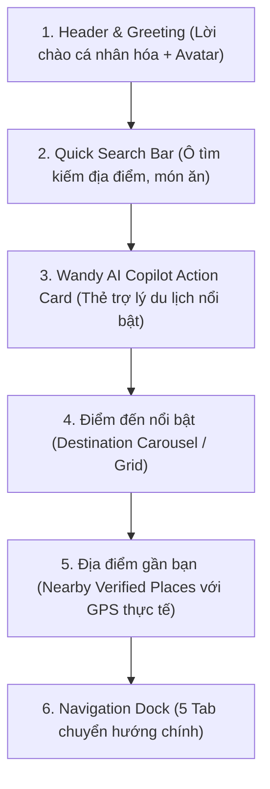

# GoMate — Home Screen Visual Review (V1)

**Tài liệu:** Đánh giá Chi tiết Thiết kế Thị giác Màn hình Khám phá (Home Screen Visual Review)  
**Phiên bản:** 1.0.0  
**Ngày ban hành:** 2026-10-04  
**Nhánh:** `feature/gomate-visual-mockups`  
**Trạng thái:** Sẵn sàng cho Human Review & UI Implementation Approval  
**Màn hình:** `HOME / KHÁM PHÁ` (`FLOW 01`)  

---

## Danh mục Tài sản Thị giác Đã Tạo (Artifact Inventory)

Tất cả các mockup được kết xuất trực tiếp ở độ phân giải pixel-perfect theo quy chuẩn thiết kế:

| Tập tin Mockup | Kích thước Viewport | Trạng thái hiển thị | Mục đích kiểm chứng |
| :--- | :--- | :--- | :--- |
| `home-mobile-default.png` | $390 \times 844\text{ px}$ | **Default State** (Data-rich) | Trải nghiệm chuẩn mobile: Lời chào, Wandy card, Điểm đến nổi bật, Địa điểm gần bạn (GPS thực tế), Bottom Nav 5 tab. |
| `home-mobile-loading.png` | $390 \times 844\text{ px}$ | **Loading State** | Hiệu ứng Skeleton Shimmer đồng bộ toàn màn hình (Header, Search, Wandy Card, Carousels, Cards). |
| `home-mobile-location-unavailable.png` | $390 \times 844\text{ px}$ | **Location Unavailable State** | Trạng thái không có quyền GPS: Thẻ nhắc nhở viền nét đứt trung thực, nút "Bật vị trí" (không bịa khoảng cách/tọa độ). |
| `home-mobile-error.png` | $390 \times 844\text{ px}$ | **Error State** | Banner cảnh báo kết nối nhẹ nhàng, hình minh họa lỗi thân thiện, nút "Thử lại" nổi bật. |
| `home-desktop-default.png` | $1440 \times 900\text{ px}$ | **Desktop Default State** | Giao diện màn hình rộng: Căn giữa `max-width: 800px`, Top Navigation Bar ngang, lưới điểm đến 3 cột trực quan. |
| `home-desktop-loading.png` | $1440 \times 900\text{ px}$ | **Desktop Loading State** | Khung Skeleton Shimmer căn giữa cho màn hình máy tính để bàn/laptop. |

---

## 1. Visual Hierarchy (Phân cấp Thị giác)

Bố cục của màn hình Trang chủ tuân thủ nguyên tắc đọc quét tự nhiên từ trên xuống dưới (Top-to-Bottom Scan Path), tạo cảm giác ấm áp, an tâm và khơi gợi cảm hứng du lịch:

1. **Header & Greeting (Cấp 1):** Định vị thương hiệu GoMate với huy hiệu màu Teal đậm, lời chào thân thiện `"Xin chào bạn 👋"` và câu gợi ý `"Hôm nay bạn muốn đi đâu?"`.
2. **Search Bar (Cấp 2):** Điểm tương tác nhanh với placeholder rõ ràng, có icon kính lúp và nút bộ lọc.
3. **Wandy AI Action Card (Cấp 3 - Hero CTA):** Thẻ trợ lý du lịch trên nền Teal nhạt (`#CCFBF1`) với viền mềm (`#99F6E4`). Biểu tượng ngôi sao ✦ tạo điểm nhấn AI hiện đại, thân thiện, không phô trương. Kèm theo 2 chip tác vụ nhanh: *"✦ Lên lịch trình 3 ngày"* và *"✦ Quán cà phê yên tĩnh"*.
4. **Điểm đến nổi bật (Cấp 4):** Trình bày các thành phố/tỉnh thành du lịch trọng điểm Việt Nam (Hà Nội, Đà Nẵng, Ninh Bình, Hội An) với hình ảnh chất lượng cao và số lượng địa điểm đã xác minh (`"128 địa điểm đã xác minh"`).
5. **Địa điểm gần bạn (Cấp 5):** Thẻ danh sách địa điểm đã xác minh (OSM Verified Places) với khoảng cách thực tế tính từ vị trí người dùng (`"1.2 km"`, `"850 m"`), huy hiệu `"Đã xác minh"` và nhãn trung thực `"Chưa có đánh giá"` (không tạo số sao giả).
6. **Bottom Navigation (Cấp 6 - Neo điều hướng):** 5 tab chuẩn: Khám phá (Active), Bản đồ, Wandy AI, An toàn, Chuyến đi.

---

## 2. Layout Measurements (Kích thước Chi tiết)

### 2.1. Mobile ($390 \times 844\text{ px}$)
- **Safe Area Top:** $44\text{ px}$ (Chứa status bar đồng hồ, pin, sóng).
- **Horizontal Screen Padding:** $16\text{ px}$ (`AppSpacing.screenHorizontal`).
- **Header Height:** $48\text{ px}$.
- **Search Bar Height:** $46\text{ px}$, Bo góc $12\text{ px}$ (`AppRadius.md`), Viền $1\text{ px}$ `#E2E8F0`.
- **Wandy Action Card:** Padding $16\text{ px}$, Bo góc $16\text{ px}$ (`AppRadius.card`), Viền $1\text{ px}$ `#99F6E4`, Chiều cao khoảng $130\text{ px} - 140\text{ px}$.
- **Destination Card (Horizontal Carousel):**
  - Chiều rộng: $155\text{ px}$.
  - Chiều cao: $185\text{ px}$.
  - Chiều cao ảnh nền: $115\text{ px}$ với bo góc trên $16\text{ px}$.
  - Padding nội dung dưới: $10\text{ px}$.
  - Khoảng cách giữa các thẻ: $12\text{ px}$.
- **Nearby Place Card (Vertical List):**
  - Chiều cao thẻ: $88\text{ px}$.
  - Kích thước thumbnail ảnh: $68 \times 68\text{ px}$, bo góc $12\text{ px}$.
  - Padding trong thẻ: $10\text{ px} - 12\text{ px}$.
  - Margin đáy giữa các thẻ: $10\text{ px}$.
- **Bottom Navigation Dock:** Chiều cao $68\text{ px}$, Safe Area Bottom $16\text{ px}$, Viền trên $1\text{ px}$ `#E2E8F0`, Đổ bóng mềm `rgba(0,0,0,0.04)`.

### 2.2. Desktop ($1440 \times 900\text{ px}$)
- **Max Content Container Width:** $800\text{ px}$ căn giữa đối xứng (`margin: 0 auto`).
- **Top Navigation Bar:** Chiều cao $64\text{ px}$, Viền dưới $1\text{ px}$ `#E2E8F0`, Chiều rộng toàn màn hình $1440\text{ px}$, nội dung trong giới hạn $1160\text{ px}$.
- **Desktop Destination Grid:** Hiển thị lưới 3 cột trực quan (`grid-template-columns: repeat(3, 1fr)`), chiều cao mỗi thẻ $195\text{ px}$.
- **Desktop Nearby Grid:** Hiển thị lưới 2 cột (`grid-template-columns: repeat(2, 1fr)`), tận dụng diện tích chiều ngang rộng rãi mà không gây loãng mắt.

---

## 3. Component List (Danh mục Thành phần)

1. **`AppGreetingHeader`**:
   - Logo GoMate (Huy hiệu Teal với icon la bàn/khám phá).
   - Dòng tiêu đề chính: Text H2 `"Xin chào bạn 👋"`.
   - Dòng phụ: Text BodyS `"Hôm nay bạn muốn đi đâu?"`.
   - Nút Avatar tròn ($38 \times 38\text{ px}$) có viền và hiệu ứng hover.

2. **`AppSearchBar`**:
   - Container màu trắng, bo góc $12\text{ px}$, viền xám Slate-200.
   - Icon kính lúp `#94A3B8` bên trái.
   - Text placeholder: `"Tìm địa điểm, món ăn, khách sạn..."`.
   - Icon nút bộ lọc (Filter) bên phải với touch target $44 \times 44\text{ px}$.

3. **`WandyActionCard`**:
   - Container gradient siêu nhẹ: `from #CCFBF1 to #E6FFFA`.
   - Tiêu đề: Text H3 `"✦ Lên kế hoạch cùng Wandy"`.
   - Mô tả: Text BodyS `"Gợi ý lịch trình cá nhân hóa, tối ưu thời gian và chi phí"`.
   - Hàng chip tác vụ nhanh (Quick Prompt Chips) màu trắng có viền mỏng.

4. **`SectionHeader`**:
   - Tiêu đề phân mục: Text H3 `"Điểm đến nổi bật"`, `"Địa điểm gần bạn"`.
   - Nút liên kết phụ: `"Xem tất cả →"` màu Teal-700.

5. **`DestinationCard`**:
   - Khung thẻ Card bo tròn $16\text{ px}$, đổ bóng $0\text{px } 2\text{px } 8\text{px rgba}(0,0,0,0.05)$.
   - Ảnh phong cảnh chất lượng cao với overlay gradient tinh tế.
   - Huy hiệu số lượng địa điểm đã xác minh (`"128 địa điểm"`).

6. **`NearbyPlaceCard`**:
   - Ảnh đại diện địa điểm $68 \times 68\text{ px}$.
   - Tên địa điểm: Text TitleMedium bold.
   - Hàng meta: Category Chip (`"Văn hóa"`, `"Ẩm thực"`), Chip khoảng cách Haversine (`"1.2 km"`), Huy hiệu `"Đã xác minh"`.
   - Dòng đánh giá trung thực: `"Chưa có đánh giá"` (không tạo số sao giả mạo).

7. **`LocationUnavailableCard`**:
   - Container viền nét đứt ($1.5\text{ px}$ dashed `#CBD5E1`), nền xám nhạt `#F8FAFC`.
   - Biểu tượng `location_off` màu xám `#94A3B8`.
   - Lời giải thích minh bạch: *"Bật định vị để GoMate hiển thị chính xác các điểm tham quan gần bạn."*.
   - Nút CTA nổi bật: `"Bật vị trí"` (Nền Teal, chữ trắng, bo góc $10\text{ px}$).

8. **`ErrorBanner` & `EmptyErrorState`**:
   - Banner cảnh báo kết nối `#FEE2E2` viền đỏ `#FECACA` ở đầu trang.
   - Nút hành động phục hồi: `"Thử lại"` (Retry).

9. **`AppNavigationDock` (Bottom Nav & Top Nav)**:
   - 5 Tab chuẩn hóa: Khám phá (Active), Bản đồ, Wandy AI, An toàn, Chuyến đi.
   - Đảm bảo điểm chạm tối thiểu $48 \times 48\text{ px}$ cho mỗi tab trên mobile.

---

## 4. Color Usage (Quy chuẩn Màu sắc Áp dụng)

| Token Thiết kế | Giá trị Hex | Vai trò trong Home Screen | Kiểm tra Độ tương phản (Contrast Ratio) |
| :--- | :--- | :--- | :--- |
| `primary` | `#0F766E` | Màu chủ đạo GoMate, icon active navigation, tiêu đề phụ, nút CTA chính. | $4.8:1$ trên nền trắng (Đạt WCAG AA). |
| `primaryContainer` | `#CCFBF1` | Nền thẻ `WandyActionCard`, nền active tab indicator. | Đạt chuẩn nền pastel dễ chịu. |
| `onPrimaryContainer` | `#115E59` | Chữ tiêu đề trên nền thẻ Wandy card. | $6.2:1$ trên `#CCFBF1` (Đạt WCAG AAA). |
| `accentTerracotta` | `#C96B4B` | Điểm nhấn bản địa Việt Nam, badge nổi bật, icon văn hóa. | $4.6:1$ trên nền trắng (Đạt WCAG AA). |
| `background` | `#F8FAFC` | Nền ứng dụng toàn trang (Slate-50), không gây chói mắt. | Chuẩn nền dịu mắt. |
| `surface` | `#FFFFFF` | Bề mặt các thẻ Card, Search bar, Bottom nav bar. | Độ tách lớp bằng viền `#E2E8F0` + bóng nhẹ. |
| `textPrimary` | `#0F172A` | Tiêu đề chính, tên địa điểm, tên thành phố. | $15.4:1$ trên nền trắng (Đạt WCAG AAA). |
| `textSecondary` | `#475569` | Mô tả phụ, khoảng cách, thông tin hỗ trợ. | $7.1:1$ trên nền trắng (Đạt WCAG AAA). |
| `textTertiary` | `#94A3B8` | Placeholder tìm kiếm, text phụ không quan trọng. | $3.1:1$ (Đạt chuẩn cho non-essential text). |
| `border` | `#E2E8F0` | Đường kẻ phân tách, viền thẻ card, viền dock. | Viền sắc nét, không gắt. |
| `error` | `#B91C1C` | Chữ báo lỗi mạng, icon lỗi. | $5.9:1$ trên nền trắng (Đạt WCAG AA). |
| `errorContainer` | `#FEE2E2` | Nền banner thông báo lỗi. | Chuẩn alert nhẹ nhàng. |

---

## 5. Typography (Hệ thống Kiểu chữ)

Phông chữ hiển thị chủ đạo: `Plus Jakarta Sans` / `Be Vietnam Pro` / `Inter`, hỗ trợ hoàn hảo tiếng Việt với đầy đủ dấu thanh:

| Cấp bậc Chữ | Size / Line-height | Weight | Màu áp dụng | Thành phần áp dụng |
| :--- | :--- | :--- | :--- | :--- |
| **Display** | $30\text{ px} / 38\text{ px}$ | Bold (700) | `#0F172A` | Tiêu đề trang trọng (khi mở rộng). |
| **H1** | $24\text{ px} / 32\text{ px}$ | Bold (700) | `#0F172A` | Tiêu đề màn hình chính. |
| **H2** | $20\text{ px} / 28\text{ px}$ | Bold (700) | `#0F172A` | Lời chào `"Xin chào bạn 👋"`. |
| **H3** | $18\text{ px} / 26\text{ px}$ | SemiBold (600) | `#0F172A` | Tiêu đề section (`"Điểm đến nổi bật"`). |
| **BodyL** | $16\text{ px} / 24\text{ px}$ | Regular (400) | `#0F172A` | Nội dung văn bản chính. |
| **BodyM** | $14\text{ px} / 20\text{ px}$ | Regular / Medium | `#475569` | Placeholder tìm kiếm, mô tả thẻ Wandy. |
| **BodyS** | $13\text{ px} / 18\text{ px}$ | Regular (400) | `#64748B` | Nhãn khoảng cách (`"1.2 km"`), số lượng địa điểm. |
| **LabelSmall** | $11\text{ px} / 14\text{ px}$ | SemiBold (600) | `#0F766E` / `#475569` | Category Badge, Verified Badge, Tab Label. |

---

## 6. Spacing & Rhythm (Nhịp điệu Khoảng cách)

- **Base Grid:** Bội số $4\text{ px}$ (`AppSpacing.xs = 4`, `sm = 8`, `md = 16`, `lg = 24`, `xl = 32`).
- **Screen Margins:** Cố định $16\text{ px}$ hai bên lề trên Mobile.
- **Vertical Flow Spacing:**
  - Header $\rightarrow$ Search Bar: $12\text{ px}$.
  - Search Bar $\rightarrow$ Wandy Card: $16\text{ px}$.
  - Wandy Card $\rightarrow$ Section Header ("Điểm đến nổi bật"): $20\text{ px}$.
  - Section Header $\rightarrow$ Carousel: $12\text{ px}$.
  - Carousel $\rightarrow$ Section Header ("Địa điểm gần bạn"): $24\text{ px}$.
  - Section Header $\rightarrow$ List Card: $12\text{ px}$.
  - Bottom-most item $\rightarrow$ Navigation Dock: $32\text{ px}$ (đảm bảo không bị thanh dock che khuất nội dung).

---

## 7. Responsive Behavior (Hành vi Co giãn Đa nền tảng)

1. **Mobile (< 720px):**
   - Nội dung cuộn 1 cột tự nhiên với `maxWidth: 100%`.
   - Điểm đến nổi bật cuộn ngang (`SingleChildScrollView(scrollDirection: Axis.horizontal)`).
   - Thanh điều hướng đặt cố định ở đáy màn hình (`BottomNavigationBar`).
2. **Tablet (720px - 1024px):**
   - Nội dung nằm trong container trung tâm `maxWidth: 720px`.
   - Điểm đến nổi bật chuyển sang dạng lưới 2 hoặc 3 cột.
3. **Desktop (≥ 1024px, chuẩn 1440px):**
   - Container trung tâm cố định `maxWidth: 800px` căn giữa màn hình (`margin: 0 auto`).
   - Thanh điều hướng chuyển lên đầu trang (`TopNavigationBar`), hiển thị logo GoMate bên trái, 5 liên kết điều hướng ở giữa, và Avatar hồ sơ bên phải.
   - Thẻ điểm đến hiển thị lưới 3 cột hoàn chỉnh, không cần cuộn ngang.
   - Địa điểm gần bạn chia lưới 2 cột đối xứng giúp không gian cân đối và chuyên nghiệp.

---

## 8. Interaction Notes (Ghi chú Tương tác)

- **Touch Target:** Tất cả các nút bấm, icon và ô nhập liệu đều có vùng chạm tối thiểu $44 \times 44\text{ px}$ (chuẩn Apple HIG và Material Design).
- **Search Bar Tap:** Mở Search Delegate hoặc chuyển sang Map Search với focus tự động vào bàn phím.
- **Wandy Action Card Tap:** Chuyển thẳng sang Tab Wandy AI (`index: 2`) hoặc kích hoạt nhanh kịch bản gợi ý tương ứng.
- **Destination Card Tap:** Điều hướng đến danh sách địa điểm lọc theo tỉnh thành đó trên Bản đồ.
- **Nearby Place Card Tap:** Mở trực tiếp màn hình `Place Detail Screen` (`FLOW 08`).
- **Feedback:** Hiệu ứng InkWell / Ripple tinh tế với màu `AppColors.primary.withOpacity(0.08)` khi người dùng chạm vào thẻ.

---

## 9. Accessibility Notes (Khả năng Tiếp cận)

- **Độ tương phản màu sắc (WCAG AA & AAA):** Chữ văn bản chính `#0F172A` trên nền `#FFFFFF` đạt tỷ lệ tương phản $15.4:1$ (vượt xa chuẩn $4.5:1$). Chữ màu thương hiệu `#0F766E` trên nền trắng đạt $4.8:1$.
- **Semantics:** Tất cả hình ảnh đều có thuộc tính mô tả ý nghĩa (Semantic Labels) cho trình đọc màn hình (TalkBack/VoiceOver).
- **Không phụ thuộc vào màu sắc (Non-color reliant):** Huy hiệu `"Đã xác minh"` luôn đi kèm biểu tượng dấu tích xanh `✓` và chữ tiếng Việt rõ ràng.
- **Dynamic Type Support:** Thiết kế sẵn sàng co giãn khi người dùng tăng kích cỡ chữ trong cài đặt hệ thống mà không gây tràn khung (`RenderFlex overflow`).

---

## 10. Open Design Questions (Câu hỏi Thiết kế Cần Duyệt Trước Khi Code)

1. **Vị trí hiển thị của Navigation Bar trên Desktop:**
   - *Phương án A (Khuyến nghị - Đã mockup):* Thanh Top Navigation Bar ở đỉnh màn hình (`height: 64px`) theo chuẩn web hiện đại.
   - *Phương án B:* Thanh Side Navigation Rail bên trái màn hình.
   *(Khuyến nghị chốt Phương án A để đồng bộ với trải nghiệm website du lịch).*
2. **Kích thước Lưới Điểm đến trên Desktop:**
   - Hiện tại đang mockup lưới 3 cột trong container $800\text{ px}$. Đội ngũ thiết kế đánh giá mật độ hiển thị rất hài hòa và không bị loãng.
3. **Trạng thái khi chưa bật GPS:**
   - Thiết kế sử dụng thẻ viền nét đứt (`LocationUnavailableCard`) nhắc nhở bật vị trí ngay tại mục "Địa điểm gần bạn", thay vì hiển thị popup modal chặn toàn màn hình. Giải pháp này giúp người dùng vẫn duyệt được các mục khác của ứng dụng một cách thoải mái.

---

## Kết luận & Sẵn sàng Nghiệm thu

Bộ 6 hình ảnh visual mockup cùng tài liệu đánh giá kỹ thuật này đã thiết lập chuẩn mực thị giác hoàn chỉnh cho GoMate. Toàn bộ hình ảnh đã được lưu tại:
`docs/design/mockups/home/`

Sẵn sàng chuyển giao cho Human Review trước khi tiến hành bước tiếp theo (Thiết kế Mockup Bản đồ MAP SCREEN).
