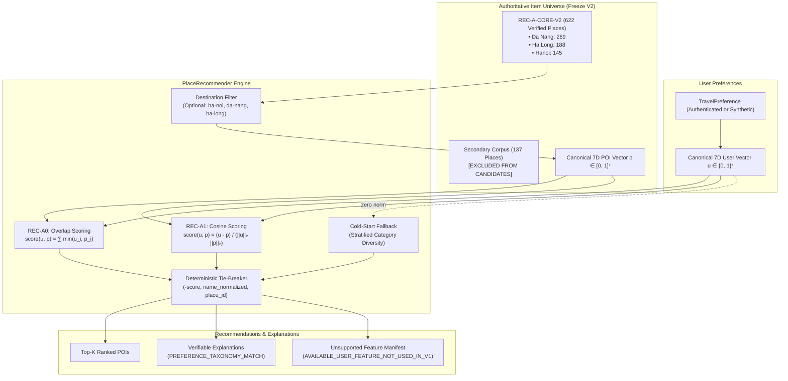
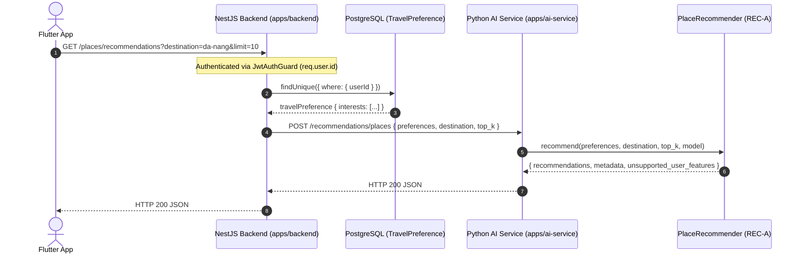

# GoMate REC-A Content-Based Personalized Place Recommender V1

**Specification Identifier:** `gomate-rec-a-content-baseline-v1`  
**Version:** `1.0.0`  
**Status:** IMPLEMENTED, BENCHMARKED & VERIFIED  
**Date:** 2026-10-09  
**Branch:** `feature/rec-a-content-baseline-v1`  
**Base Commit:** `e464062`  
**Thesis Phase:** Week 4 — Recommender Baseline (REC-A)  
**Authoritative Dataset:** Dataset Freeze V2 ([`gomate_places_freeze_v2.json`](file:///d:/Do_an/wanderai/data/curated/gomate_places_freeze_v2.json))  

---

## 1. Executive Summary

This document specifies the design, mathematical formulation, architectural implementation, runtime integration, and offline benchmark results of the first personalized place recommendation baselines for the GoMate intelligent travel platform:
- **`REC-A0`**: Taxonomy Match Overlap Baseline
- **`REC-A1`**: Cosine Content-Based Vector Baseline
- **`COLD_START_DIVERSE_CATALOG_BASELINE`**: Deterministic Stratified Cold-Start Fallback

The recommender system bridges authenticated and synthetic `TravelPreference` profiles with the canonical, factual POI catalog across GoMate's 3-city MVP scope (Hanoi, Da Nang, Ha Long), providing transparent, deterministic Top-K recommendations accompanied by verifiable Vietnamese explanations.



---

## 2. Authoritative Dataset Lock & Item Universe

### 2.1 REC-A-CORE-V2 Candidate Universe
The candidate POI universe is strictly locked to **`REC-A-CORE-V2`**, consisting of exactly **622 verified OpenStreetMap / Overture-crosschecked places**:

| Destination | Destination Slug | Core POI Count | Status |
| :--- | :--- | :--- | :--- |
| **Đà Nẵng** | `da-nang` | 289 | Primary Core |
| **Hạ Long** | `ha-long` | 188 | Primary Core |
| **Hà Nội** | `ha-noi` | 145 | Primary Core |
| **Total Core Universe** | — | **622** | **REC-A-CORE-V2** |

### 2.2 Secondary Corpus Segregation (137 POIs)
The secondary corpus comprises **137 places** (Hội An: 50, Huế: 50, Nha Trang: 33, and 4 boundary places in Điện Bàn / Quảng Nam). These places have `is_rec_a_core_v2: false` in [`gomate_places_freeze_v2.json`](file:///d:/Do_an/wanderai/data/curated/gomate_places_freeze_v2.json) and are strictly excluded from the recommendation candidate universe.

### 2.3 Strict Exclusion of Quảng Nam Boundary Places
As ratified in `MVP-SCOPE-01-R1`, the following 4 POIs located in Điện Bàn, Quảng Nam are explicitly excluded from Da Nang recommendations:
1. `5e1ca20e-b579-59b8-b243-9f13aa43c65f` (*TASY STUDIO*)
2. `6489aeb0-fb3d-584d-9ca9-d6172e9cc63f` (*Khu tưởng niệm Hà My*)
3. `db61c6ab-1fde-51fe-ac20-0deef2fc5981` (*Đài tưởng niệm thảm sát Hà My*)
4. `4c4ca7e8-2586-57cb-af5d-5e2b72c7bd4d` (*Mini-Golf Hoi An*)

### 2.4 Freeze V1 Narrative Erratum
In the initial `DATA-02` textual summary report, an informal text narrative stated Da Nang baseline had 89 places. However, the authoritative JSON artifact [`gomate_places_freeze_v1.json`](file:///d:/Do_an/wanderai/data/curated/gomate_places_freeze_v1.json) always contained exactly 114 Da Nang places (alongside Hanoi: 145, Ha Long: 188, Hoi An: 50, Hue: 50, Nha Trang: 33 = 580 total). In `MVP-SCOPE-01-R1`, this was reconciled and documented in [`freeze-v1-to-v2-place-lineage.json`](file:///d:/Do_an/wanderai/data/manifests/freeze-v1-to-v2-place-lineage.json). The 179 newly collected Da Nang POIs plus the 110 original Da Nang core places (114 minus 4 Quảng Nam boundary places) form the 289 Da Nang core items in Freeze V2 ($145 + 188 + 289 = 622$).

---

## 3. Feature Representation & Vectorization

### 3.1 Canonical 7D Vocabulary
To eliminate unstructured text entropy and align with [`gomate-reca-feature-contract-v1.md`](file:///d:/Do_an/wanderai/docs/recommendation/gomate-reca-feature-contract-v1.md), both user profiles and items are projected into a 7-dimensional orthogonal space:

$$\mathcal{D} = [d_1, d_2, d_3, d_4, d_5, d_6, d_7]$$

```python
CANONICAL_INTERESTS = [
    "food_cuisine",             # Ẩm thực & Đặc sản
    "culture_history",          # Văn hóa & Lịch sử
    "nature_outdoor",           # Thiên nhiên & Dã ngoại
    "coffee_culture",           # Cà phê & Trà quán
    "beach_island",             # Biển đảo & Nghỉ dưỡng
    "shopping_local",           # Mua sắm & Chợ địa phương
    "nightlife_entertainment",  # Giải trí & Đời sống về đêm
]
```

### 3.2 User Vector Construction
For a given `TravelPreference` profile containing active interests $I \subseteq \mathcal{D}$:

$$u_i = \begin{cases} 1.0 & \text{if } d_i \in I \\ 0.0 & \text{otherwise} \end{cases}$$

The user vector $u \in \{0, 1\}^7$ has Euclidean norm $\|u\|_2 = \sqrt{\sum_{i=1}^7 u_i^2} = \sqrt{|I|}$.

### 3.3 Item Vector Construction (`poi_to_canonical_vector`)
Items are mapped into $p \in [0, 1]^7$ through deterministic projection from their verified taxonomy and tags:
- **Primary Domain Mapping:**
  - `FOOD_BEVERAGE` $\rightarrow$ `food_cuisine` ($1.0$). If `tier_2 == cafe_tea` or cafe tags exist $\rightarrow$ also `coffee_culture` ($1.0$).
  - `CULTURE_HERITAGE` $\rightarrow$ `culture_history` ($1.0$).
  - `NATURE_SCENERY` $\rightarrow$ `nature_outdoor` ($1.0$). If coastal/beach tags exist $\rightarrow$ also `beach_island` ($1.0$).
  - `SHOPPING_COMMERCE` $\rightarrow$ `shopping_local` ($1.0$).
  - `ATTRACTIONS_LEISURE` $\rightarrow$ `nightlife_entertainment` ($1.0$). If nature/parks $\rightarrow$ also `nature_outdoor` ($1.0$).
- **Hospitality & Secondary Tags:**
  - Resort/Beach hotels $\rightarrow$ `beach_island` ($0.5$).
  - General city hotels $\rightarrow$ no activity bias ($[0]^7$).
  - Nightlife venues $\rightarrow$ `nightlife_entertainment` ($1.0$).

---

## 4. Mathematical Formulation of Recommendation Algorithms

### 4.1 REC-A0: Taxonomy Match Overlap Baseline
`REC-A0` computes an unnormalized overlap count reflecting how many canonical interest domains are simultaneously active in both the user profile and the place:

$$\text{score}_{\text{A0}}(u, p) = \sum_{i=1}^7 \min(u_i, p_i) \quad \text{for } u_i > 0 \land p_i > 0$$

- **Range:** $[0.0, 4.0]$ (integer/half-integer values).
- **Properties:** Fast, intuitive, favors items with broad domain coverage matching user interests.

### 4.2 REC-A1: Cosine Content-Based Vector Baseline
`REC-A1` normalizes for vector length by computing the cosine similarity between the 7D user vector and the 7D item vector:

$$\text{score}_{\text{A1}}(u, p) = \frac{u \cdot p}{\|u\|_2 \|p\|_2} = \frac{\sum_{i=1}^7 u_i p_i}{\sqrt{\sum_{i=1}^7 u_i^2} \sqrt{\sum_{i=1}^7 p_i^2}}$$

If $\|u\|_2 = 0$ or $\|p\|_2 = 0$, $\text{score}_{\text{A1}}(u, p) = 0.0$.
- **Range:** $[0.0, 1.0]$.
- **Properties:** Angle-based similarity penalizing items with bloated or irrelevant tags, rewarding high-purity thematic alignment.

### 4.3 Deterministic Tie-Breaking
When candidates achieve identical scores, GoMate applies a strict, platform-independent 3-tuple sort key:

$$\text{SortKey}(item) = (-\text{score}, \text{NormalizeString}(name), \text{place\_id})$$

Where `NormalizeString` removes diacritics, strips punctuation, and lowercases text. This guarantees 100% bit-identical ordering across operating systems, Python versions, and runtime invocations.

---

## 5. Cold-Start Handling (`COLD_START_DIVERSE_CATALOG_BASELINE`)

When a user has no persisted preferences, empty interests, or completely unrecognized tags ($\|u\|_2 = 0$):
1. **Never Fabricate Popularity:** GoMate does not invent ratings, review counts, or view counts.
2. **Stratified Catalog Diversity:** Candidates are partitioned by primary category (`FOOD_BEVERAGE`, `CULTURE_HERITAGE`, `NATURE_SCENERY`, `ATTRACTIONS_LEISURE`, `SHOPPING_COMMERCE`).
3. **Round-Robin Interleaving:** The engine samples items across distinct categories using deterministic sorting, providing wide exploratory discovery.
4. **Metadata & Strategy:** Explicitly tagged as `cold_start: true`, `algorithm: "COLD_START_DIVERSE_CATALOG_BASELINE"`, and reason code `COLD_START_DIVERSE_FALLBACK`.

---

## 6. Unsupported Features Manifest

The `TravelPreference` database model includes dimensions currently unsupported by factual OSM/Overture POI attributes. To maintain research honesty, these dimensions are returned explicitly in every recommendation response:

```json
"unsupported_user_features": [
  {
    "feature": "budgetMin",
    "status": "AVAILABLE_USER_FEATURE_NOT_USED_IN_V1",
    "reason": "POI price data is not reliably standardized in OSM/Overture factual dataset."
  },
  {
    "feature": "budgetMax",
    "status": "AVAILABLE_USER_FEATURE_NOT_USED_IN_V1",
    "reason": "POI price data is not reliably standardized in OSM/Overture factual dataset."
  },
  {
    "feature": "preferredGroup",
    "status": "AVAILABLE_USER_FEATURE_NOT_USED_IN_V1",
    "reason": "Group dynamics and party size constraints are not modeled in REC-A baseline."
  },
  {
    "feature": "avoidances",
    "status": "AVAILABLE_USER_FEATURE_NOT_USED_IN_V1",
    "reason": "Negative preference filtering is deferred to post-filtering in later milestones."
  },
  {
    "feature": "dietaryNeeds",
    "status": "AVAILABLE_USER_FEATURE_NOT_USED_IN_V1",
    "reason": "Detailed dietary certification is not universally populated in OSM nodes."
  }
]
```

---

## 7. Transparent Recommendation Explanations

Each recommended POI includes a verifiable explanation object derived directly from the active vector dimensions:

```json
{
  "place_id": "11201442-7048-5ca4-974d-3ad73b9d4e89",
  "name": "Bãi Bà Đa",
  "destination": "Đà Nẵng",
  "destination_slug": "da-nang",
  "category": "beach",
  "score": 0.67082,
  "rank": 1,
  "matched_interests": [
    "nature_outdoor",
    "beach_island"
  ],
  "explanation": {
    "reason_code": "PREFERENCE_TAXONOMY_MATCH",
    "matched_interests": [
      "nature_outdoor",
      "beach_island"
    ],
    "matched_taxonomy": [
      "NATURE_SCENERY"
    ],
    "text": "Phù hợp vì bạn quan tâm đến thiên nhiên & dã ngoại và biển đảo & nghỉ dưỡng."
  },
  "strategy": "rec-a1_content_match"
}
```

---

## 8. Runtime Architecture & API Integration

The recommendation stack consists of a decoupled, layered architecture:



### 8.1 Pure Python Engine
Located at [`apps/ai-service/recommendation/reca/`](file:///d:/Do_an/wanderai/apps/ai-service/recommendation/reca/):
- `contract.py`: Pure vector projection and taxonomy logic.
- `models.py`: Mathematical implementations of `RecA0TaxonomyBaseline`, `RecA1CosineBaseline`, `ColdStartDiverseBaseline`, and `build_explanation`.
- `engine.py`: `PlaceRecommender` class with automated dataset loading, caching, core filtering, and deterministic sorting.

### 8.2 FastAPI Runtime Endpoint
- **Route:** `POST /recommendations/places`
- **Request Body:**
  ```json
  {
    "preferences": {
      "interests": ["nature_outdoor", "beach_island"]
    },
    "destination": "da-nang",
    "top_k": 10,
    "model": "rec-a1"
  }
  ```

### 8.3 NestJS Backend Gateway
- **Route:** `GET /places/recommendations`
- **Controller:** [`apps/backend/src/modules/places/places.controller.ts`](file:///d:/Do_an/wanderai/apps/backend/src/modules/places/places.controller.ts)
- **Security:** Protected by `JwtAuthGuard`. The user ID is strictly extracted from the validated JWT token (`@CurrentUser()`). Arbitrary client `userId` spoofing is impossible.
- **Service Integration:** Injects `AiProxyService` calling FastAPI with persisted preferences.

---

## 9. Empirical Offline Benchmark Results

The benchmark suite ([`scripts/run_reca_benchmarks.py`](file:///d:/Do_an/wanderai/scripts/run_reca_benchmarks.py)) was executed over all **300 synthetic preference profiles** from [`data/evaluation/synthetic/preferences_n300_seed42.json`](file:///d:/Do_an/wanderai/data/evaluation/synthetic/preferences_n300_seed42.json) against the 622 `REC-A-CORE-V2` places.

### 9.1 Benchmark Metrics Summary

| Metric | REC-A0 (Overlap) | REC-A1 (Cosine) | Status / Notes |
| :--- | :--- | :--- | :--- |
| **Evaluated Profiles ($N$)** | 300 | 300 | 100% evaluated |
| **Total Recommendations ($N \times K$)** | 3,000 | 3,000 | $K = 10$ |
| **Zero-Result Profiles** | **0** | **0** | **0% failure rate** |
| **Cold-Start Fallback Invocations** | 0 | 0 | All 300 profiles have valid interests |
| **Unique POIs Recommended** | 56 | 76 | Cosine provides higher catalog exploration (+35.7%) |
| **Catalog Coverage (%)** | 9.00% | 12.22% | In pure Top-10 unconstrained ranking |
| **Score Minimum** | 1.0000 | 0.5000 | At least 1 matching dimension |
| **Score Maximum** | 1.5000 | 1.0000 | Perfect vector direction alignment |
| **Score Mean** | 1.0903 | 0.6495 | Balanced distribution |
| **Score Median** | 1.0000 | 0.6708 | Consistent central tendency |
| **Score Std Dev** | 0.1869 | 0.1067 | Stable variance |
| **Run 1 == Run 2 (Determinism)** | **True** | **True** | **100% Bit-Identical Reproducibility** |

### 9.2 Destination Distribution of Top-10 Recommendations

| Destination | REC-A0 Count | REC-A0 % | REC-A1 Count | REC-A1 % |
| :--- | :--- | :--- | :--- | :--- |
| **Đà Nẵng** | 1,992 | 66.4% | 1,801 | 60.0% |
| **Hạ Long** | 754 | 25.1% | 684 | 22.8% |
| **Hà Nội** | 254 | 8.5% | 515 | 17.2% |
| **Total** | 3,000 | 100.0% | 3,000 | 100.0% |

### 9.3 Generated Evaluation Artifacts
- [`reca0_top10_n300.json`](file:///d:/Do_an/wanderai/data/evaluation/reca/reca0_top10_n300.json): 300 profiles $\times$ Top-10 recommendations under REC-A0.
- [`reca1_top10_n300.json`](file:///d:/Do_an/wanderai/data/evaluation/reca/reca1_top10_n300.json): 300 profiles $\times$ Top-10 recommendations under REC-A1.
- [`reca_benchmark_summary.json`](file:///d:/Do_an/wanderai/data/evaluation/reca/reca_benchmark_summary.json): Aggregated distribution, diagnostic metrics, and determinism verification.

---

## 10. Research Threats to Validity & Limitations

1. **Top-K Catalog Concentration:** In unconstrained global ranking ($K=10$), the top items are concentrated among POIs with high thematic coverage in popular categories (e.g. coastal beaches and top food venues), yielding 12.22% catalog coverage across 300 users. Destination-constrained queries distribute coverage evenly across cities.
2. **Absence of Interaction History:** Pure content-based baselines do not model collaborative filtering patterns. This limitation will be addressed in REC-B (collaborative hotel recommendations via ViHoRec benchmark).
3. **Scientific Claims Boundary:** This milestone establishes the reproducible algorithmic baseline and runtime vertical slice. Final scientific benchmarking with NDCG, MAP, and cross-model ranking tests is deferred to `REC-EVAL-01` (Week 5).
