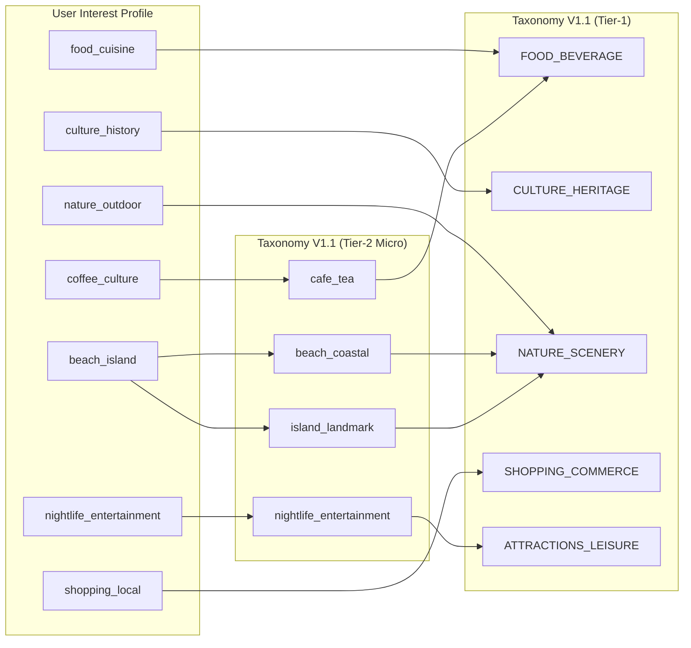

# GoMate REC-A Recommender Feature & Input Contract (V1)

**Specification Identifier:** `gomate-reca-feature-contract-v1`  
**Version:** `1.0.0`  
**Status:** RATIFIED & LOCKED  
**Date:** 2026-10-07  
**Branch:** `feature/profile-preferences`  
**Target Consumer:** REC-A Recommender Evaluation Track & Cold-Start Matching  
**Upstream Source Model:** PostgreSQL `travel_preferences` table (`TravelPreference`)  
**Evaluation Item Universe:** 580 Canonical Verified OSM POIs ([`gomate_places_freeze_v1.json`](file:///d:/Do_an/wanderai/data/curated/gomate_places_freeze_v1.json))

---

## 1. Executive Summary

This document establishes the official feature contract between user travel preference profiles (`TravelPreference`) and the recommender item universe (REC-A) for the GoMate platform.

It defines:
1. **Canonical Interest Vocabulary:** A controlled 7-key vocabulary for new preference writes.
2. **POI Taxonomy Mapping:** Explicit semantic projections from user interests to GoMate Taxonomy V1.1 (Tier-1 macro domains and Tier-2 micro categories).
3. **Attribute Semantics:** Concrete representations for budget constraints, travel styles, preferred group sizes, avoidances, and dietary requirements.
4. **Backward Compatibility & Defense-in-Depth:** Permissive parsing of legacy free-form preferences combined with strict validation for new persistence operations.

---

## 2. Canonical Preference Vocabulary

To eliminate free-text entropy and ensure reproducible feature vectors for recommendation algorithms without exposing low-level OSM tagging, all user interest inputs are restricted to the following 7 canonical keys:

| Canonical Key | Display Label (VI) | Description |
| :--- | :--- | :--- |
| `food_cuisine` | Ẩm thực & Đặc sản | Khám phá ẩm thực địa phương, nhà hàng, ẩm thực đường phố và đặc sản vùng miền. |
| `culture_history` | Văn hóa & Lịch sử | Tham quan di tích lịch sử, bảo tàng, chùa chiền, làng nghề truyền thống và kiến trúc cổ. |
| `nature_outdoor` | Thiên nhiên & Dã ngoại | Khám phá danh lam thắng cảnh, vườn quốc gia, hồ nước, leo núi và hoạt động ngoài trời. |
| `coffee_culture` | Cà phê & Trà quán | Trải nghiệm văn hóa cà phê Việt Nam, quán trà, không gian thư giãn và check-in. |
| `beach_island` | Biển đảo & Nghỉ dưỡng | Tắm biển, tham quan vịnh, đảo, hang động ven biển và hoạt động thể thao mặt nước. |
| `shopping_local` | Mua sắm & Chợ địa phương | Mua sắm đặc sản, quà lưu niệm, khám phá chợ truyền thống và trung tâm thương mại. |
| `nightlife_entertainment` | Giải trí & Đời sống về đêm | Phố đi bộ, quán bar, pub, biểu diễn nghệ thuật, chợ đêm và hoạt động giải trí đêm. |

---

## 3. Preference → POI Taxonomy V1.1 Mapping

The recommender candidate selection and scoring engine projects canonical interest keys into POI taxonomy dimensions:

### Detailed Mapping Rules

| Canonical Interest | Primary Tier-1 Macro Domain | Target Tier-2 Micro Categories | Fallback POI Legacy Category |
| :--- | :--- | :--- | :--- |
| `food_cuisine` | `FOOD_BEVERAGE` | `restaurant_dining`, `street_food`, `seafood_dining` | `restaurant` |
| `culture_history` | `CULTURE_HERITAGE` | `temple_pagoda`, `museum_gallery`, `historic_monument`, `heritage_craft` | `culture`, `temple`, `museum` |
| `nature_outdoor` | `NATURE_SCENERY` | `park_garden`, `cave_grotto`, `lake_river`, `zoo_wildlife`, `scenic_viewpoint` | `nature`, `attraction` |
| `coffee_culture` | `FOOD_BEVERAGE` | `cafe_tea` | `cafe` |
| `beach_island` | `NATURE_SCENERY` | `beach_coastal`, `island_landmark`, `cave_grotto` | `beach`, `attraction` |
| `shopping_local` | `SHOPPING_COMMERCE` | `traditional_market`, `shopping_mall`, `souvenir_craft` | `market`, `attraction` |
| `nightlife_entertainment` | `ATTRACTIONS_LEISURE` | `nightlife_entertainment`, `theme_park_leisure`, `water_park` | `nightlife`, `attraction` |

---

## 4. Attribute Semantics

### 4.1 Travel Style (`travelStyle`)
Stored as PostgreSQL enum `TravelStyle`:
- `BACKPACKER`: Phượt, tối ưu tính cơ động, trải nghiệm khám phá bản địa, chi phí tối thiểu.
- `BUDGET`: Du lịch tiết kiệm, tập trung tối ưu chi tiêu nhưng ưu tiên dịch vụ cơ bản ổn định.
- `COMFORT` *(Default)*: Thoải mái, cân bằng chi phí và tiện nghi, khách sạn 3-4 sao, ẩm thực chọn lọc.
- `LUXURY`: Sang trọng, khu nghỉ dưỡng 4-5 sao, dịch vụ cao cấp, trải nghiệm ẩm thực tinh hoa.

*Recommender Semantic:* Sets the prior distribution for price tier filtering and venue ambiance scoring.

### 4.2 Budget Range (`budgetMin`, `budgetMax`)
- **Unit:** Integer in Vietnamese Đồng (VND).
- **Invariants:**
  - $\text{budgetMin} \ge 0$
  - $\text{budgetMax} \ge 0$
  - $\text{budgetMin} \le \text{budgetMax}$
- **Default Baseline:** $\text{budgetMin} = 0$, $\text{budgetMax} = 10,000,000$ VND.
- *Recommender Semantic:* Hard/soft constraint on cumulative trip cost or per-venue estimated price level.

### 4.3 Preferred Group Size (`preferredGroup`)
Stored as PostgreSQL enum `GroupSize`:
- `SOLO`: 1 người.
- `COUPLE`: 2 người (ưu tiên không gian lãng mạn, ẩm thực ấm cúng).
- `SMALL_GROUP`: 3–5 người (bạn bè, gia đình nhỏ).
- `LARGE_GROUP`: 6+ người (ưu tiên địa điểm có sức chứa lớn, bàn tiệc, dịch vụ đoàn).
- `FAMILY`: Gia đình (có người già hoặc trẻ em; ưu tiên an toàn, tiếp cận dễ dàng, không gian thân thiện trẻ nhỏ).

*Recommender Semantic:* Filters venues unsuitable for large groups or families with children.

### 4.4 Avoidances (`avoidances`)
- Free-form string array capturing user aversion (e.g. `['crowds', 'heights', 'loud_music', 'steep_stairs']`).
- *Recommender Semantic:* Negative penalty filter. Venues tagged with matching negative attributes receive a score penalty or are excluded.

### 4.5 Dietary Needs (`dietaryNeeds`)
- Free-form string array capturing dietary restrictions (e.g. `['vegetarian', 'vegan', 'halal', 'no_seafood']`).
- *Recommender Semantic:* Dining filter. For recommendations within `FOOD_BEVERAGE`, restaurants lacking support for specified dietary needs are deprioritized or filtered out.

---

## 5. Backward Compatibility & Defense-in-Depth

1. **Permissive Legacy Read:**
   - Pre-existing user profiles or benchmark datasets (e.g. synthetic fixtures) may contain unnormalized string tags (`'beach'`, `'mountain'`, `'historic_architecture'`).
   - `GET /users/me` returns these tags verbatim without throwing validation errors.
2. **Strict Canonical New Writes:**
   - Any `PUT /users/me/preferences` invocation must pass strict validation against `CANONICAL_INTERESTS`.
   - Unknown keys, negative budgets, inverted budget ranges, or disallowed attributes are rejected with HTTP 400.
3. **Field Whitelisting:**
   - Unsupported or un-migrated fields (`pace`, `presence`, `online`, `showActivityStatus`, `userId`) are rejected by NestJS `ValidationPipe({ forbidNonWhitelisted: true })`.

---

## 6. Scientific Limitations & Out-of-Scope Declarations

- **No Ranking Algorithm:** This contract specifies the input representation only. Scoring functions, collaborative filtering models (REC-B), and graph-based rerankers will be evaluated in subsequent tasks.
- **No Dietary Medical Diagnostics:** `dietaryNeeds` serves strictly as venue tag filtering and does not provide allergen safety guarantees.
- **Fixed Item Universe:** Recommender candidate selection evaluates strictly against the 580 canonical verified OSM POIs frozen in [`data/curated/gomate_places_freeze_v1.json`](file:///d:/Do_an/wanderai/data/curated/gomate_places_freeze_v1.json).
