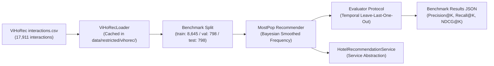

# WanderAI Hotel Recommendation Pipeline & Benchmark

**Document Version:** 1.0.0  
**Audit Date:** 2026-10-01  
**Auditor:** Technical Lead & AI Engineer (Antigravity)  
**Task Reference:** TASK 06.4 — Track B: Recommendation Foundation  
**Dataset Reference:** ViHoRec (CC BY-NC 4.0 / MIT)  

---

## 1. Overview & Architecture

The WanderAI Hotel Recommendation subsystem provides personalized and cold-start accommodation suggestions for Vietnamese destinations. In accordance with data governance rules, the **ViHoRec** corpus is assigned exclusively to recommendation research and evaluation.



---

## 2. Dataset Preprocessing & Normalization

The current release of `MinhNguyenDS/ViHoRec` (`Master` branch) exhibits distinct schemas across files:
* `interactions.csv`: Columns `user_id`, `hotel_id`, `rating`, `date`, `source`.
* `train.csv`, `val.csv`, `test.csv`: Columns `userID`, `itemID`, `rating`, `timestamp`.
* `hotels.csv`: Columns `hotel_id`, `name`, `location`.

The `ViHoRecLoader` (`apps/ai-service/recommendation/loader.py`) automatically standardizes these into canonical names:
* `userID` → `user_id`
* `itemID` → `hotel_id`
* `location` → `city`

---

## 3. Evaluation Protocol

* **Temporal Leave-Last-One-Out:** To avoid temporal leakage, the last interaction for each test user in chronological order is held out as the evaluation target.
* **Cold-Start Focus:** 69.5% of users in the dataset have only a single interaction, making this a rigorous testbed for cold-start algorithms.
* **Evaluation Metrics:**
  * **Precision@K:** Fraction of top-K recommendations that match user test selections.
  * **Recall@K:** Fraction of user test selections captured within the top-K recommendations.
  * **NDCG@K:** Ranking-weighted evaluation attributing higher gain to relevant items appearing earlier in the list.

---

## 4. MostPop Baseline Benchmark Results

Evaluated across **798 test users** on the official benchmark test split:

| Metric | K = 5 | K = 10 |
| :--- | :---: | :---: |
| **Precision@K** | **0.01228** | **0.01103** |
| **Recall@K** | **0.06140** | **0.11028** |
| **NDCG@K** | **0.03793** | **0.05366** |

Machine-readable results are saved at:
[`apps/ai-service/recommendation/results/mostpop_benchmark.json`](file:///d:/Do_an/wanderai/apps/ai-service/recommendation/results/mostpop_benchmark.json).

---

## 5. Service Abstraction (`HotelRecommendationService`)

Located at `apps/ai-service/recommendation/service.py`:
```python
from recommendation.service import get_recommendation_service

rec_service = get_recommendation_service()
# Cold-start recommendations for Da Nang
hotels = rec_service.recommend_hotels(city="Đà Nẵng", top_k=5)
```

### Decoupled Integration Policy:
The recommendation model operates as an offline service artifact. Live user interactions from the WanderAI mobile app will accumulate in PostgreSQL before online collaborative filtering retraining is initiated in subsequent milestones.
