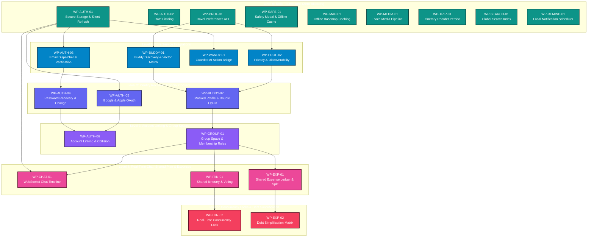

# GoMate Implementation Dependency DAG V1
## Topological Execution Sort, Critical Path & Subsystem Precondition Graph

- **Document Reference:** `docs/roadmap/gomate-implementation-dependency-dag-v1.md`
- **Scope:** Complete Directed Acyclic Graph (DAG) for GoMate Engineering Execution
- **Status:** **DEPENDENCY DAG LOCKED**
- **Date:** October 7, 2026
- **Companion Specifications:**
  - `docs/roadmap/gomate-master-implementation-roadmap-v1.md`
  - `docs/roadmap/gomate-parallel-development-matrix-v1.md`
  - `docs/audit/ui/task-08.2.4-design-dependency-register.md`

---

## 1. Executive Summary & DAG Governance

Engineering tasks cannot be executed in arbitrary order. To prevent blocking bottlenecks, merge collisions, and incomplete dependencies, all 23 work packages defined in the Master Implementation Roadmap are structured as a **Directed Acyclic Graph (DAG)**.

### 1.1. DAG Construction Principles
1. **Zero Deadlocks:** The graph contains strictly zero circular dependencies ($A \rightarrow B \rightarrow A$).
2. **Topological Leveling:** Work packages are grouped into discrete execution levels (Level 0 through Level 5). Packages in Level $N$ are only unlocked when all prerequisite packages in Level $< N$ have passed their acceptance gates.
3. **Traceability to 14 Subsystems:** Every single dependency in `task-08.2.4-design-dependency-register.md` maps directly to one or more DAG edges.

---

## 2. Complete Directed Acyclic Graph (Mermaid Visualization)

---

## 3. Node-by-Node Execution Invariants

| Node ID | Work Package Title | Blocked By (Prerequisites) | Blocks (Downstream Dependents) | Can Run in Parallel With |
| :--- | :--- | :--- | :--- | :--- |
| **WP-AUTH-01** | Secure Storage & Silent Refresh | *None* | WP-AUTH-03, WP-AUTH-05, WP-WANDY-01, WP-CHAT-01 | WP-AUTH-02, WP-PROF-01, WP-SAFE-01, WP-MAP-01, WP-MEDIA-01, WP-TRIP-01, WP-SEARCH-01 |
| **WP-AUTH-02** | Rate Limiting & Throttling | *None* | *None* | All Level 0 & Level 1 packages |
| **WP-PROF-01** | Travel Preference Persistence | *None* | WP-PROF-02, WP-BUDDY-01 | WP-AUTH-01, WP-AUTH-02, WP-SAFE-01, WP-MAP-01, WP-MEDIA-01, WP-TRIP-01 |
| **WP-SAFE-01** | Safety Confirmation Modal | *None* | *None* | All Level 0, 1, 2 packages |
| **WP-MAP-01**  | Offline Basemap Tile Caching | *None* | *None* | All Level 0, 1, 2 packages |
| **WP-MEDIA-01**| Production Place Media Pipeline | *None* | *None* | All Level 0, 1, 2 packages |
| **WP-TRIP-01** | Drag-and-Drop Reordering Persist| *None* | *None* | All Level 0, 1, 2 packages |
| **WP-SEARCH-01**| Global Multi-Destination Search | *None* | *None* | All Level 0, 1, 2 packages |
| **WP-REMIND-01**| Local Notification Scheduler | *None* | *None* | All Level 0, 1, 2 packages |
| **WP-AUTH-03** | Email Dispatcher & Verification | WP-AUTH-01 | WP-AUTH-04 | WP-PROF-01, WP-PROF-02, WP-WANDY-01, WP-BUDDY-01 |
| **WP-PROF-02** | Privacy & Visibility Controls | WP-PROF-01 | WP-BUDDY-02 | WP-AUTH-03, WP-WANDY-01, WP-BUDDY-01 |
| **WP-WANDY-01**| Guarded AI Action Bridge | WP-AUTH-01 | *None* | WP-AUTH-03, WP-PROF-02, WP-BUDDY-01 |
| **WP-BUDDY-01**| Buddy Discovery & Vector Match | WP-PROF-01 | WP-BUDDY-02 | WP-AUTH-03, WP-AUTH-04, WP-PROF-02, WP-WANDY-01 |
| **WP-AUTH-04** | Password Recovery & Change | WP-AUTH-03 | WP-AUTH-06 | WP-AUTH-05, WP-BUDDY-01, WP-BUDDY-02 |
| **WP-AUTH-05** | Google & Apple OAuth | WP-AUTH-01 | WP-AUTH-06 | WP-AUTH-04, WP-BUDDY-01, WP-BUDDY-02 |
| **WP-BUDDY-02**| Masked Profile & Double Opt-In | WP-BUDDY-01, WP-PROF-02 | WP-GROUP-01 | WP-AUTH-04, WP-AUTH-05 |
| **WP-AUTH-06** | Account Linking & Collision | WP-AUTH-04, WP-AUTH-05 | *None* | WP-GROUP-01, Level 4 packages |
| **WP-GROUP-01**| Group Space & Membership Roles | WP-BUDDY-02 | WP-CHAT-01, WP-ITIN-01, WP-EXP-01 | WP-AUTH-06 |
| **WP-CHAT-01** | WebSocket Chat Timeline | WP-GROUP-01, WP-AUTH-01 | *None* | WP-ITIN-01, WP-EXP-01 |
| **WP-ITIN-01** | Shared Itinerary Board & Voting | WP-GROUP-01 | WP-ITIN-02 | WP-CHAT-01, WP-EXP-01 |
| **WP-EXP-01**  | Expense Ledger & Split Engine | WP-GROUP-01 | WP-EXP-02 | WP-CHAT-01, WP-ITIN-01 |
| **WP-ITIN-02** | Real-Time Concurrency Lock | WP-ITIN-01 | *None* | WP-EXP-02, WP-CHAT-01 |
| **WP-EXP-02**  | Debt Simplification & Settlement| WP-EXP-01 | *None* | WP-ITIN-02, WP-CHAT-01 |

---

## 4. Subsystem Dependency Traceability Matrix (14 Subsystems)

This table demonstrates 100% bidirectional traceability between the **14 Subsystems** in `task-08.2.4-design-dependency-register.md` and the DAG work package nodes:

| # | Dependency Subsystem Name | Primary Work Package | Upstream Prerequisite | Downstream Consumers |
| :-: | :--- | :---: | :--- | :--- |
| **1** | Place Media Pipeline & Image Provenance | **WP-MEDIA-01** | None (Independent asset pipeline) | Place Detail Screen Hero |
| **2** | Travel Preference Persistence | **WP-PROF-01** | None (Prisma model exists) | WP-PROF-02, WP-BUDDY-01 |
| **3** | Buddy Matching & Mutual Consent | **WP-BUDDY-01, 02** | WP-PROF-01, WP-PROF-02 | WP-GROUP-01 |
| **4** | Group Persistence & Membership Graph | **WP-GROUP-01** | WP-BUDDY-02 | WP-CHAT-01, WP-ITIN-01, WP-EXP-01 |
| **5** | Group Real-Time Chat Timeline | **WP-CHAT-01** | WP-GROUP-01, WP-AUTH-01 | Group Chat UI Screen |
| **6** | Shared Itinerary Collaborative Board | **WP-ITIN-01, 02** | WP-GROUP-01 | Group Shared Itinerary UI |
| **7** | Shared Expense Ledger & Settlement | **WP-EXP-01, 02** | WP-GROUP-01 | Group Shared Expense UI |
| **8** | Scheduling & Local Reminder Delivery | **WP-REMIND-01** | None (OS local notification) | Trip Itinerary Item Cards |
| **9** | Safety Hotline & Offline Asset Cache | **WP-SAFE-01** | None (Bundled asset JSON) | Safety & Emergency Screen |
| **10**| Transactional Email & Verification | **WP-AUTH-03** | WP-AUTH-01 | WP-AUTH-04 (Reset tokens) |
| **11**| Anti-Enumeration Password Recovery | **WP-AUTH-04** | WP-AUTH-03 (Email delivery) | WP-AUTH-06 (Collision linking) |
| **12**| Social OAuth & Collision Resolver | **WP-AUTH-05, 06** | WP-AUTH-01, WP-AUTH-04 | Auth Login & Register Screens |
| **13**| Secure Storage & Silent Refresh Queue | **WP-AUTH-01** | None (Core HTTP client) | All authenticated endpoints |
| **14**| Map Basemap Tile Caching | **WP-MAP-01** | None (Flutter map plugin) | Map & Nearby Places Screen |

---

## 5. Critical Path & Bottleneck Analysis

### 5.1. The Primary Critical Path (Social & Collaborative Travel)
The longest sequence of dependent activities in GoMate is the **Social Travel Collaborative Chain**:

$$\text{WP-PROF-01} \longrightarrow \text{WP-BUDDY-01} \longrightarrow \text{WP-BUDDY-02} \longrightarrow \text{WP-GROUP-01} \longrightarrow \text{WP-ITIN-01} \longrightarrow \text{WP-ITIN-02}$$

- **Chain Duration:** $1.5\text{d} + 3.5\text{d} + 2.0\text{d} + 2.0\text{d} + 3.0\text{d} + 1.5\text{d} = \mathbf{13.5\text{ Engineering Days}}$.
- **Strategic Impact:** If `WP-PROF-01` (Travel Preference Persistence) is delayed, the entire Buddy Matching, Group Management, Group Chat, Shared Itinerary, and Shared Expense streams are completely blocked.
- **Remediation Invariant:** `WP-PROF-01` must be scheduled for immediate execution in Sprint 1.

### 5.2. The Secondary Critical Path (Authentication & Identity Recovery)
The authentication security hardening sequence:

$$\text{WP-AUTH-01} \longrightarrow \text{WP-AUTH-03} \longrightarrow \text{WP-AUTH-04} \longrightarrow \text{WP-AUTH-06}$$

- **Chain Duration:** $1.5\text{d} + 1.5\text{d} + 2.0\text{d} + 1.5\text{d} = \mathbf{6.5\text{ Engineering Days}}$.
- **Strategic Impact:** `WP-AUTH-01` unblocks authenticated mobile flows; `WP-AUTH-03` unblocks password reset tokens; both feed into `WP-AUTH-06` account linking.

---

## 6. DAG Verification & Integrity Declaration

- **Cycles:** **0 Detected** (Strictly acyclic).
- **Orphan Nodes:** **0 Detected** (Every work package either has prerequisites or unlocks downstream nodes, or provides standalone user value).
- **Subsystem Coverage:** **14 / 14 Subsystems Mapped (100% Traceability)**.
- **Acceptance Gate:** Guaranteed readiness for multi-agent parallel execution.
